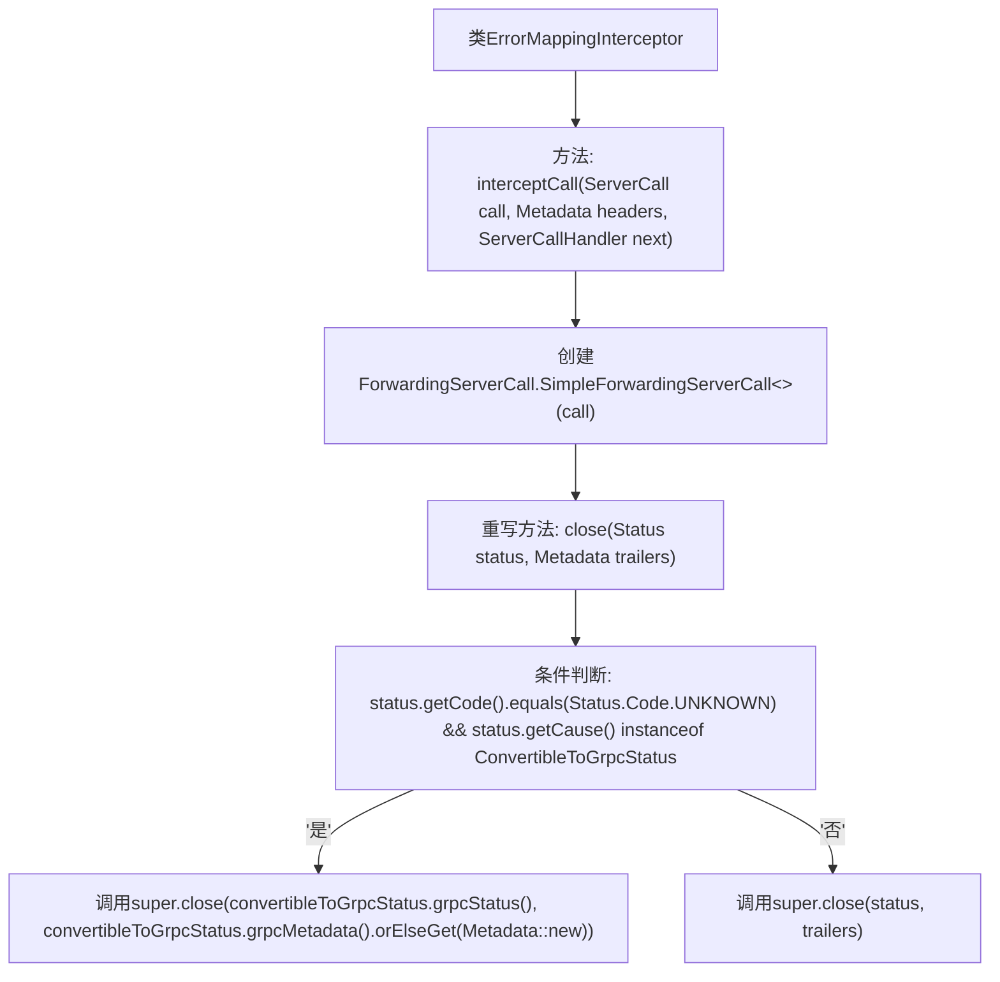

# 基础信息

|      |      |
|------|------|
| 名称 | ErrorMappingInterceptor |
| 编码语言 | .java |
| 代码路径 | Signal-Server/service/src/main/java/org/whispersystems/textsecuregcm/grpc/ErrorMappingInterceptor.java |
| 包名 | org.whispersystems.textsecuregcm.grpc |
| 依赖项 | ['io.grpc.ForwardingServerCall', 'io.grpc.Metadata', 'io.grpc.ServerCall', 'io.grpc.ServerCallHandler', 'io.grpc.ServerInterceptor', 'io.grpc.Status'] |
| 概述说明 | 拦截器自动转换未知状态为gRPC状态，防止服务逻辑冲突。 |

# 说明

ErrorMappingInterceptor拦截器的主要功能是自动将未知状态转换为gRPC状态，确保服务逻辑不受干扰。通过这种转换，拦截器能够有效处理未知状态，避免其与服务逻辑产生冲突，从而提升系统的稳定性和可靠性。

# 类列表 Class Summary

| 名称   | 类型  | 说明 |
|-------|------|-------------|
| ErrorMappingInterceptor | class | ErrorMappingInterceptor拦截器自动转换未知状态为gRPC状态，避免与服务逻辑冲突。 |

## 类 ErrorMappingInterceptor

|      |      |
|------|------|
| 访问范围 | public |
| 类型 | class |
| 名称 | ErrorMappingInterceptor |
| 说明 | ErrorMappingInterceptor拦截器自动转换未知状态为gRPC状态，避免与服务逻辑冲突。 |

### UML类图

这段代码定义了一个 `ErrorMappingInterceptor` 类，它实现了 `ServerInterceptor` 接口。该类的主要作用是在 gRPC 服务调用中拦截并处理错误状态。通过检查 `Status` 对象的代码和原因，如果状态为 `UNKNOWN` 且原因是 `ConvertibleToGrpcStatus` 类型，则将其转换为 gRPC 状态并关闭调用。否则，直接关闭调用。代码中使用了泛型和接口来实现灵活的调用处理。

### 内部方法调用关系图

**描述：**
`ErrorMappingInterceptor`类实现了`ServerInterceptor`接口，主要用于拦截和处理gRPC服务调用中的错误。`interceptCall`方法创建了一个`ForwardingServerCall.SimpleForwardingServerCall`实例，并重写了其`close`方法。在`close`方法中，根据状态码和异常类型决定是否将错误状态转换为gRPC状态，并调用相应的`super.close`方法。

### 字段列表 Field List

| 名称  | 类型  | 说明 |
|-------|-------|------|

### 方法列表 Method List

| 名称  | 类型  | 说明 |
|-------|-------|------|
| interceptCall | ServerCall.Listener<ReqT> | 重写`interceptCall`方法，自动转换未知状态为gRPC状态。 |

