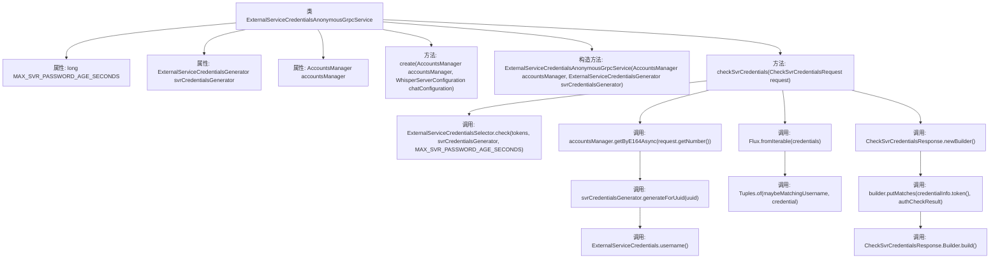

# 基础信息

|      |      |
|------|------|
| 名称 | ExternalServiceCredentialsAnonymousGrpcService |
| 编码语言 | .java |
| 代码路径 | Signal-Server/service/src/main/java/org/whispersystems/textsecuregcm/grpc/ExternalServiceCredentialsAnonymousGrpcService.java |
| 包名 | org.whispersystems.textsecuregcm.grpc |
| 依赖项 | ['java.util.Objects.requireNonNull', 'com.google.common.annotations.VisibleForTesting', 'java.time.Clock', 'java.util.List', 'java.util.Optional', 'java.util.concurrent.TimeUnit', 'org.signal.chat.credentials.AuthCheckResult', 'org.signal.chat.credentials.CheckSvrCredentialsRequest', 'org.signal.chat.credentials.CheckSvrCredentialsResponse', 'org.signal.chat.credentials.ReactorExternalServiceCredentialsAnonymousGrpc', 'org.whispersystems.textsecuregcm.WhisperServerConfiguration', 'org.whispersystems.textsecuregcm.auth.ExternalServiceCredentials', 'org.whispersystems.textsecuregcm.auth.ExternalServiceCredentialsGenerator', 'org.whispersystems.textsecuregcm.auth.ExternalServiceCredentialsSelector', 'org.whispersystems.textsecuregcm.storage.Account', 'org.whispersystems.textsecuregcm.storage.AccountsManager', 'reactor.core.publisher.Flux', 'reactor.core.publisher.Mono', 'reactor.util.function.Tuples'] |
| 概述说明 | 匿名Grpc服务，验证凭证，管理账户，生成凭证，检查有效性，返回结果。 |

# 说明

匿名Grpc服务类主要用于处理与外部服务凭证相关的操作。其主要功能包括验证外部服务凭证的有效性，管理用户账户信息，生成新的凭证，以及检查现有凭证是否有效并返回相应的匹配结果。该服务类通过Grpc协议与外部系统进行通信，确保凭证管理的安全性和可靠性。

# 类列表 Class Summary

| 名称   | 类型  | 说明 |
|-------|------|-------------|
| ExternalServiceCredentialsAnonymousGrpcService | class | 匿名Grpc服务类，用于验证外部服务凭证，管理账户和生成凭证，检查凭证有效性并返回匹配结果。 |

## 类 ExternalServiceCredentialsAnonymousGrpcService

|      |      |
|------|------|
| 访问范围 | public |
| 类型 | class |
| 名称 | ExternalServiceCredentialsAnonymousGrpcService |
| 说明 | 匿名Grpc服务类，用于验证外部服务凭证，管理账户和生成凭证，检查凭证有效性并返回匹配结果。 |

### UML类图

```mermaid
classDiagram
    class ExternalServiceCredentialsAnonymousGrpcService {
        -long MAX_SVR_PASSWORD_AGE_SECONDS
        -ExternalServiceCredentialsGenerator svrCredentialsGenerator
        -AccountsManager accountsManager
        +ExternalServiceCredentialsAnonymousGrpcService(AccountsManager accountsManager, ExternalServiceCredentialsGenerator svrCredentialsGenerator)
        +Mono~CheckSvrCredentialsResponse~ checkSvrCredentials(CheckSvrCredentialsRequest request)
        +static ExternalServiceCredentialsAnonymousGrpcService create(AccountsManager accountsManager, WhisperServerConfiguration chatConfiguration)
    }

    class AccountsManager {
        +Future~Optional~Account~~ getByE164Async(String number)
    }

    class ExternalServiceCredentialsGenerator {
        +ExternalServiceCredentials generateForUuid(UUID uuid)
    }

    class ExternalServiceCredentials {
        +String username()
    }

    class CheckSvrCredentialsRequest {
        +List~String~ getPasswordsList()
        +String getNumber()
    }

    class CheckSvrCredentialsResponse {
        +Builder putMatches(String token, AuthCheckResult authCheckResult)
        +Builder build()
    }

    class ExternalServiceCredentialsSelector {
        +static List~CredentialInfo~ check(List~String~ tokens, ExternalServiceCredentialsGenerator generator, long maxAgeSeconds)
    }

    class CredentialInfo {
        +boolean valid()
        +ExternalServiceCredentials credentials()
        +String token()
    }

    class AuthCheckResult {
        <<Enumeration>>
        AUTH_CHECK_RESULT_INVALID
        AUTH_CHECK_RESULT_MATCH
        AUTH_CHECK_RESULT_NO_MATCH
    }

    ExternalServiceCredentialsAnonymousGrpcService --> AccountsManager : 依赖
    ExternalServiceCredentialsAnonymousGrpcService --> ExternalServiceCredentialsGenerator : 依赖
    ExternalServiceCredentialsAnonymousGrpcService --> CheckSvrCredentialsRequest : 依赖
    ExternalServiceCredentialsAnonymousGrpcService --> CheckSvrCredentialsResponse : 依赖
    ExternalServiceCredentialsAnonymousGrpcService --> ExternalServiceCredentialsSelector : 依赖
    ExternalServiceCredentialsAnonymousGrpcService --> CredentialInfo : 依赖
    ExternalServiceCredentialsAnonymousGrpcService --> AuthCheckResult : 依赖
    ExternalServiceCredentialsGenerator --> ExternalServiceCredentials : 依赖
```

### 描述
`ExternalServiceCredentialsAnonymousGrpcService` 是一个用于处理匿名外部服务凭证的 gRPC 服务类。它依赖于 `AccountsManager` 和 `ExternalServiceCredentialsGenerator` 来验证和生成凭证。该类的主要方法 `checkSvrCredentials` 通过检查提供的凭证列表，验证其有效性，并与账户信息进行匹配，最终返回验证结果。整个过程涉及多个辅助类和枚举类型，如 `CredentialInfo` 和 `AuthCheckResult`，以确保凭证验证的准确性和安全性。

### 内部方法调用关系图

这段代码定义了一个名为`ExternalServiceCredentialsAnonymousGrpcService`的类，主要用于处理与外部服务凭证相关的匿名gRPC请求。类中包含了一个静态方法`create`用于创建实例，一个构造方法用于初始化属性，以及一个`checkSvrCredentials`方法用于验证服务凭证的有效性。`checkSvrCredentials`方法通过调用多个内部方法，最终返回一个包含验证结果的响应对象。流程图展示了类中各方法之间的调用关系及其执行顺序。

### 字段列表 Field List

| 名称  | 类型  | 说明 |
|-------|-------|------|
| accountsManager | AccountsManager | 私有账户管理器实例变量。 |
| svrCredentialsGenerator | ExternalServiceCredentialsGenerator | 私有外部服务凭证生成器实例变量。 |
| MAX_SVR_PASSWORD_AGE_SECONDS = TimeUnit.DAYS.toSeconds(30) | long | 私有静态常量MAX_SVR_PASSWORD_AGE_SECONDS表示服务器密码最大有效期，设置为30天的秒数。 |

### 方法列表 Method List

| 名称  | 类型  | 说明 |
|-------|-------|------|
| create | ExternalServiceCredentialsAnonymousGrpcService | 创建匿名gRPC服务，使用账户管理器和聊天配置。 |
| checkSvrCredentials | Mono<CheckSvrCredentialsResponse> | 检查服务器凭据，验证密码有效性并匹配账户信息。 |

