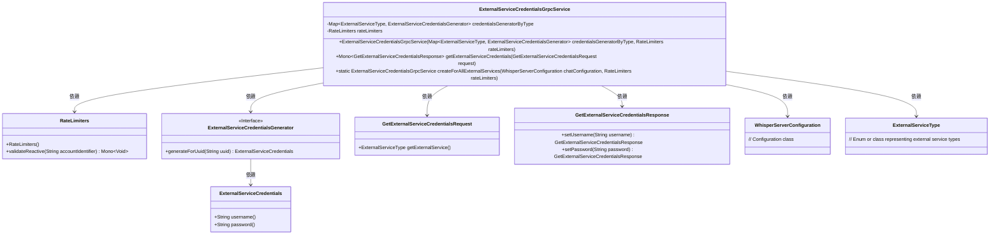
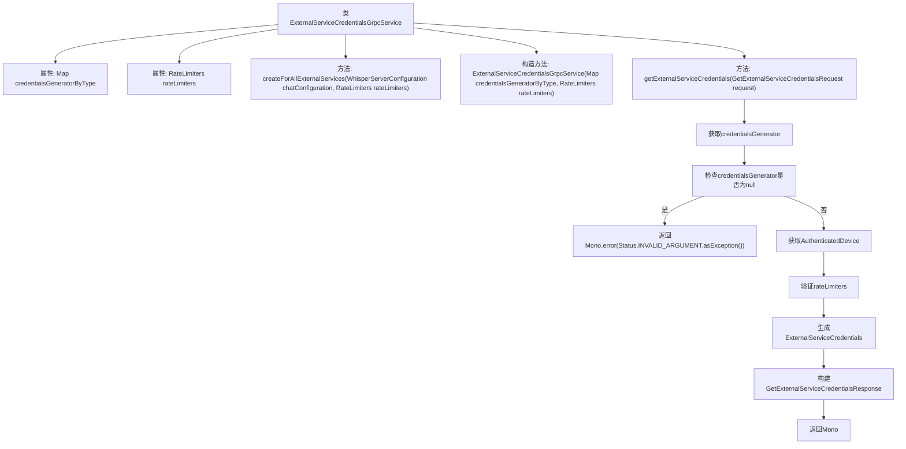

# 基础信息

|      |      |
|------|------|
| 名称 | ExternalServiceCredentialsGrpcService |
| 编码语言 | .java |
| 代码路径 | Signal-Server/service/src/main/java/org/whispersystems/textsecuregcm/grpc/ExternalServiceCredentialsGrpcService.java |
| 包名 | org.whispersystems.textsecuregcm.grpc |
| 依赖项 | ['java.util.Objects.requireNonNull', 'com.google.common.annotations.VisibleForTesting', 'io.grpc.Status', 'java.time.Clock', 'java.util.Map', 'org.signal.chat.credentials.ExternalServiceType', 'org.signal.chat.credentials.GetExternalServiceCredentialsRequest', 'org.signal.chat.credentials.GetExternalServiceCredentialsResponse', 'org.signal.chat.credentials.ReactorExternalServiceCredentialsGrpc', 'org.whispersystems.textsecuregcm.WhisperServerConfiguration', 'org.whispersystems.textsecuregcm.auth.ExternalServiceCredentials', 'org.whispersystems.textsecuregcm.auth.ExternalServiceCredentialsGenerator', 'org.whispersystems.textsecuregcm.auth.grpc.AuthenticatedDevice', 'org.whispersystems.textsecuregcm.auth.grpc.AuthenticationUtil', 'org.whispersystems.textsecuregcm.limits.RateLimiters', 'reactor.core.publisher.Mono'] |
| 概述说明 | 外部gRPC服务负责生成和验证设备凭证，并实施限流控制。 |

# 说明

外部服务凭证gRPC服务是一个综合性的系统，主要包含凭证生成器和限流器两大核心组件。该服务负责处理来自外部的凭证请求，并对请求设备进行验证，以确保其合法性和安全性。凭证生成器负责创建和发放凭证，而限流器则用于控制请求的流量，防止系统过载。通过这两个组件的协同工作，该服务能够高效、安全地管理凭证请求，保障系统的稳定运行。

# 类列表 Class Summary

| 名称   | 类型  | 说明 |
|-------|------|-------------|
| ExternalServiceCredentialsGrpcService | class | 外部服务凭证gRPC服务，包含凭证生成器和限流器，处理凭证请求并验证设备。 |

## 类 ExternalServiceCredentialsGrpcService

|      |      |
|------|------|
| 访问范围 | public |
| 类型 | class |
| 名称 | ExternalServiceCredentialsGrpcService |
| 说明 | 外部服务凭证gRPC服务，包含凭证生成器和限流器，处理凭证请求并验证设备。 |

### UML类图

**描述：**
`ExternalServiceCredentialsGrpcService` 是一个gRPC服务类，用于生成外部服务的凭据。它依赖于 `RateLimiters` 进行速率限制，并利用 `ExternalServiceCredentialsGenerator` 接口生成凭据。该类通过 `createForAllExternalServices` 方法初始化，并处理 `GetExternalServiceCredentialsRequest` 请求，返回 `GetExternalServiceCredentialsResponse` 响应。该服务确保在生成凭据前进行身份验证和速率限制验证。

### 内部方法调用关系图

这段代码定义了一个名为 `ExternalServiceCredentialsGrpcService` 的类，用于处理外部服务凭证的生成和验证。类中包含两个主要属性：`credentialsGeneratorByType` 和 `rateLimiters`，分别用于存储凭证生成器和速率限制器。类提供了两个方法：`createForAllExternalServices` 用于创建服务实例，`getExternalServiceCredentials` 用于根据请求生成并返回外部服务凭证。流程图中详细展示了 `getExternalServiceCredentials` 方法的执行流程，包括获取凭证生成器、验证凭证生成器、获取认证设备、验证速率限制、生成凭证并构建响应。

### 字段列表 Field List

| 名称  | 类型  | 说明 |
|-------|-------|------|
| credentialsGeneratorByType | Map<ExternalServiceType, ExternalServiceCredentialsGenerator> | 私有映射存储外部服务类型与凭证生成器的对应关系。 |
| rateLimiters | RateLimiters | 私有且不可变的限流器实例。 |

### 方法列表 Method List

| 名称  | 类型  | 说明 |
|-------|-------|------|
| getExternalServiceCredentials | Mono<GetExternalServiceCredentialsResponse> | 根据请求生成外部服务凭证，验证设备并返回用户名和密码。 |
| createForAllExternalServices | ExternalServiceCredentialsGrpcService | 创建外部服务凭证的gRPC服务，基于聊天配置和限流器。 |

