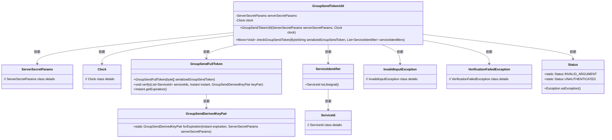
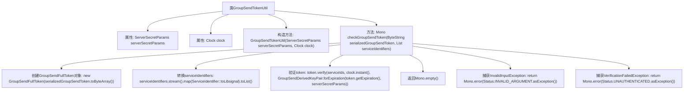

# 基础信息

|      |      |
|------|------|
| 名称 | GroupSendTokenUtil |
| 编码语言 | .java |
| 代码路径 | Signal-Server/service/src/main/java/org/whispersystems/textsecuregcm/grpc/GroupSendTokenUtil.java |
| 包名 | org.whispersystems.textsecuregcm.grpc |
| 依赖项 | ['com.google.protobuf.ByteString', 'io.grpc.Status', 'java.time.Clock', 'java.util.List', 'org.signal.libsignal.protocol.ServiceId', 'org.signal.libsignal.zkgroup.InvalidInputException', 'org.signal.libsignal.zkgroup.ServerSecretParams', 'org.signal.libsignal.zkgroup.VerificationFailedException', 'org.signal.libsignal.zkgroup.groupsend.GroupSendDerivedKeyPair', 'org.signal.libsignal.zkgroup.groupsend.GroupSendFullToken', 'org.whispersystems.textsecuregcm.identity.ServiceIdentifier', 'reactor.core.publisher.Mono'] |
| 概述说明 | GroupSendTokenUtil类验证群组发送令牌的有效性和服务标识符匹配。 |

# 说明

GroupSendTokenUtil类的主要功能是验证群组发送令牌的有效性，并确保令牌中的服务标识符与预期值匹配。该类通过检查令牌的合法性和服务标识符的正确性，确保群组发送操作的合法性和安全性。

# 类列表 Class Summary

| 名称   | 类型  | 说明 |
|-------|------|-------------|
| GroupSendTokenUtil | class | GroupSendTokenUtil类用于验证群组发送令牌，检查其有效性和服务标识符匹配。 |

## 类 GroupSendTokenUtil

|      |      |
|------|------|
| 访问范围 | public |
| 类型 | class |
| 名称 | GroupSendTokenUtil |
| 说明 | GroupSendTokenUtil类用于验证群组发送令牌，检查其有效性和服务标识符匹配。 |

### UML类图

这段代码定义了一个 `GroupSendTokenUtil` 类，用于验证群组发送令牌的有效性。该类依赖于 `ServerSecretParams` 和 `Clock` 来执行验证操作。`checkGroupSendToken` 方法接收一个序列化的群组发送令牌和一个服务标识符列表，通过 `GroupSendFullToken` 类进行验证。如果验证失败，会抛出 `InvalidInputException` 或 `VerificationFailedException` 异常，并返回相应的错误状态。代码中涉及多个类之间的依赖关系，包括 `ServiceIdentifier`、`ServiceId`、`GroupSendDerivedKeyPair` 和 `Status` 等。

### 内部方法调用关系图

这段代码定义了一个名为 `GroupSendTokenUtil` 的类，用于检查和验证群组发送令牌的有效性。它包含一个构造方法和一个 `checkGroupSendToken` 方法。`checkGroupSendToken` 方法首先将传入的 `ByteString` 转换为 `GroupSendFullToken` 对象，然后将 `ServiceIdentifier` 列表转换为 `ServiceId` 列表，最后验证令牌的有效性。如果验证成功，返回 `Mono.empty()`；如果捕获到 `InvalidInputException` 或 `VerificationFailedException`，则分别返回相应的错误 `Mono`。

### 字段列表 Field List

| 名称  | 类型  | 说明 |
|-------|-------|------|
| serverSecretParams | ServerSecretParams | 服务器密钥参数为私有不可变类型。 |
| clock | Clock | 类中包含一个私有的Clock类型变量clock。 |

### 方法列表 Method List

| 名称  | 类型  | 说明 |
|-------|-------|------|
| checkGroupSendToken | Mono<Void> | 检查群组发送令牌，验证服务标识符，处理异常并返回结果。 |

