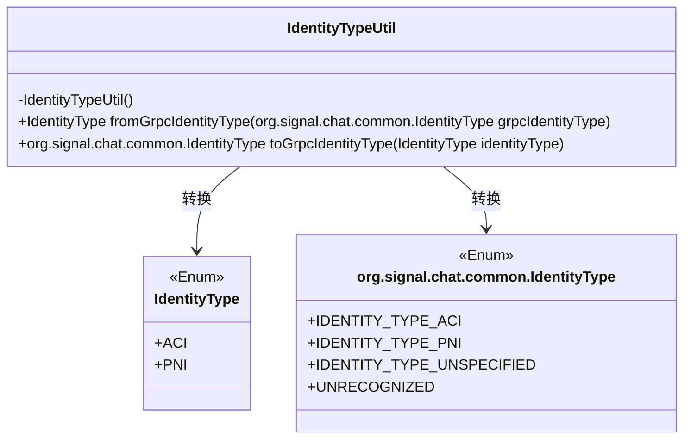
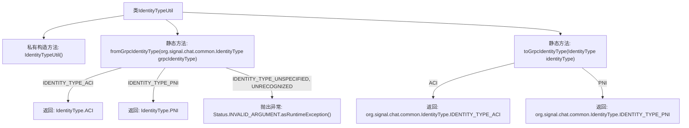

# 基础信息

|      |      |
|------|------|
| 名称 | IdentityTypeUtil |
| 编码语言 | .java |
| 代码路径 | Signal-Server/service/src/main/java/org/whispersystems/textsecuregcm/grpc/IdentityTypeUtil.java |
| 包名 | org.whispersystems.textsecuregcm.grpc |
| 依赖项 | ['io.grpc.Status', 'org.whispersystems.textsecuregcm.identity.IdentityType'] |
| 概述说明 | IdentityTypeUtil类实现gRPC与本地IdentityType的互转。 |

# 说明

IdentityTypeUtil类的主要功能是实现gRPC与本地IdentityType之间的相互转换。它充当了一个桥梁，确保两种不同的身份类型表示方式能够无缝对接和转换，从而在系统间传递和处理身份信息时保持一致性。

# 类列表 Class Summary

| 名称   | 类型  | 说明 |
|-------|------|-------------|
| IdentityTypeUtil | class | IdentityTypeUtil类用于gRPC与本地IdentityType的相互转换。 |

## 类 IdentityTypeUtil

|      |      |
|------|------|
| 访问范围 | public |
| 类型 | class |
| 名称 | IdentityTypeUtil |
| 说明 | IdentityTypeUtil类用于gRPC与本地IdentityType的相互转换。 |

### UML类图

这段代码定义了一个工具类 `IdentityTypeUtil`，用于在两种不同的 `IdentityType` 枚举类型之间进行转换。`IdentityTypeUtil` 提供了两个静态方法：`fromGrpcIdentityType` 和 `toGrpcIdentityType`，分别用于将 `org.signal.chat.common.IdentityType` 转换为 `IdentityType`，以及将 `IdentityType` 转换为 `org.signal.chat.common.IdentityType`。代码中使用了 `switch` 表达式来处理枚举类型的转换，并在遇到不支持的类型时抛出异常。

### 内部方法调用关系图

这段代码定义了一个名为 `IdentityTypeUtil` 的工具类，用于在 `IdentityType` 和 `org.signal.chat.common.IdentityType` 之间进行转换。类中包含两个静态方法：`fromGrpcIdentityType` 和 `toGrpcIdentityType`。`fromGrpcIdentityType` 方法将 `grpcIdentityType` 转换为 `IdentityType`，并根据不同的枚举值返回相应的结果或抛出异常。`toGrpcIdentityType` 方法则将 `IdentityType` 转换为 `org.signal.chat.common.IdentityType`，并返回相应的枚举值。

### 字段列表 Field List

| 名称  | 类型  | 说明 |
|-------|-------|------|

### 方法列表 Method List

| 名称  | 类型  | 说明 |
|-------|-------|------|
| fromGrpcIdentityType | IdentityType | 将gRPC身份类型转换为内部身份类型，处理未指定或未知类型异常。 |
| toGrpcIdentityType | org.signal.chat.common.IdentityType | 将IdentityType转换为GrpcIdentityType的静态方法。 |

