# 基础信息

|      |      |
|------|------|
| 名称 | KeysAnonymousGrpcService |
| 编码语言 | .java |
| 代码路径 | Signal-Server/service/src/main/java/org/whispersystems/textsecuregcm/grpc/KeysAnonymousGrpcService.java |
| 包名 | org.whispersystems.textsecuregcm.grpc |
| 依赖项 | ['com.google.protobuf.ByteString', 'io.grpc.Status', 'java.security.MessageDigest', 'java.security.NoSuchAlgorithmException', 'java.time.Clock', 'java.util.Arrays', 'java.util.List', 'org.signal.chat.keys.CheckIdentityKeyRequest', 'org.signal.chat.keys.CheckIdentityKeyResponse', 'org.signal.chat.keys.GetPreKeysAnonymousRequest', 'org.signal.chat.keys.GetPreKeysResponse', 'org.signal.chat.keys.ReactorKeysAnonymousGrpc', 'org.signal.libsignal.protocol.IdentityKey', 'org.signal.libsignal.zkgroup.ServerSecretParams', 'org.whispersystems.textsecuregcm.auth.UnidentifiedAccessUtil', 'org.whispersystems.textsecuregcm.identity.ServiceIdentifier', 'org.whispersystems.textsecuregcm.storage.Account', 'org.whispersystems.textsecuregcm.storage.AccountsManager', 'org.whispersystems.textsecuregcm.storage.KeysManager', 'reactor.core.publisher.Flux', 'reactor.core.publisher.Mono', 'reactor.util.function.Tuples'] |
| 概述说明 | KeysAnonymousGrpcService处理匿名密钥请求，依赖AccountsManager和KeysManager。 |

# 说明

KeysAnonymousGrpcService负责处理匿名密钥请求，主要功能包括获取预密钥和检查身份密钥。该服务依赖于AccountsManager和KeysManager来执行相关操作，确保密钥请求的安全性和准确性。通过集成这两个管理器，KeysAnonymousGrpcService能够有效地管理和验证匿名密钥，保障用户身份和数据的安全。

# 类列表 Class Summary

| 名称   | 类型  | 说明 |
|-------|------|-------------|
| KeysAnonymousGrpcService | class | KeysAnonymousGrpcService处理匿名密钥请求，包括获取预密钥和检查身份密钥，依赖AccountsManager和KeysManager。 |


## 类 KeysAnonymousGrpcService

|      |      |
|------|------|
| 访问范围 | public |
| 类型 | class |
| 名称 | KeysAnonymousGrpcService |
| 说明 | KeysAnonymousGrpcService处理匿名密钥请求，包括获取预密钥和检查身份密钥，依赖AccountsManager和KeysManager。 |


### UML类图

```mermaid
classDiagram
    class KeysAnonymousGrpcService {
        -AccountsManager accountsManager
        -KeysManager keysManager
        -GroupSendTokenUtil groupSendTokenUtil
        +KeysAnonymousGrpcService(AccountsManager accountsManager, KeysManager keysManager, ServerSecretParams serverSecretParams, Clock clock)
        +Mono~GetPreKeysResponse~ getPreKeys(GetPreKeysAnonymousRequest request)
        +Flux~CheckIdentityKeyResponse~ checkIdentityKeys(Flux~CheckIdentityKeyRequest~ requests)
        -Mono~Account~ lookUpAccount(ServiceIdentifier serviceIdentifier, Status onNotFound)
        -boolean fingerprintMatches(IdentityKey identityKey, byte[] fingerprint)
    }

    class AccountsManager {
        <<Interface>>
        +Mono~Account~ getByServiceIdentifierAsync(ServiceIdentifier serviceIdentifier)
    }

    class KeysManager {
        <<Interface>>
    }

    class GroupSendTokenUtil {
        +GroupSendTokenUtil(ServerSecretParams serverSecretParams, Clock clock)
        +Mono~Void~ checkGroupSendToken(GroupSendToken groupSendToken, List~ServiceIdentifier~ serviceIdentifiers)
    }

    class ServiceIdentifierUtil {
        +ServiceIdentifier fromGrpcServiceIdentifier(GrpcServiceIdentifier grpcServiceIdentifier)
        +GrpcServiceIdentifier toGrpcServiceIdentifier(ServiceIdentifier serviceIdentifier)
    }

    class DeviceIdUtil {
        +byte validate(byte deviceId)
    }

    class KeysGrpcHelper {
        +Mono~GetPreKeysResponse~ getPreKeys(Account targetAccount, IdentityType identityType, byte deviceId, KeysManager keysManager)
    }

    class UnidentifiedAccessUtil {
        +boolean checkUnidentifiedAccess(Account targetAccount, byte[] unidentifiedAccessKey)
    }

    class MessageDigest {
        +byte[] digest(byte[] input)
    }

    class Account {
        +IdentityKey getIdentityKey(IdentityType identityType)
    }

    class IdentityKey {
        +byte[] serialize()
    }

    class Status {
        +Exception asException()
    }

    class Mono~T~ {
        <<Interface>>
    }

    class Flux~T~ {
        <<Interface>>
    }

    KeysAnonymousGrpcService --> AccountsManager : 依赖
    KeysAnonymousGrpcService --> KeysManager : 依赖
    KeysAnonymousGrpcService --> GroupSendTokenUtil : 依赖
    GroupSendTokenUtil --> ServerSecretParams : 依赖
    GroupSendTokenUtil --> Clock : 依赖
    KeysAnonymousGrpcService --> ServiceIdentifierUtil : 依赖
    KeysAnonymousGrpcService --> DeviceIdUtil : 依赖
    KeysAnonymousGrpcService --> KeysGrpcHelper : 依赖
    KeysAnonymousGrpcService --> UnidentifiedAccessUtil : 依赖
    KeysAnonymousGrpcService --> MessageDigest : 依赖
    KeysAnonymousGrpcService --> Account : 依赖
    KeysAnonymousGrpcService --> IdentityKey : 依赖
    KeysAnonymousGrpcService --> Status : 依赖
    KeysAnonymousGrpcService --> Mono~T~ : 依赖
    KeysAnonymousGrpcService --> Flux~T~ : 依赖
```



**描述：**  
`KeysAnonymousGrpcService` 是一个基于 gRPC 的服务类，主要用于处理匿名密钥请求。它依赖于 `AccountsManager`、`KeysManager` 和 `GroupSendTokenUtil` 等组件来管理账户、密钥和组发送令牌。该类提供了 `getPreKeys` 和 `checkIdentityKeys` 方法，分别用于获取预密钥和验证身份密钥。`getPreKeys` 方法根据请求的授权类型（如组发送令牌或未识别访问密钥）进行不同的处理，而 `checkIdentityKeys` 方法则通过 `AccountsManager` 获取账户信息并验证指纹匹配。整个类设计复杂，涉及多个工具类和接口的协作。


### 内部方法调用关系图

```mermaid
graph TD
    A["类KeysAnonymousGrpcService"]
    B["属性: AccountsManager accountsManager"]
    C["属性: KeysManager keysManager"]
    D["属性: GroupSendTokenUtil groupSendTokenUtil"]
    E["构造方法: KeysAnonymousGrpcService(AccountsManager, KeysManager, ServerSecretParams, Clock)"]
    F["方法: Mono<GetPreKeysResponse> getPreKeys(GetPreKeysAnonymousRequest)"]
    G["方法: Flux<CheckIdentityKeyResponse> checkIdentityKeys(Flux<CheckIdentityKeyRequest>)"]
    H["私有方法: Mono<Account> lookUpAccount(ServiceIdentifier, Status)"]
    I["私有方法: boolean fingerprintMatches(IdentityKey, byte[])"]
    J["流程: getPreKeys方法"]
    K["流程: checkIdentityKeys方法"]
    L["流程: lookUpAccount方法"]
    M["流程: fingerprintMatches方法"]

    A --> B
    A --> C
    A --> D
    A --> E
    A --> F
    A --> G
    A --> H
    A --> I

    J --> F
    K --> G
    L --> H
    M --> I

    F --> J
    G --> K
    H --> L
    I --> M

    J --> "ServiceIdentifierUtil.fromGrpcServiceIdentifier(request.getRequest().getTargetIdentifier())"
    J --> "DeviceIdUtil.validate(request.getRequest().getDeviceId())"
    J --> "groupSendTokenUtil.checkGroupSendToken(request.getGroupSendToken(), List.of(serviceIdentifier))"
    J --> "lookUpAccount(serviceIdentifier, Status.NOT_FOUND)"
    J --> "KeysGrpcHelper.getPreKeys(targetAccount, serviceIdentifier.identityType(), deviceId, keysManager)"
    J --> "UnidentifiedAccessUtil.checkUnidentifiedAccess(targetAccount, request.getUnidentifiedAccessKey().toByteArray())"
    J --> "Mono.error(Status.UNAUTHENTICATED.asException())"
    J --> "Mono.error(Status.INVALID_ARGUMENT.asException())"

    K --> "ServiceIdentifierUtil.fromGrpcServiceIdentifier(request.getTargetIdentifier())"
    K --> "accountsManager.getByServiceIdentifierAsync(serviceIdentifierAndFingerprint.getT1())"
    K --> "fingerprintMatches(account.getIdentityKey(serviceIdentifierAndFingerprint.getT1().identityType()), serviceIdentifierAndFingerprint.getT2())"
    K --> "CheckIdentityKeyResponse.newBuilder().setTargetIdentifier(ServiceIdentifierUtil.toGrpcServiceIdentifier(serviceIdentifierAndFingerprint.getT1()))"

    L --> "accountsManager.getByServiceIdentifierAsync(serviceIdentifier)"
    L --> "Mono.error(onNotFound.asException())"

    M --> "MessageDigest.getInstance('SHA-256').digest(identityKey.serialize())"
    M --> "Arrays.equals(digest, 0, 4, fingerprint, 0, 4)"
```

这段代码描述了一个名为`KeysAnonymousGrpcService`的类，它继承自`ReactorKeysAnonymousGrpc.KeysAnonymousImplBase`。该类包含两个主要方法：`getPreKeys`和`checkIdentityKeys`，分别用于处理获取预密钥和检查身份密钥的请求。`getPreKeys`方法根据请求的授权类型（`GROUP_SEND_TOKEN`或`UNIDENTIFIED_ACCESS_KEY`）执行不同的逻辑，最终返回预密钥或错误。`checkIdentityKeys`方法处理多个请求，验证每个请求的身份密钥指纹是否匹配，并返回相应的响应。类中还包含两个私有方法`lookUpAccount`和`fingerprintMatches`，分别用于查找账户和验证指纹匹配。

### 字段列表 Field List

| 名称  | 类型  | 说明 |
|-------|-------|------|
| accountsManager | AccountsManager | 私有且不可变的AccountsManager实例。 |
| keysManager | KeysManager | 私有不可变的KeysManager实例变量。 |
| groupSendTokenUtil | GroupSendTokenUtil | 私有且不可变的GroupSendTokenUtil实例。 |

### 方法列表 Method List

| 名称  | 类型  | 说明 |
|-------|-------|------|
| checkIdentityKeys | Flux<CheckIdentityKeyResponse> | 方法检查身份密钥，处理请求并返回响应。 |
| lookUpAccount | Mono<Account> | 通过异步查询账户信息，若不存在则抛出异常。 |
| getPreKeys | Mono<GetPreKeysResponse> | 根据请求类型获取预密钥，处理组发送令牌和未识别访问密钥，返回预密钥或错误。 |
| fingerprintMatches | boolean | 该方法通过SHA-256算法验证身份密钥与指纹是否匹配。 |


