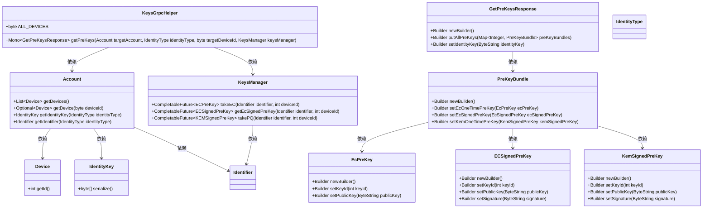
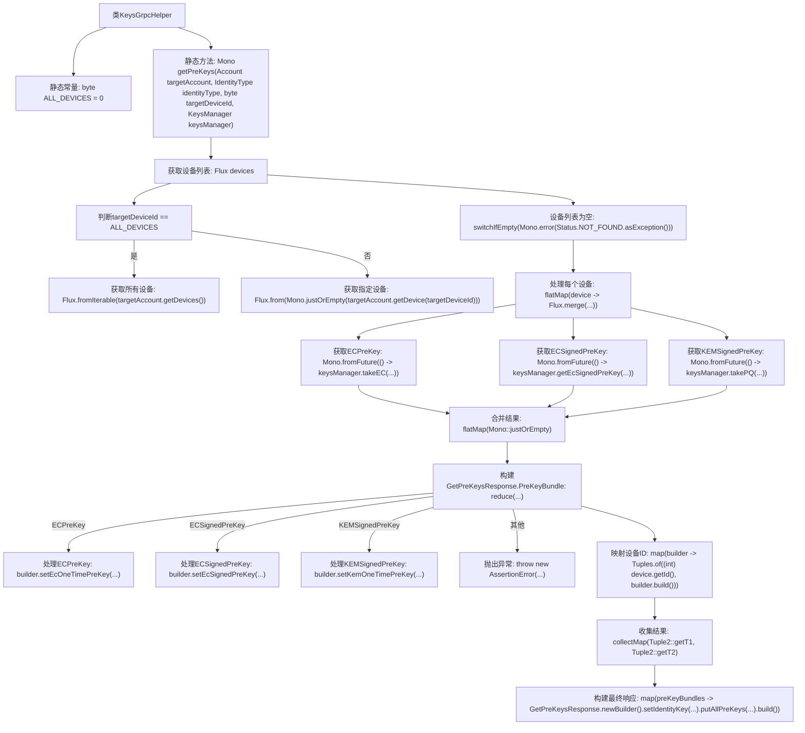

# 基础信息

|      |      |
|------|------|
| 名称 | KeysGrpcHelper |
| 编码语言 | .java |
| 代码路径 | Signal-Server/service/src/main/java/org/whispersystems/textsecuregcm/grpc/KeysGrpcHelper.java |
| 包名 | org.whispersystems.textsecuregcm.grpc |
| 依赖项 | ['com.google.protobuf.ByteString', 'io.grpc.Status', 'org.signal.chat.common.EcPreKey', 'org.signal.chat.common.EcSignedPreKey', 'org.signal.chat.common.KemSignedPreKey', 'org.signal.chat.keys.GetPreKeysResponse', 'org.whispersystems.textsecuregcm.entities.ECPreKey', 'org.whispersystems.textsecuregcm.entities.ECSignedPreKey', 'org.whispersystems.textsecuregcm.entities.KEMSignedPreKey', 'org.whispersystems.textsecuregcm.identity.IdentityType', 'org.whispersystems.textsecuregcm.storage.Account', 'org.whispersystems.textsecuregcm.storage.Device', 'org.whispersystems.textsecuregcm.storage.KeysManager', 'reactor.core.publisher.Flux', 'reactor.core.publisher.Mono', 'reactor.util.function.Tuple2', 'reactor.util.function.Tuples'] |
| 概述说明 | KeysGrpcHelper类通过getPreKeys获取目标账户预密钥，支持所有或指定设备，返回EC和KEM预密钥。 |

# 说明

KeysGrpcHelper类中的getPreKeys方法用于获取目标账户的预密钥，支持获取所有设备或指定设备的预密钥。该方法返回的响应包含EC（椭圆曲线）和KEM（密钥封装机制）两种类型的预密钥。

# 类列表 Class Summary

| 名称   | 类型  | 说明 |
|-------|------|-------------|
| KeysGrpcHelper | class | KeysGrpcHelper类通过getPreKeys方法获取目标账户的预密钥，支持所有设备或指定设备，并返回包含EC和KEM预密钥的响应。 |

## 类 KeysGrpcHelper

|      |      |
|------|------|
| 访问范围 | None |
| 类型 | class |
| 名称 | KeysGrpcHelper |
| 说明 | KeysGrpcHelper类通过getPreKeys方法获取目标账户的预密钥，支持所有设备或指定设备，并返回包含EC和KEM预密钥的响应。 |

### UML类图

这段代码定义了一个 `KeysGrpcHelper` 类，用于处理与密钥管理相关的 gRPC 请求。`getPreKeys` 方法根据目标账户、设备ID和密钥管理器，获取并构建预密钥响应。该方法通过 Flux 和 Mono 处理异步操作，最终返回一个包含预密钥的 `GetPreKeysResponse` 对象。代码涉及多个类，如 `Account`、`Device`、`KeysManager` 等，它们共同协作完成密钥的获取和响应构建。

### 内部方法调用关系图

这段代码是`KeysGrpcHelper`类中的一个静态方法`getPreKeys`，用于获取指定账户的预密钥。方法首先根据设备ID获取设备列表，然后为每个设备获取不同类型的预密钥（ECPreKey、ECSignedPreKey、KEMSignedPreKey），并将这些预密钥合并构建成一个`GetPreKeysResponse`对象返回。流程图展示了从设备获取到最终响应构建的完整流程。

### 字段列表 Field List

| 名称  | 类型  | 说明 |
|-------|-------|------|
| ALL_DEVICES = 0 | byte | 定义静态常量ALL_DEVICES，值为0。 |

### 方法列表 Method List

| 名称  | 类型  | 说明 |
|-------|-------|------|
| getPreKeys | Mono<GetPreKeysResponse> | 获取目标账户设备的预密钥，合并并构建响应。 |

