# 基础信息

|      |      |
|------|------|
| 名称 | KeysGrpcService |
| 编码语言 | .java |
| 代码路径 | Signal-Server/service/src/main/java/org/whispersystems/textsecuregcm/grpc/KeysGrpcService.java |
| 包名 | org.whispersystems.textsecuregcm.grpc |
| 依赖项 | ['io.grpc.Status', 'io.grpc.StatusRuntimeException', 'java.util.List', 'java.util.Map', 'java.util.UUID', 'java.util.concurrent.CompletableFuture', 'java.util.function.BiFunction', 'org.signal.chat.common.EcPreKey', 'org.signal.chat.common.EcSignedPreKey', 'org.signal.chat.common.KemSignedPreKey', 'org.signal.chat.keys.GetPreKeyCountRequest', 'org.signal.chat.keys.GetPreKeyCountResponse', 'org.signal.chat.keys.GetPreKeysRequest', 'org.signal.chat.keys.GetPreKeysResponse', 'org.signal.chat.keys.ReactorKeysGrpc', 'org.signal.chat.keys.SetEcSignedPreKeyRequest', 'org.signal.chat.keys.SetKemLastResortPreKeyRequest', 'org.signal.chat.keys.SetOneTimeEcPreKeysRequest', 'org.signal.chat.keys.SetOneTimeKemSignedPreKeysRequest', 'org.signal.chat.keys.SetPreKeyResponse', 'org.signal.libsignal.protocol.IdentityKey', 'org.signal.libsignal.protocol.InvalidKeyException', 'org.signal.libsignal.protocol.ecc.ECPublicKey', 'org.signal.libsignal.protocol.kem.KEMPublicKey', 'org.whispersystems.textsecuregcm.auth.grpc.AuthenticatedDevice', 'org.whispersystems.textsecuregcm.auth.grpc.AuthenticationUtil', 'org.whispersystems.textsecuregcm.entities.ECPreKey', 'org.whispersystems.textsecuregcm.entities.ECSignedPreKey', 'org.whispersystems.textsecuregcm.entities.KEMSignedPreKey', 'org.whispersystems.textsecuregcm.identity.IdentityType', 'org.whispersystems.textsecuregcm.identity.ServiceIdentifier', 'org.whispersystems.textsecuregcm.limits.RateLimiters', 'org.whispersystems.textsecuregcm.storage.Account', 'org.whispersystems.textsecuregcm.storage.AccountsManager', 'org.whispersystems.textsecuregcm.storage.KeysManager', 'reactor.core.publisher.Flux', 'reactor.core.publisher.Mono', 'reactor.util.function.Tuples'] |
| 概述说明 | KeysGrpcService管理密钥，支持EC和KEM类型，处理预密钥获取、存储及签名验证。 |

# 说明

KeysGrpcService是一个用于密钥管理的服务，主要功能包括预密钥的获取、存储以及签名验证。该服务支持两种密钥类型：EC（椭圆曲线）和KEM（密钥封装机制）。通过这些功能，KeysGrpcService能够有效管理密钥的生命周期，确保密钥的安全性和可靠性。

# 类列表 Class Summary

| 名称   | 类型  | 说明 |
|-------|------|-------------|
| KeysGrpcService | class | KeysGrpcService处理密钥管理，包括预密钥获取、存储及签名验证，支持EC和KEM类型。 |


## 类 KeysGrpcService

|      |      |
|------|------|
| 访问范围 | public |
| 类型 | class |
| 名称 | KeysGrpcService |
| 说明 | KeysGrpcService处理密钥管理，包括预密钥获取、存储及签名验证，支持EC和KEM类型。 |


### UML类图

```mermaid
classDiagram
    class KeysGrpcService {
        -AccountsManager accountsManager
        -KeysManager keysManager
        -RateLimiters rateLimiters
        -static StatusRuntimeException INVALID_PUBLIC_KEY_EXCEPTION
        -static StatusRuntimeException INVALID_SIGNATURE_EXCEPTION
        -enum PreKeyType { EC, KEM }
        +KeysGrpcService(AccountsManager accountsManager, KeysManager keysManager, RateLimiters rateLimiters)
        +Mono~GetPreKeyCountResponse~ getPreKeyCount(GetPreKeyCountRequest request)
        +Mono~GetPreKeysResponse~ getPreKeys(GetPreKeysRequest request)
        +Mono~SetPreKeyResponse~ setOneTimeEcPreKeys(SetOneTimeEcPreKeysRequest request)
        +Mono~SetPreKeyResponse~ setOneTimeKemSignedPreKeys(SetOneTimeKemSignedPreKeysRequest request)
        +Mono~SetPreKeyResponse~ setEcSignedPreKey(SetEcSignedPreKeyRequest request)
        +Mono~SetPreKeyResponse~ setKemLastResortPreKey(SetKemLastResortPreKeyRequest request)
        -Mono~SetPreKeyResponse~ storeOneTimePreKeys(UUID authenticatedAccountUuid, List~R~ requestPreKeys, IdentityType identityType, BiFunction~R, IdentityKey, K~ extractPreKeyFunction, BiFunction~UUID, List~K~, CompletableFuture~Void~~ storeKeysFunction)
        -Mono~SetPreKeyResponse~ storeRepeatedUseKey(UUID authenticatedAccountUuid, org.signal.chat.common.IdentityType identityType, R storeKeyRequest, BiFunction~R, IdentityKey, K~ extractKeyFunction, BiFunction~Account, K, Mono~?~~ storeKeyFunction)
        -static ECPreKey checkEcPreKey(EcPreKey preKey)
        -static ECSignedPreKey checkEcSignedPreKey(EcSignedPreKey preKey, IdentityKey identityKey)
        -static KEMSignedPreKey checkKemSignedPreKey(KemSignedPreKey preKey, IdentityKey identityKey)
    }

    class AccountsManager {
        <<Interface>>
        +CompletableFuture~Optional~Account~~ getByAccountIdentifierAsync(UUID accountIdentifier)
        +CompletableFuture~Optional~Account~~ getByServiceIdentifierAsync(ServiceIdentifier serviceIdentifier)
    }

    class KeysManager {
        <<Interface>>
        +CompletableFuture~Integer~ getEcCount(UUID identifier, byte deviceId)
        +CompletableFuture~Integer~ getPqCount(UUID identifier, byte deviceId)
        +CompletableFuture~Void~ storeEcOneTimePreKeys(UUID identifier, byte deviceId, List~ECPreKey~ preKeys)
        +CompletableFuture~Void~ storeKemOneTimePreKeys(UUID identifier, byte deviceId, List~KEMSignedPreKey~ preKeys)
        +CompletableFuture~Void~ storeEcSignedPreKeys(UUID identifier, byte deviceId, ECSignedPreKey signedPreKey)
        +CompletableFuture~Void~ storePqLastResort(UUID identifier, byte deviceId, KEMSignedPreKey lastResortKey)
    }

    class RateLimiters {
        <<Interface>>
        +RateLimiter getPreKeysLimiter()
    }

    class AuthenticationUtil {
        <<Interface>>
        +static AuthenticatedDevice requireAuthenticatedDevice()
    }

    class KeysGrpcHelper {
        <<Interface>>
        +static Mono~GetPreKeysResponse~ getPreKeys(Account targetAccount, IdentityType identityType, byte deviceId, KeysManager keysManager)
    }

    class IdentityTypeUtil {
        <<Interface>>
        +static IdentityType fromGrpcIdentityType(org.signal.chat.common.IdentityType identityType)
    }

    class ServiceIdentifierUtil {
        <<Interface>>
        +static ServiceIdentifier fromGrpcServiceIdentifier(org.signal.chat.common.ServiceIdentifier serviceIdentifier)
    }

    class DeviceIdUtil {
        <<Interface>>
        +static byte validate(byte deviceId)
    }

    class Account {
        +UUID getUuid()
        +UUID getPhoneNumberIdentifier()
        +IdentityKey getIdentityKey(IdentityType identityType)
        +UUID getIdentifier(IdentityType identityType)
    }

    class IdentityKey {
        +boolean verifySignature(byte[] signature, byte[] data)
    }

    class ECPreKey {
        +ECPreKey(int keyId, ECPublicKey publicKey)
    }

    class ECSignedPreKey {
        +ECSignedPreKey(int keyId, ECPublicKey publicKey, byte[] signature)
        +boolean signatureValid(IdentityKey identityKey)
    }

    class KEMSignedPreKey {
        +KEMSignedPreKey(int keyId, KEMPublicKey publicKey, byte[] signature)
        +boolean signatureValid(IdentityKey identityKey)
    }

    class ECPublicKey {
        +ECPublicKey(byte[] key)
    }

    class KEMPublicKey {
        +KEMPublicKey(byte[] key)
    }

    class GetPreKeyCountRequest {
        +ServiceIdentifier getTargetIdentifier()
        +boolean hasDeviceId()
        +byte getDeviceId()
    }

    class GetPreKeyCountResponse {
        +Builder newBuilder()
        +Builder setAciEcPreKeyCount(int count)
        +Builder setAciKemPreKeyCount(int count)
        +Builder setPniEcPreKeyCount(int count)
        +Builder setPniKemPreKeyCount(int count)
        +GetPreKeyCountResponse build()
    }

    class GetPreKeysRequest {
        +ServiceIdentifier getTargetIdentifier()
        +boolean hasDeviceId()
        +byte getDeviceId()
    }

    class GetPreKeysResponse {
        +Builder newBuilder()
        +GetPreKeysResponse build()
    }

    class SetOneTimeEcPreKeysRequest {
        +List~EcPreKey~ getPreKeysList()
        +org.signal.chat.common.IdentityType getIdentityType()
    }

    class SetOneTimeKemSignedPreKeysRequest {
        +List~KemSignedPreKey~ getPreKeysList()
        +org.signal.chat.common.IdentityType getIdentityType()
    }

    class SetEcSignedPreKeyRequest {
        +org.signal.chat.common.IdentityType getIdentityType()
        +EcSignedPreKey getSignedPreKey()
    }

    class SetKemLastResortPreKeyRequest {
        +org.signal.chat.common.IdentityType getIdentityType()
        +KemSignedPreKey getSignedPreKey()
    }

    class SetPreKeyResponse {
        +Builder newBuilder()
        +SetPreKeyResponse build()
    }

    class EcPreKey {
        +int getKeyId()
        +ByteString getPublicKey()
    }

    class EcSignedPreKey {
        +int getKeyId()
        +ByteString getPublicKey()
        +ByteString getSignature()
    }

    class KemSignedPreKey {
        +int getKeyId()
        +ByteString getPublicKey()
        +ByteString getSignature()
    }

    class ServiceIdentifier {
        +UUID uuid()
    }

    class IdentityType {
        <<Enum>>
        ACI, PNI
    }

    class org.signal.chat.common.IdentityType {
        <<Enum>>
        ACI, PNI
    }

    class ByteString {
        +byte[] toByteArray()
    }

    KeysGrpcService --> AccountsManager : 依赖
    KeysGrpcService --> KeysManager : 依赖
    KeysGrpcService --> RateLimiters : 依赖
    KeysGrpcService --> AuthenticationUtil : 依赖
    KeysGrpcService --> KeysGrpcHelper : 依赖
    KeysGrpcService --> IdentityTypeUtil : 依赖
    KeysGrpcService --> ServiceIdentifierUtil : 依赖
    KeysGrpcService --> DeviceIdUtil : 依赖
    KeysGrpcService --> Account : 依赖
    KeysGrpcService --> IdentityKey : 依赖
    KeysGrpcService --> ECPreKey : 依赖
    KeysGrpcService --> ECSignedPreKey : 依赖
    KeysGrpcService --> KEMSignedPreKey : 依赖
    KeysGrpcService --> ECPublicKey : 依赖
    KeysGrpcService --> KEMPublicKey : 依赖
    KeysGrpcService --> GetPreKeyCountRequest : 依赖
    KeysGrpcService --> GetPreKeyCountResponse : 依赖
    KeysGrpcService --> GetPreKeysRequest : 依赖
    KeysGrpcService --> GetPreKeysResponse : 依赖
    KeysGrpcService --> SetOneTimeEcPreKeysRequest : 依赖
    KeysGrpcService --> SetOneTimeKemSignedPreKeysRequest : 依赖
    KeysGrpcService --> SetEcSignedPreKeyRequest : 依赖
    KeysGrpcService --> SetKemLastResortPreKeyRequest : 依赖
    KeysGrpcService --> SetPreKeyResponse : 依赖
    KeysGrpcService --> EcPreKey : 依赖
    KeysGrpcService --> EcSignedPreKey : 依赖
    KeysGrpcService --> KemSignedPreKey : 依赖
    KeysGrpcService --> ServiceIdentifier : 依赖
    KeysGrpcService --> IdentityType : 依赖
    KeysGrpcService --> org.signal.chat.common.IdentityType : 依赖
    KeysGrpcService --> ByteString : 依赖
```

**描述**：`KeysGrpcService` 是一个 gRPC 服务类，负责处理与密钥相关的请求，包括获取预密钥数量、获取预密钥、设置一次性 EC 预密钥、设置一次性 KEM 签名预密钥、设置 EC 签名预密钥和设置 KEM 最后一道防线预密钥。它依赖于 `AccountsManager`、`KeysManager` 和 `RateLimiters` 等接口来管理账户、密钥和限流。该类通过多种方法验证和存储密钥，确保密钥的安全性和有效性。


### 内部方法调用关系图

```mermaid
graph TD
    A["类KeysGrpcService"]
    B["属性: AccountsManager accountsManager"]
    C["属性: KeysManager keysManager"]
    D["属性: RateLimiters rateLimiters"]
    E["构造方法: KeysGrpcService(AccountsManager, KeysManager, RateLimiters)"]
    F["方法: Mono<GetPreKeyCountResponse> getPreKeyCount(GetPreKeyCountRequest)"]
    G["方法: Mono<GetPreKeysResponse> getPreKeys(GetPreKeysRequest)"]
    H["方法: Mono<SetPreKeyResponse> setOneTimeEcPreKeys(SetOneTimeEcPreKeysRequest)"]
    I["方法: Mono<SetPreKeyResponse> setOneTimeKemSignedPreKeys(SetOneTimeKemSignedPreKeysRequest)"]
    J["方法: Mono<SetPreKeyResponse> setEcSignedPreKey(SetEcSignedPreKeyRequest)"]
    K["方法: Mono<SetPreKeyResponse> setKemLastResortPreKey(SetKemLastResortPreKeyRequest)"]
    L["私有方法: <K, R> Mono<SetPreKeyResponse> storeOneTimePreKeys(UUID, List<R>, IdentityType, BiFunction<R, IdentityKey, K>, BiFunction<UUID, List<K>, CompletableFuture<Void>>)"]
    M["私有方法: <K, R> Mono<SetPreKeyResponse> storeRepeatedUseKey(UUID, IdentityType, R, BiFunction<R, IdentityKey, K>, BiFunction<Account, K, Mono<?>>)"]
    N["私有方法: static ECPreKey checkEcPreKey(EcPreKey)"]
    O["私有方法: static ECSignedPreKey checkEcSignedPreKey(EcSignedPreKey, IdentityKey)"]
    P["私有方法: static KEMSignedPreKey checkKemSignedPreKey(KemSignedPreKey, IdentityKey)"]

    A --> B
    A --> C
    A --> D
    A --> E
    A --> F
    A --> G
    A --> H
    A --> I
    A --> J
    A --> K
    A --> L
    A --> M
    A --> N
    A --> O
    A --> P
```



这段代码定义了一个名为 `KeysGrpcService` 的类，该类继承了 `ReactorKeysGrpc.KeysImplBase`。它主要用于管理密钥相关的操作，包括获取预密钥数量、获取预密钥、设置一次性EC预密钥、设置一次性KEM签名预密钥、设置EC签名预密钥以及设置KEM最后一道防线预密钥。类中包含了多个私有方法，用于处理密钥的验证和存储逻辑。代码通过异步操作和流式处理来高效地执行这些任务，并使用了多个管理器和工具类来辅助完成这些操作。

### 字段列表 Field List

| 名称  | 类型  | 说明 |
|-------|-------|------|
| accountsManager | AccountsManager | 私有且不可变的账户管理器实例。 |
| INVALID_PUBLIC_KEY_EXCEPTION = Status.fromCode(Status.Code.INVALID_ARGUMENT)      .withDescription("Invalid public key")      .asRuntimeException() | StatusRuntimeException | 定义了无效公钥的运行时异常。 |
| rateLimiters | RateLimiters | 私有且不可变的限流器实例。 |
| keysManager | KeysManager | 私有且不可变的KeysManager实例。 |
| INVALID_SIGNATURE_EXCEPTION = Status.fromCode(Status.Code.INVALID_ARGUMENT)      .withDescription("Invalid signature")      .asRuntimeException() | StatusRuntimeException | 定义无效签名的运行时异常。 |

### 方法列表 Method List

| 名称  | 类型  | 说明 |
|-------|-------|------|
| checkKemSignedPreKey | KEMSignedPreKey | 检查KEM签名预密钥有效性，验证签名后返回或抛出异常。 |
| setEcSignedPreKey | Mono<SetPreKeyResponse> | 方法设置EC签名预密钥，验证设备并存储密钥。 |
| checkEcPreKey | ECPreKey | 检查ECPreKey并生成新实例，处理无效公钥异常。 |
| setOneTimeKemSignedPreKeys | Mono<SetPreKeyResponse> | 重写方法处理一次性KEM签名预密钥设置请求。 |
| storeRepeatedUseKey | Mono<SetPreKeyResponse> | 存储重复使用密钥的方法，涉及账户验证、密钥提取与存储操作。 |
| getPreKeys | Mono<GetPreKeysResponse> | 方法获取预密钥，验证设备并限流，返回目标账户的预密钥。 |
| setOneTimeEcPreKeys | Mono<SetPreKeyResponse> | 方法设置一次性EC预密钥，验证设备后存储密钥。 |
| checkEcSignedPreKey | ECSignedPreKey | 检查EC签名预密钥有效性，验证通过返回，否则抛出异常。 |
| setKemLastResortPreKey | Mono<SetPreKeyResponse> | 方法用于设置KEM最后备用密钥，验证设备并存储密钥。 |
| getPreKeyCount | Mono<GetPreKeyCountResponse> | 该方法通过验证设备、获取账户信息，查询并统计不同身份类型的预密钥数量，最终生成响应。 |
| storeOneTimePreKeys | Mono<SetPreKeyResponse> | 方法存储一次性预密钥，验证账户并处理密钥列表，最后返回响应。 |


