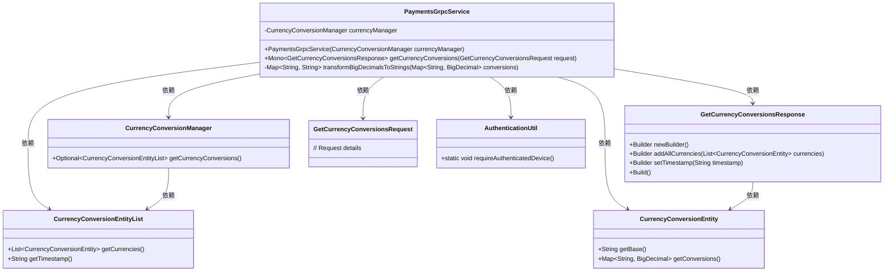
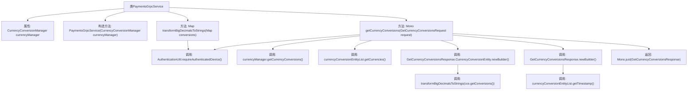

# 基础信息

|      |      |
|------|------|
| 名称 | PaymentsGrpcService |
| 编码语言 | .java |
| 代码路径 | Signal-Server/service/src/main/java/org/whispersystems/textsecuregcm/grpc/PaymentsGrpcService.java |
| 包名 | org.whispersystems.textsecuregcm.grpc |
| 依赖项 | ['java.util.Objects.requireNonNull', 'io.grpc.Status', 'java.math.BigDecimal', 'java.util.List', 'java.util.Map', 'java.util.stream.Collectors', 'javax.annotation.Nonnull', 'org.apache.commons.lang3.tuple.Pair', 'org.signal.chat.payments.GetCurrencyConversionsRequest', 'org.signal.chat.payments.GetCurrencyConversionsResponse', 'org.signal.chat.payments.ReactorPaymentsGrpc', 'org.whispersystems.textsecuregcm.auth.grpc.AuthenticationUtil', 'org.whispersystems.textsecuregcm.currency.CurrencyConversionManager', 'org.whispersystems.textsecuregcm.entities.CurrencyConversionEntityList', 'reactor.core.publisher.Mono'] |
| 概述说明 | PaymentsGrpcService处理货币转换，验证设备并返回结果。 |

# 说明

PaymentsGrpcService负责处理货币转换请求，首先验证设备的认证信息，确保请求来源的合法性和安全性。在认证通过后，服务执行货币转换计算，最终将转换结果返回给请求方。整个过程涵盖了认证验证和货币转换两个关键步骤，确保服务的可靠性和准确性。

# 类列表 Class Summary

| 名称   | 类型  | 说明 |
|-------|------|-------------|
| PaymentsGrpcService | class | PaymentsGrpcService处理货币转换请求，验证设备认证并返回转换结果。 |

## 类 PaymentsGrpcService

|      |      |
|------|------|
| 访问范围 | public |
| 类型 | class |
| 名称 | PaymentsGrpcService |
| 说明 | PaymentsGrpcService处理货币转换请求，验证设备认证并返回转换结果。 |

### UML类图

这段代码描述了一个名为 `PaymentsGrpcService` 的类，它继承自 `ReactorPaymentsGrpc.PaymentsImplBase`，主要用于处理与货币转换相关的gRPC请求。`PaymentsGrpcService` 依赖于 `CurrencyConversionManager` 来获取货币转换数据，并通过 `AuthenticationUtil` 进行设备认证。`getCurrencyConversions` 方法处理请求并返回包含货币转换信息的响应。`transformBigDecimalsToStrings` 方法将 `BigDecimal` 类型的货币转换值转换为字符串格式。整个流程涉及多个类和接口的协作，确保了数据的正确获取和处理。

### 内部方法调用关系图

这段代码定义了一个`PaymentsGrpcService`类，继承自`ReactorPaymentsGrpc.PaymentsImplBase`，用于处理货币转换的gRPC请求。类中包含一个构造方法和两个主要方法：`getCurrencyConversions`和`transformBigDecimalsToStrings`。`getCurrencyConversions`方法首先验证设备认证，然后从`currencyManager`获取货币转换数据，将其转换为响应格式并返回。`transformBigDecimalsToStrings`方法将`BigDecimal`类型的货币转换数据转换为字符串格式。整个流程涉及到多个内部方法调用和数据处理步骤。

### 字段列表 Field List

| 名称  | 类型  | 说明 |
|-------|-------|------|
| currencyManager | CurrencyConversionManager | 私有且不可变的货币转换管理器实例。 |

### 方法列表 Method List

| 名称  | 类型  | 说明 |
|-------|-------|------|
| transformBigDecimalsToStrings | Map<String, String> | 将BigDecimal映射转换为字符串映射，需设备认证。 |
| getCurrencyConversions | Mono<GetCurrencyConversionsResponse> | 该方法获取货币转换数据，验证设备认证，处理并返回转换结果。 |

