# 基础信息

|      |      |
|------|------|
| 名称 | ProfileAnonymousGrpcService |
| 编码语言 | .java |
| 代码路径 | Signal-Server/service/src/main/java/org/whispersystems/textsecuregcm/grpc/ProfileAnonymousGrpcService.java |
| 包名 | org.whispersystems.textsecuregcm.grpc |
| 依赖项 | ['io.grpc.Status', 'java.time.Clock', 'java.util.List', 'org.signal.chat.profile.CredentialType', 'org.signal.chat.profile.GetExpiringProfileKeyCredentialAnonymousRequest', 'org.signal.chat.profile.GetExpiringProfileKeyCredentialResponse', 'org.signal.chat.profile.GetUnversionedProfileAnonymousRequest', 'org.signal.chat.profile.GetUnversionedProfileResponse', 'org.signal.chat.profile.GetVersionedProfileAnonymousRequest', 'org.signal.chat.profile.GetVersionedProfileResponse', 'org.signal.chat.profile.ReactorProfileAnonymousGrpc', 'org.signal.libsignal.zkgroup.ServerSecretParams', 'org.signal.libsignal.zkgroup.profiles.ServerZkProfileOperations', 'org.whispersystems.textsecuregcm.auth.UnidentifiedAccessUtil', 'org.whispersystems.textsecuregcm.badges.ProfileBadgeConverter', 'org.whispersystems.textsecuregcm.identity.IdentityType', 'org.whispersystems.textsecuregcm.identity.ServiceIdentifier', 'org.whispersystems.textsecuregcm.storage.Account', 'org.whispersystems.textsecuregcm.storage.AccountsManager', 'org.whispersystems.textsecuregcm.storage.ProfilesManager', 'reactor.core.publisher.Mono'] |
| 概述说明 | 匿名GRPC服务处理用户资料请求，支持多种密钥凭证获取方式。 |

# 说明

匿名GRPC服务能够处理用户资料请求，支持三种不同的凭证获取方式：未版本化、版本化和过期密钥。未版本化方式适用于不需要特定版本的用户资料请求，版本化方式允许用户获取指定版本的用户资料，而过期密钥方式则用于处理使用已过期密钥的请求。该服务通过灵活的凭证管理，确保用户资料请求的安全性和准确性。

# 类列表 Class Summary

| 名称   | 类型  | 说明 |
|-------|------|-------------|
| ProfileAnonymousGrpcService | class | 匿名GRPC服务处理用户资料请求，支持未版本化、版本化和过期密钥凭证获取。 |

## 类 ProfileAnonymousGrpcService

|      |      |
|------|------|
| 访问范围 | public |
| 类型 | class |
| 名称 | ProfileAnonymousGrpcService |
| 说明 | 匿名GRPC服务处理用户资料请求，支持未版本化、版本化和过期密钥凭证获取。 |

### UML类图

```mermaid
classDiagram
    class ProfileAnonymousGrpcService {
        -AccountsManager accountsManager
        -ProfilesManager profilesManager
        -ProfileBadgeConverter profileBadgeConverter
        -ServerZkProfileOperations zkProfileOperations
        -GroupSendTokenUtil groupSendTokenUtil
        +ProfileAnonymousGrpcService(AccountsManager accountsManager, ProfilesManager profilesManager, ProfileBadgeConverter profileBadgeConverter, ServerSecretParams serverSecretParams)
        +Mono~GetUnversionedProfileResponse~ getUnversionedProfile(GetUnversionedProfileAnonymousRequest request)
        +Mono~GetVersionedProfileResponse~ getVersionedProfile(GetVersionedProfileAnonymousRequest request)
        +Mono~GetExpiringProfileKeyCredentialResponse~ getExpiringProfileKeyCredential(GetExpiringProfileKeyCredentialAnonymousRequest request)
        -Mono~Account~ getTargetAccountAndValidateUnidentifiedAccess(ServiceIdentifier targetIdentifier, byte[] unidentifiedAccessKey)
    }

    class AccountsManager {
        <<Interface>>
        +Mono~Account~ getByServiceIdentifierAsync(ServiceIdentifier targetIdentifier)
    }

    class ProfilesManager {
        <<Interface>>
    }

    class ProfileBadgeConverter {
        <<Interface>>
    }

    class ServerZkProfileOperations {
        +ServerZkProfileOperations(ServerSecretParams serverSecretParams)
    }

    class GroupSendTokenUtil {
        +GroupSendTokenUtil(ServerSecretParams serverSecretParams, Clock clock)
        +Mono~Void~ checkGroupSendToken(GroupSendToken groupSendToken, List~ServiceIdentifier~ targetIdentifiers)
    }

    class ServiceIdentifierUtil {
        +ServiceIdentifier fromGrpcServiceIdentifier(GrpcServiceIdentifier grpcServiceIdentifier)
    }

    class UnidentifiedAccessUtil {
        +boolean checkUnidentifiedAccess(Account account, byte[] unidentifiedAccessKey)
    }

    class ProfileGrpcHelper {
        +GetUnversionedProfileResponse buildUnversionedProfileResponse(ServiceIdentifier targetIdentifier, Object context, Account targetAccount, ProfileBadgeConverter profileBadgeConverter)
        +Mono~GetVersionedProfileResponse~ getVersionedProfile(Account targetAccount, ProfilesManager profilesManager, String version)
        +Mono~GetExpiringProfileKeyCredentialResponse~ getExpiringProfileKeyCredentialResponse(UUID uuid, String version, byte[] credentialRequest, ProfilesManager profilesManager, ServerZkProfileOperations zkProfileOperations)
    }

    ProfileAnonymousGrpcService --> AccountsManager : 依赖
    ProfileAnonymousGrpcService --> ProfilesManager : 依赖
    ProfileAnonymousGrpcService --> ProfileBadgeConverter : 依赖
    ProfileAnonymousGrpcService --> ServerZkProfileOperations : 依赖
    ProfileAnonymousGrpcService --> GroupSendTokenUtil : 依赖
    ProfileAnonymousGrpcService --> ServiceIdentifierUtil : 依赖
    ProfileAnonymousGrpcService --> UnidentifiedAccessUtil : 依赖
    ProfileAnonymousGrpcService --> ProfileGrpcHelper : 依赖
```

这段代码定义了一个名为 `ProfileAnonymousGrpcService` 的类，它继承自 `ReactorProfileAnonymousGrpc.ProfileAnonymousImplBase`，用于处理与匿名用户配置文件相关的gRPC请求。该类依赖于多个管理器（如 `AccountsManager` 和 `ProfilesManager`）和工具类（如 `ProfileBadgeConverter` 和 `ServerZkProfileOperations`）来执行其功能。代码中的方法主要处理获取未版本化、版本化和即将过期的配置文件凭证的请求，并在处理过程中进行身份验证和权限检查。

### 内部方法调用关系图

```mermaid
graph TD
    A["类ProfileAnonymousGrpcService"]
    B["属性: AccountsManager accountsManager"]
    C["属性: ProfilesManager profilesManager"]
    D["属性: ProfileBadgeConverter profileBadgeConverter"]
    E["属性: ServerZkProfileOperations zkProfileOperations"]
    F["属性: GroupSendTokenUtil groupSendTokenUtil"]
    G["构造方法: ProfileAnonymousGrpcService"]
    H["方法: Mono<GetUnversionedProfileResponse> getUnversionedProfile"]
    I["方法: Mono<GetVersionedProfileResponse> getVersionedProfile"]
    J["方法: Mono<GetExpiringProfileKeyCredentialResponse> getExpiringProfileKeyCredential"]
    K["私有方法: Mono<Account> getTargetAccountAndValidateUnidentifiedAccess"]

    A --> B
    A --> C
    A --> D
    A --> E
    A --> F
    A --> G
    A --> H
    A --> I
    A --> J
    A -.-> K

    H --> L["ServiceIdentifierUtil.fromGrpcServiceIdentifier"]
    H --> M["检查IdentityType"]
    H --> N["groupSendTokenUtil.checkGroupSendToken"]
    H --> O["accountsManager.getByServiceIdentifierAsync"]
    H --> P["getTargetAccountAndValidateUnidentifiedAccess"]
    H --> Q["ProfileGrpcHelper.buildUnversionedProfileResponse"]

    I --> R["ServiceIdentifierUtil.fromGrpcServiceIdentifier"]
    I --> S["检查IdentityType"]
    I --> T["getTargetAccountAndValidateUnidentifiedAccess"]
    I --> U["ProfileGrpcHelper.getVersionedProfile"]

    J --> V["ServiceIdentifierUtil.fromGrpcServiceIdentifier"]
    J --> W["检查IdentityType"]
    J --> X["检查CredentialType"]
    J --> Y["getTargetAccountAndValidateUnidentifiedAccess"]
    J --> Z["ProfileGrpcHelper.getExpiringProfileKeyCredentialResponse"]

    K --> AA["accountsManager.getByServiceIdentifierAsync"]
    K --> AB["UnidentifiedAccessUtil.checkUnidentifiedAccess"]
```

这段代码定义了一个名为`ProfileAnonymousGrpcService`的类，该类继承自`ReactorProfileAnonymousGrpc.ProfileAnonymousImplBase`。类中包含多个方法，用于处理不同类型的匿名Grpc请求，如获取未版本化的个人资料、获取版本化的个人资料以及获取过期的个人资料密钥凭证。每个方法都通过调用其他工具类和管理器来验证请求并返回相应的响应。流程图展示了类中各个方法的调用关系以及它们之间的依赖关系，清晰地描述了代码的执行流程。

### 字段列表 Field List

| 名称  | 类型  | 说明 |
|-------|-------|------|
| accountsManager | AccountsManager | 私有且不可变的账户管理器实例。 |
| zkProfileOperations | ServerZkProfileOperations | 私有且不可变的ServerZkProfileOperations实例。 |
| profileBadgeConverter | ProfileBadgeConverter | ProfileBadgeConverter的私有最终实例变量。 |
| profilesManager | ProfilesManager | 私有且不可变的ProfilesManager实例。 |
| groupSendTokenUtil | GroupSendTokenUtil | 私有常量GroupSendTokenUtil实例变量groupSendTokenUtil。 |

### 方法列表 Method List

| 名称  | 类型  | 说明 |
|-------|-------|------|
| getVersionedProfile | Mono<GetVersionedProfileResponse> | 方法获取版本化配置文件，验证身份类型为ACI，返回目标账户的版本化配置。 |
| getExpiringProfileKeyCredential | Mono<GetExpiringProfileKeyCredentialResponse> | 方法验证请求类型并返回过期配置文件密钥凭证响应。 |
| getTargetAccountAndValidateUnidentifiedAccess | Mono<Account> | 通过异步获取目标账户并验证未识别访问权限，若失败则抛出未认证异常。 |
| getUnversionedProfile | Mono<GetUnversionedProfileResponse> | 获取未版本化用户档案的方法，需验证身份，处理不同认证方式并返回响应。 |

