# 基础信息

|      |      |
|------|------|
| 名称 | ProfileGrpcHelper |
| 编码语言 | .java |
| 代码路径 | Signal-Server/service/src/main/java/org/whispersystems/textsecuregcm/grpc/ProfileGrpcHelper.java |
| 包名 | org.whispersystems.textsecuregcm.grpc |
| 依赖项 | ['com.google.common.annotations.VisibleForTesting', 'com.google.protobuf.ByteString', 'io.grpc.Status', 'java.util.ArrayList', 'java.util.Arrays', 'java.util.List', 'java.util.UUID', 'org.signal.chat.profile.Badge', 'org.signal.chat.profile.BadgeSvg', 'org.signal.chat.profile.GetExpiringProfileKeyCredentialResponse', 'org.signal.chat.profile.GetUnversionedProfileResponse', 'org.signal.chat.profile.GetVersionedProfileResponse', 'org.signal.libsignal.protocol.ServiceId', 'org.signal.libsignal.zkgroup.InvalidInputException', 'org.signal.libsignal.zkgroup.VerificationFailedException', 'org.signal.libsignal.zkgroup.profiles.ExpiringProfileKeyCredentialResponse', 'org.signal.libsignal.zkgroup.profiles.ServerZkProfileOperations', 'org.whispersystems.textsecuregcm.auth.UnidentifiedAccessChecksum', 'org.whispersystems.textsecuregcm.badges.ProfileBadgeConverter', 'org.whispersystems.textsecuregcm.identity.ServiceIdentifier', 'org.whispersystems.textsecuregcm.storage.Account', 'org.whispersystems.textsecuregcm.storage.DeviceCapability', 'org.whispersystems.textsecuregcm.storage.ProfilesManager', 'org.whispersystems.textsecuregcm.storage.VersionedProfile', 'org.whispersystems.textsecuregcm.util.ProfileHelper', 'reactor.core.publisher.Mono'] |
| 概述说明 | ProfileGrpcHelper类负责处理用户档案、徽章和设备能力信息的GRPC接口。 |

# 说明

ProfileGrpcHelper类是一个用于处理GRPC接口的工具，主要负责管理用户档案、徽章和设备能力信息。该类通过GRPC协议与客户端进行通信，确保数据的准确传输和处理。它涵盖了用户档案的创建、更新和查询，徽章的授予和管理，以及设备能力的检测和配置。通过这一工具，系统能够高效地处理与用户相关的各种信息，确保数据的完整性和一致性。

# 类列表 Class Summary

| 名称   | 类型  | 说明 |
|-------|------|-------------|
| ProfileGrpcHelper | class | ProfileGrpcHelper类提供GRPC接口，处理用户档案、徽章和设备能力信息。 |

## 类 ProfileGrpcHelper

|      |      |
|------|------|
| 访问范围 | public |
| 类型 | class |
| 名称 | ProfileGrpcHelper |
| 说明 | ProfileGrpcHelper类提供GRPC接口，处理用户档案、徽章和设备能力信息。 |

### UML类图

```mermaid
classDiagram
    class ProfileGrpcHelper {
        +static Mono~GetVersionedProfileResponse~ getVersionedProfile(Account account, ProfilesManager profilesManager, String requestVersion)
        +static List~Badge~ buildBadges(List~org.whispersystems.textsecuregcm.entities.Badge~ badges)
        +static List~org.signal.chat.common.DeviceCapability~ buildAccountCapabilities(Account account)
        -static List~BadgeSvg~ buildBadgeSvgs(List~org.whispersystems.textsecuregcm.entities.BadgeSvg~ badgeSvgs)
        +static GetUnversionedProfileResponse buildUnversionedProfileResponse(ServiceIdentifier targetIdentifier, UUID requesterUuid, Account targetAccount, ProfileBadgeConverter profileBadgeConverter)
        +static Mono~GetExpiringProfileKeyCredentialResponse~ getExpiringProfileKeyCredentialResponse(UUID targetUuid, String version, byte[] encodedCredentialRequest, ProfilesManager profilesManager, ServerZkProfileOperations zkProfileOperations)
    }

    class Account {
        +UUID getUuid()
        +Optional~String~ getCurrentProfileVersion()
        +boolean isUnrestrictedUnidentifiedAccess()
        +Optional~byte[]~ getUnidentifiedAccessKey()
        +List~org.whispersystems.textsecuregcm.entities.Badge~ getBadges()
        +boolean hasCapability(DeviceCapability capability)
        +byte[] getIdentityKey(IdentityType identityType)
    }

    class ProfilesManager {
        +CompletableFuture~Optional~VersionedProfile~~ getAsync(UUID uuid, String version)
    }

    class ProfileBadgeConverter {
        +List~org.whispersystems.textsecuregcm.entities.Badge~ convert(List~Locale~ locales, List~org.whispersystems.textsecuregcm.entities.Badge~ badges, boolean isSelfProfileRequest)
    }

    class ServerZkProfileOperations {
        +ExpiringProfileKeyCredentialResponse getExpiringProfileKeyCredential(byte[] encodedCredentialRequest, VersionedProfile profile, ServiceId.Aci aci)
    }

    class ServiceIdentifier {
        +IdentityType identityType()
    }

    class VersionedProfile {
        +String name()
        +String about()
        +String aboutEmoji()
        +String avatar()
        +String phoneNumberSharing()
        +String paymentAddress()
    }

    class DeviceCapability {
        +static boolean includeInProfile()
    }

    class DeviceCapabilityUtil {
        +static org.signal.chat.common.DeviceCapability toGrpcDeviceCapability(DeviceCapability capability)
    }

    class ProfileHelper {
        +static ExpiringProfileKeyCredentialResponse getExpiringProfileKeyCredential(byte[] encodedCredentialRequest, VersionedProfile profile, ServiceId.Aci aci, ServerZkProfileOperations zkProfileOperations)
    }

    class RequestAttributesUtil {
        +static List~Locale~ getAvailableAcceptedLocales()
    }

    ProfileGrpcHelper --> Account : 依赖
    ProfileGrpcHelper --> ProfilesManager : 依赖
    ProfileGrpcHelper --> ProfileBadgeConverter : 依赖
    ProfileGrpcHelper --> ServerZkProfileOperations : 依赖
    ProfileGrpcHelper --> ServiceIdentifier : 依赖
    ProfileGrpcHelper --> VersionedProfile : 依赖
    ProfileGrpcHelper --> DeviceCapability : 依赖
    ProfileGrpcHelper --> DeviceCapabilityUtil : 依赖
    ProfileGrpcHelper --> ProfileHelper : 依赖
    ProfileGrpcHelper --> RequestAttributesUtil : 依赖
```

这段代码展示了 `ProfileGrpcHelper` 类，它主要负责处理与用户档案相关的 gRPC 请求。该类包含了多个静态方法，用于获取版本化档案、构建徽章列表、处理设备能力、生成未版本化档案响应以及获取过期的档案密钥凭证响应。`ProfileGrpcHelper` 类依赖于多个其他类，如 `Account`、`ProfilesManager`、`ProfileBadgeConverter` 等，来完成这些任务。每个方法都有明确的职责，并通过调用其他类的方法来实现其功能。

### 内部方法调用关系图

```mermaid
graph TD
    A["类ProfileGrpcHelper"]
    B["方法: getVersionedProfile(Account account, ProfilesManager profilesManager, String requestVersion)"]
    C["方法: buildBadges(List<org.whispersystems.textsecuregcm.entities.Badge> badges)"]
    D["方法: buildAccountCapabilities(Account account)"]
    E["方法: buildBadgeSvgs(List<org.whispersystems.textsecuregcm.entities.BadgeSvg> badgeSvgs)"]
    F["方法: buildUnversionedProfileResponse(ServiceIdentifier targetIdentifier, UUID requesterUuid, Account targetAccount, ProfileBadgeConverter profileBadgeConverter)"]
    G["方法: getExpiringProfileKeyCredentialResponse(UUID targetUuid, String version, byte[] encodedCredentialRequest, ProfilesManager profilesManager, ServerZkProfileOperations zkProfileOperations)"]
    H["内部调用: profilesManager.getAsync(account.getUuid(), requestVersion)"]
    I["内部调用: maybeProfile.map(VersionedProfile::name).map(ByteString::copyFrom).ifPresent(responseBuilder::setName)"]
    J["内部调用: maybeProfile.map(VersionedProfile::about).map(ByteString::copyFrom).ifPresent(responseBuilder::setAbout)"]
    K["内部调用: maybeProfile.map(VersionedProfile::aboutEmoji).map(ByteString::copyFrom).ifPresent(responseBuilder::setAboutEmoji)"]
    L["内部调用: maybeProfile.map(VersionedProfile::avatar).ifPresent(responseBuilder::setAvatar)"]
    M["内部调用: maybeProfile.map(VersionedProfile::phoneNumberSharing).map(ByteString::copyFrom).ifPresent(responseBuilder::setPhoneNumberSharing)"]
    N["内部调用: maybeProfile.filter(p -> account.getCurrentProfileVersion().map(v -> v.equals(requestVersion)).orElse(true)).map(VersionedProfile::paymentAddress).map(ByteString::copyFrom).ifPresent(responseBuilder::setPaymentAddress)"]
    O["内部调用: responseBuilder.build()"]
    P["内部调用: badge.getSprites6()"]
    Q["内部调用: badge.getSvgs()"]
    R["内部调用: buildBadgeSvgs(badge.getSvgs())"]
    S["内部调用: DeviceCapabilityUtil.toGrpcDeviceCapability(DeviceCapability)"]
    T["内部调用: targetAccount.getIdentityKey(targetIdentifier.identityType()).serialize()"]
    U["内部调用: profileBadgeConverter.convert(RequestAttributesUtil.getAvailableAcceptedLocales(), targetAccount.getBadges(), ProfileHelper.isSelfProfileRequest(requesterUuid, targetIdentifier))"]
    V["内部调用: UnidentifiedAccessChecksum.generateFor(targetAccount.getUnidentifiedAccessKey())"]
    W["内部调用: ProfileHelper.getExpiringProfileKeyCredential(encodedCredentialRequest, profile, new ServiceId.Aci(targetUuid), zkProfileOperations)"]
    X["内部调用: profileKeyCredentialResponse.serialize()"]

    A --> B
    A --> C
    A --> D
    A --> E
    A --> F
    A --> G
    B --> H
    B --> I
    B --> J
    B --> K
    B --> L
    B --> M
    B --> N
    B --> O
    C --> P
    C --> Q
    C --> R
    D --> S
    F --> T
    F --> U
    F --> V
    G --> W
    G --> X
```

这段代码展示了`ProfileGrpcHelper`类的多个方法，主要用于处理与用户配置文件相关的操作。`getVersionedProfile`方法用于获取指定版本的配置文件，`buildBadges`方法用于构建徽章列表，`buildAccountCapabilities`方法用于构建账户能力列表，`buildBadgeSvgs`方法用于构建徽章SVG列表，`buildUnversionedProfileResponse`方法用于构建未版本化的配置文件响应，`getExpiringProfileKeyCredentialResponse`方法用于获取过期的配置文件密钥凭证响应。这些方法通过调用内部函数和外部API来完成各自的逻辑。

### 字段列表 Field List

| 名称  | 类型  | 说明 |
|-------|-------|------|

### 方法列表 Method List

| 名称  | 类型  | 说明 |
|-------|-------|------|
| buildAccountCapabilities | List<org.signal.chat.common.DeviceCapability> | 测试用方法，构建账户设备能力列表。 |
| getVersionedProfile | Mono<GetVersionedProfileResponse> | 方法获取指定版本的账户信息，若不存在则报错，并构建响应。 |
| buildBadgeSvgs | List<BadgeSvg> | 将BadgeSvg列表转换为gRPC格式的BadgeSvg列表。 |
| getExpiringProfileKeyCredentialResponse | Mono<GetExpiringProfileKeyCredentialResponse> | 通过目标UUID和版本获取过期配置文件密钥凭证，处理异常并返回响应。 |
| buildUnversionedProfileResponse | GetUnversionedProfileResponse | 构建未版本化配置文件响应，设置身份密钥和能力，根据身份类型添加未限制未识别访问和徽章。 |
| buildBadges | List<Badge> | 将外部徽章列表转换为gRPC徽章列表的方法。 |

