# 基础信息

|      |      |
|------|------|
| 名称 | ProfileGrpcService |
| 编码语言 | .java |
| 代码路径 | Signal-Server/service/src/main/java/org/whispersystems/textsecuregcm/grpc/ProfileGrpcService.java |
| 包名 | org.whispersystems.textsecuregcm.grpc |
| 依赖项 | ['com.google.protobuf.ByteString', 'io.grpc.Status', 'java.time.Clock', 'java.time.ZonedDateTime', 'java.util.ArrayList', 'java.util.List', 'java.util.Map', 'java.util.Optional', 'java.util.UUID', 'java.util.function.Function', 'java.util.stream.Collectors', 'org.signal.chat.profile.CredentialType', 'org.signal.chat.profile.GetExpiringProfileKeyCredentialRequest', 'org.signal.chat.profile.GetExpiringProfileKeyCredentialResponse', 'org.signal.chat.profile.GetUnversionedProfileRequest', 'org.signal.chat.profile.GetUnversionedProfileResponse', 'org.signal.chat.profile.GetVersionedProfileRequest', 'org.signal.chat.profile.GetVersionedProfileResponse', 'org.signal.chat.profile.ProfileAvatarUploadAttributes', 'org.signal.chat.profile.ReactorProfileGrpc', 'org.signal.chat.profile.SetProfileRequest', 'org.signal.chat.profile.SetProfileRequest.AvatarChange', 'org.signal.chat.profile.SetProfileResponse', 'org.signal.libsignal.zkgroup.profiles.ServerZkProfileOperations', 'org.whispersystems.textsecuregcm.auth.grpc.AuthenticatedDevice', 'org.whispersystems.textsecuregcm.auth.grpc.AuthenticationUtil', 'org.whispersystems.textsecuregcm.badges.ProfileBadgeConverter', 'org.whispersystems.textsecuregcm.configuration.BadgeConfiguration', 'org.whispersystems.textsecuregcm.configuration.BadgesConfiguration', 'org.whispersystems.textsecuregcm.configuration.dynamic.DynamicConfiguration', 'org.whispersystems.textsecuregcm.identity.IdentityType', 'org.whispersystems.textsecuregcm.identity.ServiceIdentifier', 'org.whispersystems.textsecuregcm.limits.RateLimiters', 'org.whispersystems.textsecuregcm.s3.PolicySigner', 'org.whispersystems.textsecuregcm.s3.PostPolicyGenerator', 'org.whispersystems.textsecuregcm.storage.Account', 'org.whispersystems.textsecuregcm.storage.AccountBadge', 'org.whispersystems.textsecuregcm.storage.AccountsManager', 'org.whispersystems.textsecuregcm.storage.DynamicConfigurationManager', 'org.whispersystems.textsecuregcm.storage.ProfilesManager', 'org.whispersystems.textsecuregcm.storage.VersionedProfile', 'org.whispersystems.textsecuregcm.util.Pair', 'org.whispersystems.textsecuregcm.util.ProfileHelper', 'reactor.core.publisher.Flux', 'reactor.core.publisher.Mono', 'software.amazon.awssdk.services.s3.S3AsyncClient', 'software.amazon.awssdk.services.s3.model.DeleteObjectRequest'] |
| 概述说明 | ProfileGrpcService负责用户配置文件的设置、获取和验证操作。 |

# 说明

ProfileGrpcService是一个专门处理用户配置文件相关操作的GRPC服务。它提供了设置、获取和验证配置文件信息的功能，确保用户数据的管理和验证过程高效且可靠。通过该服务，用户可以轻松更新和查询自己的配置文件，同时系统能够对配置信息的准确性和完整性进行验证，从而保障数据的一致性和安全性。

# 类列表 Class Summary

| 名称   | 类型  | 说明 |
|-------|------|-------------|
| ProfileGrpcService | class | ProfileGrpcService处理用户配置文件相关操作，包括设置、获取及验证配置文件信息。 |

## 类 ProfileGrpcService

|      |      |
|------|------|
| 访问范围 | public |
| 类型 | class |
| 名称 | ProfileGrpcService |
| 说明 | ProfileGrpcService处理用户配置文件相关操作，包括设置、获取及验证配置文件信息。 |

### UML类图

```mermaid
classDiagram
    class ProfileGrpcService {
        -Clock clock
        -AccountsManager accountsManager
        -ProfilesManager profilesManager
        -DynamicConfigurationManager~DynamicConfiguration~ dynamicConfigurationManager
        -Map~String, BadgeConfiguration~ badgeConfigurationMap
        -S3AsyncClient asyncS3client
        -PostPolicyGenerator policyGenerator
        -PolicySigner policySigner
        -ProfileBadgeConverter profileBadgeConverter
        -RateLimiters rateLimiters
        -ServerZkProfileOperations zkProfileOperations
        -String bucket
        +ProfileGrpcService(Clock, AccountsManager, ProfilesManager, DynamicConfigurationManager~DynamicConfiguration~, BadgesConfiguration, S3AsyncClient, PostPolicyGenerator, PolicySigner, ProfileBadgeConverter, RateLimiters, ServerZkProfileOperations, String)
        +Mono~SetProfileResponse~ setProfile(SetProfileRequest)
        +Mono~GetUnversionedProfileResponse~ getUnversionedProfile(GetUnversionedProfileRequest)
        +Mono~GetVersionedProfileResponse~ getVersionedProfile(GetVersionedProfileRequest)
        +Mono~GetExpiringProfileKeyCredentialResponse~ getExpiringProfileKeyCredential(GetExpiringProfileKeyCredentialRequest)
        -Mono~Account~ validateRateLimitAndGetAccount(UUID, ServiceIdentifier)
        -void validateRequest(SetProfileRequest)
        -void checkByteStringLength(ByteString, String, List~Integer~)
        -ProfileAvatarUploadAttributes generateAvatarUploadForm(String)
    }

    class AvatarData {
        -Optional~String~ currentAvatar
        -Optional~String~ finalAvatar
        -Optional~ProfileAvatarUploadAttributes~ uploadAttributes
        +AvatarData(Optional~String~, Optional~String~, Optional~ProfileAvatarUploadAttributes~)
    }

    class AccountsManager {
        <<Interface>>
        +Mono~Optional~Account~~ getByAccountIdentifierAsync(UUID)
        +Mono~Void~ updateAsync(Account, Consumer~Account~)
        +Mono~Optional~Account~~ getByServiceIdentifierAsync(ServiceIdentifier)
    }

    class ProfilesManager {
        <<Interface>>
        +Mono~Optional~VersionedProfile~~ getAsync(UUID, String)
        +Mono~Void~ setAsync(UUID, VersionedProfile)
    }

    class DynamicConfigurationManager~T~ {
        <<Interface>>
        +DynamicConfiguration getConfiguration()
    }

    class BadgesConfiguration {
        +List~BadgeConfiguration~ getBadges()
    }

    class BadgeConfiguration {
        +String getId()
    }

    class S3AsyncClient {
        +Mono~DeleteObjectResponse~ deleteObject(DeleteObjectRequest)
    }

    class PostPolicyGenerator {
        +Pair~String, String~ createFor(ZonedDateTime, String, Long)
    }

    class PolicySigner {
        +String getSignature(ZonedDateTime, String)
    }

    class ProfileBadgeConverter {
        +ProfileBadge convert(AccountBadge)
    }

    class RateLimiters {
        +RateLimiter getProfileLimiter()
    }

    class ServerZkProfileOperations {
        +Mono~ExpiringProfileKeyCredentialResponse~ getExpiringProfileKeyCredential(UUID, String, ByteString)
    }

    class Account {
        -UUID uuid
        -String number
        -List~AccountBadge~ badges
        -String currentProfileVersion
        +UUID getUuid()
        +String getNumber()
        +List~AccountBadge~ getBadges()
        +void setBadges(Clock, List~AccountBadge~)
        +void setCurrentProfileVersion(String)
    }

    class VersionedProfile {
        -String version
        -ByteString name
        -String avatar
        -ByteString aboutEmoji
        -ByteString about
        -ByteString paymentAddress
        -ByteString phoneNumberSharing
        -ByteString commitment
        +String getVersion()
        +String getAvatar()
        +ByteString getPaymentAddress()
    }

    class ProfileAvatarUploadAttributes {
        -String path
        -String credential
        -String acl
        -String algorithm
        -String date
        -String policy
        -ByteString signature
        +String getPath()
        +String getCredential()
        +String getAcl()
        +String getAlgorithm()
        +String getDate()
        +String getPolicy()
        +ByteString getSignature()
    }

    class ServiceIdentifier {
        +IdentityType identityType()
    }

    class IdentityType {
        <<Enumeration>>
        ACI
    }

    class CredentialType {
        <<Enumeration>>
        CREDENTIAL_TYPE_EXPIRING_PROFILE_KEY
    }

    ProfileGrpcService --> AccountsManager : 依赖
    ProfileGrpcService --> ProfilesManager : 依赖
    ProfileGrpcService --> DynamicConfigurationManager~DynamicConfiguration~ : 依赖
    ProfileGrpcService --> BadgesConfiguration : 依赖
    ProfileGrpcService --> S3AsyncClient : 依赖
    ProfileGrpcService --> PostPolicyGenerator : 依赖
    ProfileGrpcService --> PolicySigner : 依赖
    ProfileGrpcService --> ProfileBadgeConverter : 依赖
    ProfileGrpcService --> RateLimiters : 依赖
    ProfileGrpcService --> ServerZkProfileOperations : 依赖
    ProfileGrpcService --> AvatarData : 依赖
    ProfileGrpcService --> Account : 依赖
    ProfileGrpcService --> VersionedProfile : 依赖
    ProfileGrpcService --> ProfileAvatarUploadAttributes : 依赖
    ProfileGrpcService --> ServiceIdentifier : 依赖
    ProfileGrpcService --> IdentityType : 依赖
    ProfileGrpcService --> CredentialType : 依赖
```

### 描述：
`ProfileGrpcService` 是一个基于 gRPC 的服务类，用于处理用户个人资料相关的请求。它依赖于多个管理器和工具类，如 `AccountsManager`、`ProfilesManager`、`DynamicConfigurationManager` 等，来执行用户资料的获取、更新和验证操作。该类通过 `setProfile`、`getUnversionedProfile`、`getVersionedProfile` 和 `getExpiringProfileKeyCredential` 方法提供不同的个人资料操作。`AvatarData` 是一个内部记录类，用于管理用户头像的相关数据。

### 内部方法调用关系图

```mermaid
graph TD
    A["类ProfileGrpcService"]
    B["属性: Clock clock"]
    C["属性: AccountsManager accountsManager"]
    D["属性: ProfilesManager profilesManager"]
    E["属性: DynamicConfigurationManager<DynamicConfiguration> dynamicConfigurationManager"]
    F["属性: Map<String, BadgeConfiguration> badgeConfigurationMap"]
    G["属性: S3AsyncClient asyncS3client"]
    H["属性: PostPolicyGenerator policyGenerator"]
    I["属性: PolicySigner policySigner"]
    J["属性: ProfileBadgeConverter profileBadgeConverter"]
    K["属性: RateLimiters rateLimiters"]
    L["属性: ServerZkProfileOperations zkProfileOperations"]
    M["属性: String bucket"]
    N["内部类: AvatarData"]
    O["构造方法: ProfileGrpcService"]
    P["方法: Mono<SetProfileResponse> setProfile(SetProfileRequest request)"]
    Q["方法: Mono<GetUnversionedProfileResponse> getUnversionedProfile(GetUnversionedProfileRequest request)"]
    R["方法: Mono<GetVersionedProfileResponse> getVersionedProfile(GetVersionedProfileRequest request)"]
    S["方法: Mono<GetExpiringProfileKeyCredentialResponse> getExpiringProfileKeyCredential(GetExpiringProfileKeyCredentialRequest request)"]
    T["方法: Mono<Account> validateRateLimitAndGetAccount(UUID requesterUuid, ServiceIdentifier targetIdentifier)"]
    U["方法: void validateRequest(SetProfileRequest request)"]
    V["方法: void checkByteStringLength(ByteString byteString, String errorMessage, List<Integer> allowedLengths)"]
    W["方法: ProfileAvatarUploadAttributes generateAvatarUploadForm(String objectName)"]

    A --> B
    A --> C
    A --> D
    A --> E
    A --> F
    A --> G
    A --> H
    A --> I
    A --> J
    A --> K
    A --> L
    A --> M
    A --> N
    A --> O
    A --> P
    A --> Q
    A --> R
    A --> S
    A --> T
    A --> U
    A --> V
    A --> W
```

**描述**：  
`ProfileGrpcService` 是一个基于 gRPC 的服务类，用于处理用户配置文件的创建、更新和查询。它包含多个属性和方法，用于管理用户账户、配置文件、动态配置、速率限制等。主要方法包括 `setProfile`、`getUnversionedProfile`、`getVersionedProfile` 和 `getExpiringProfileKeyCredential`，分别用于设置配置文件、获取未版本化的配置文件、获取版本化的配置文件以及获取过期的配置文件密钥凭证。该类还包含一些辅助方法，如 `validateRateLimitAndGetAccount` 用于验证速率限制并获取账户信息，`validateRequest` 用于验证请求参数的有效性，`generateAvatarUploadForm` 用于生成头像上传表单。

### 字段列表 Field List

| 名称  | 类型  | 说明 |
|-------|-------|------|
| policySigner | PolicySigner | 私有不可变的PolicySigner对象。 |
| clock | Clock | 定义了一个私有的Clock类型变量clock。 |
| bucket | String | 私有字符串变量bucket声明。 |
| profilesManager | ProfilesManager | 私有且不可变的ProfilesManager实例。 |
| policyGenerator | PostPolicyGenerator | PostPolicyGenerator的私有常量实例。 |
| rateLimiters | RateLimiters | 私有且不可变的限流器实例。 |
| asyncS3client | S3AsyncClient | 私有异步S3客户端实例。 |
| profileBadgeConverter | ProfileBadgeConverter | 私有且不可变的ProfileBadgeConverter实例。 |
| accountsManager | AccountsManager | 私有不可变账户管理器实例。 |
| dynamicConfigurationManager | DynamicConfigurationManager<DynamicConfiguration> | 私有动态配置管理器实例用于管理动态配置。 |
| zkProfileOperations | ServerZkProfileOperations | 私有且不可变的服务器Zk配置文件操作实例。 |
| badgeConfigurationMap | Map<String, BadgeConfiguration> | 私有映射存储徽章配置，键为字符串，值为徽章配置对象。 |

### 方法列表 Method List

| 名称  | 类型  | 说明 |
|-------|-------|------|
| validateRateLimitAndGetAccount | Mono<Account> | 验证请求者速率限制并获取目标账户信息，若未找到则抛出异常。 |
| checkByteStringLength | void | 检查字节串长度是否在允许范围内，否则抛出异常。 |
| getVersionedProfile | Mono<GetVersionedProfileResponse> | 方法验证设备身份，检查目标标识类型，限速验证后获取版本化配置文件。 |
| getUnversionedProfile | Mono<GetUnversionedProfileResponse> | 重写方法获取未版本化配置文件，验证速率限制并构建响应。 |
| getExpiringProfileKeyCredential | Mono<GetExpiringProfileKeyCredentialResponse> | 重写方法验证设备身份和请求参数，返回过期配置文件密钥凭证响应。 |
| generateAvatarUploadForm | ProfileAvatarUploadAttributes | 生成头像上传表单，包含路径、凭证、权限、算法、日期、策略和签名。 |
| validateRequest | void | 验证请求：检查版本、承诺、名称、表情、简介、支付地址长度。 |
| setProfile | Mono<SetProfileResponse> | 验证请求后，通过认证设备获取账户和配置信息，检查支付地址前缀，更新账户配置和头像，返回响应。 |

