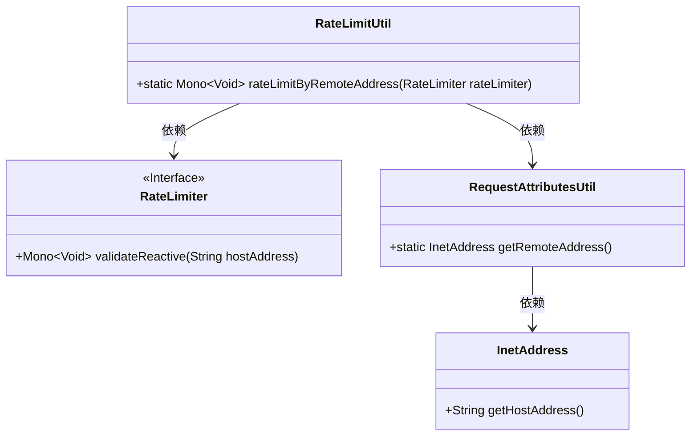
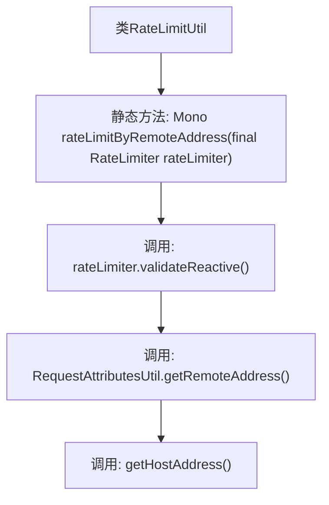

# 基础信息

|      |      |
|------|------|
| 名称 | RateLimitUtil |
| 编码语言 | .java |
| 代码路径 | Signal-Server/service/src/main/java/org/whispersystems/textsecuregcm/grpc/RateLimitUtil.java |
| 包名 | org.whispersystems.textsecuregcm.grpc |
| 依赖项 | ['org.whispersystems.textsecuregcm.limits.RateLimiter', 'reactor.core.publisher.Mono'] |
| 概述说明 | RateLimitUtil类利用远程地址进行速率控制。 |

# 说明

RateLimitUtil类的主要功能是通过远程地址来实现速率限制。该类利用远程地址作为标识，对请求的频率进行控制和限制，以防止系统因过多的请求而过载或遭受恶意攻击。通过这种方式，RateLimitUtil类有效地管理和保护系统的资源，确保其在合理的使用范围内运行。

# 类列表 Class Summary

| 名称   | 类型  | 说明 |
|-------|------|-------------|
| RateLimitUtil | class | RateLimitUtil类通过远程地址实现速率限制。 |

## 类 RateLimitUtil

|      |      |
|------|------|
| 访问范围 | None |
| 类型 | class |
| 名称 | RateLimitUtil |
| 说明 | RateLimitUtil类通过远程地址实现速率限制。 |

### UML类图

这段代码定义了一个 `RateLimitUtil` 类，其中包含一个静态方法 `rateLimitByRemoteAddress`，该方法通过 `RateLimiter` 接口和 `RequestAttributesUtil` 类来实现对远程地址的速率限制。`RateLimiter` 是一个接口，提供了 `validateReactive` 方法来验证请求是否超出速率限制。`RequestAttributesUtil` 类用于获取远程地址，并通过 `InetAddress` 类获取主机地址。整个流程展示了如何通过依赖注入和接口调用来实现速率限制功能。

### 内部方法调用关系图

这段代码展示了一个名为`RateLimitUtil`的类，其中包含一个静态方法`rateLimitByRemoteAddress`。该方法通过调用`rateLimiter.validateReactive()`来进行限流验证，并使用`RequestAttributesUtil.getRemoteAddress().getHostAddress()`获取远程地址的主机地址作为参数。流程图清晰地展示了方法调用的顺序和层级关系。

### 字段列表 Field List

| 名称  | 类型  | 说明 |
|-------|-------|------|

### 方法列表 Method List

| 名称  | 类型  | 说明 |
|-------|-------|------|
| rateLimitByRemoteAddress | Mono<Void> | 基于远程地址进行限流的反应式方法。 |

