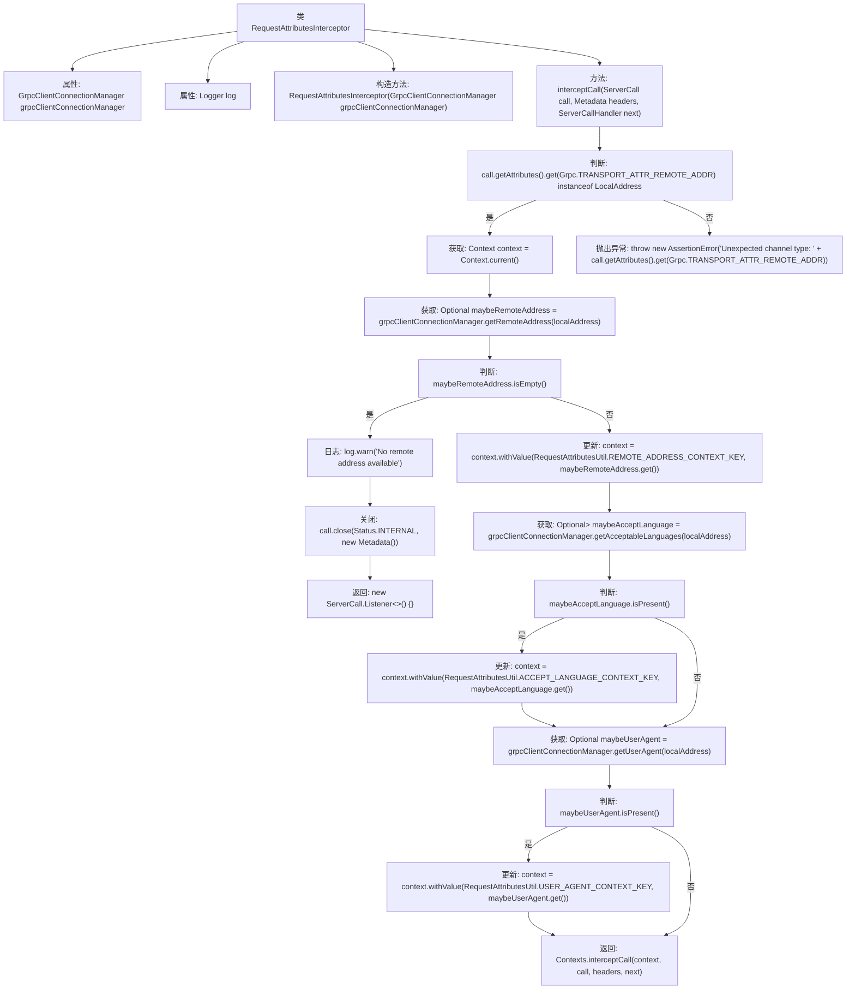

# 基础信息

|      |      |
|------|------|
| 名称 | RequestAttributesInterceptor |
| 编码语言 | .java |
| 代码路径 | Signal-Server/service/src/main/java/org/whispersystems/textsecuregcm/grpc/RequestAttributesInterceptor.java |
| 包名 | org.whispersystems.textsecuregcm.grpc |
| 依赖项 | ['io.grpc.Context', 'io.grpc.Contexts', 'io.grpc.Grpc', 'io.grpc.Metadata', 'io.grpc.ServerCall', 'io.grpc.ServerCallHandler', 'io.grpc.ServerInterceptor', 'io.grpc.Status', 'io.netty.channel.local.LocalAddress', 'org.slf4j.Logger', 'org.slf4j.LoggerFactory', 'org.whispersystems.textsecuregcm.grpc.net.GrpcClientConnectionManager', 'org.whispersystems.textsecuregcm.util.ua.UserAgent', 'java.net.InetAddress', 'java.util.List', 'java.util.Locale', 'java.util.Optional'] |
| 概述说明 | 拦截器处理gRPC请求，获取地址、语言和用户代理，更新上下文。 |

# 说明

RequestAttributesInterceptor拦截器用于处理gRPC请求，其主要功能是从请求中提取关键信息，包括远程地址、语言和用户代理信息。这些信息被获取后，拦截器会将其更新到当前上下文中，以便后续处理流程能够访问和使用这些数据。该拦截器在gRPC服务中起到了重要的信息收集和上下文管理作用，确保请求相关的属性能够在整个处理链中传递和利用。

# 类列表 Class Summary

| 名称   | 类型  | 说明 |
|-------|------|-------------|
| RequestAttributesInterceptor | class | RequestAttributesInterceptor拦截器处理gRPC请求，获取远程地址、语言和用户代理信息，并更新上下文。 |

## 类 RequestAttributesInterceptor

|      |      |
|------|------|
| 访问范围 | public |
| 类型 | class |
| 名称 | RequestAttributesInterceptor |
| 说明 | RequestAttributesInterceptor拦截器处理gRPC请求，获取远程地址、语言和用户代理信息，并更新上下文。 |

### UML类图

```mermaid
classDiagram
    class RequestAttributesInterceptor {
        -GrpcClientConnectionManager grpcClientConnectionManager
        -Logger log
        +RequestAttributesInterceptor(GrpcClientConnectionManager grpcClientConnectionManager)
        +~ReqT, RespT~ ServerCall.Listener~ReqT~ interceptCall(ServerCall~ReqT, RespT~ call, Metadata headers, ServerCallHandler~ReqT, RespT~ next)
    }

    class GrpcClientConnectionManager {
        +Optional~InetAddress~ getRemoteAddress(LocalAddress localAddress)
        +Optional~List~Locale.LanguageRange~~ getAcceptableLanguages(LocalAddress localAddress)
        +Optional~UserAgent~ getUserAgent(LocalAddress localAddress)
    }

    class ServerCall~ReqT, RespT~ {
        +Attributes getAttributes()
        +void close(Status status, Metadata trailers)
    }

    class ServerCallHandler~ReqT, RespT~ {
    }

    class Context {
        +Context withValue(Context.Key~T~ key, T value)
    }

    class Contexts {
        +~ReqT, RespT~ ServerCall.Listener~ReqT~ interceptCall(Context context, ServerCall~ReqT, RespT~ call, Metadata headers, ServerCallHandler~ReqT, RespT~ next)
    }

    class RequestAttributesUtil {
        <<Interface>>
        +Context.Key~InetAddress~ REMOTE_ADDRESS_CONTEXT_KEY
        +Context.Key~List~Locale.LanguageRange~~ ACCEPT_LANGUAGE_CONTEXT_KEY
        +Context.Key~UserAgent~ USER_AGENT_CONTEXT_KEY
    }

    RequestAttributesInterceptor --> GrpcClientConnectionManager : 依赖
    RequestAttributesInterceptor --> ServerCall~ReqT, RespT~ : 依赖
    RequestAttributesInterceptor --> ServerCallHandler~ReqT, RespT~ : 依赖
    RequestAttributesInterceptor --> Context : 依赖
    RequestAttributesInterceptor --> Contexts : 依赖
    RequestAttributesInterceptor --> RequestAttributesUtil : 依赖
```

### 描述
`RequestAttributesInterceptor` 是一个实现了 `ServerInterceptor` 接口的类，用于拦截 gRPC 请求并处理请求属性。它依赖于 `GrpcClientConnectionManager` 来获取远程地址、可接受语言和用户代理信息，并将这些信息存储在 `Context` 中。通过 `Contexts.interceptCall` 方法，它将处理后的上下文传递给下一个处理链。该类的核心功能是确保请求的远程地址、语言偏好和用户代理信息被正确识别和处理。

### 内部方法调用关系图

这段代码是一个gRPC拦截器，用于在gRPC调用过程中处理请求属性。它首先检查远程地址是否为本地地址，然后通过`GrpcClientConnectionManager`获取远程地址、可接受语言和用户代理信息，并将这些信息存储在`Context`中。如果无法识别远程地址，则记录警告并关闭调用。最后，它将更新后的`Context`传递给下一个拦截器或处理程序。

### 字段列表 Field List

| 名称  | 类型  | 说明 |
|-------|-------|------|
| log = LoggerFactory.getLogger(RequestAttributesInterceptor.class) | Logger | 定义私有静态日志记录器，用于RequestAttributesInterceptor类。 |
| grpcClientConnectionManager | GrpcClientConnectionManager | GrpcClientConnectionManager实例为私有不可变。 |

### 方法列表 Method List

| 名称  | 类型  | 说明 |
|-------|-------|------|
| interceptCall | ServerCall.Listener<ReqT> | 拦截gRPC调用，验证远程地址，设置上下文属性并返回监听器。 |

