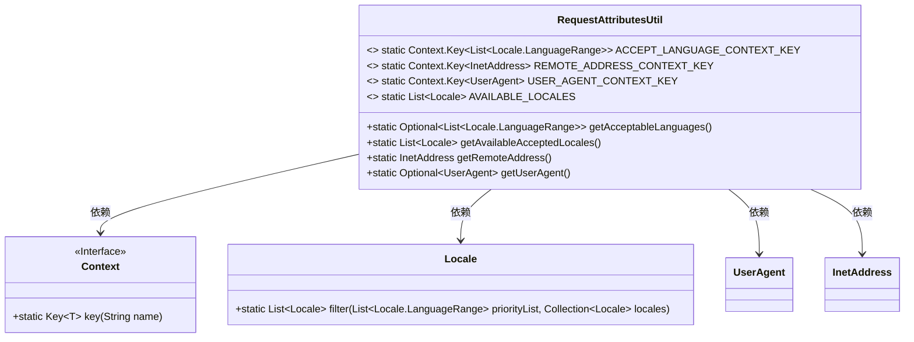
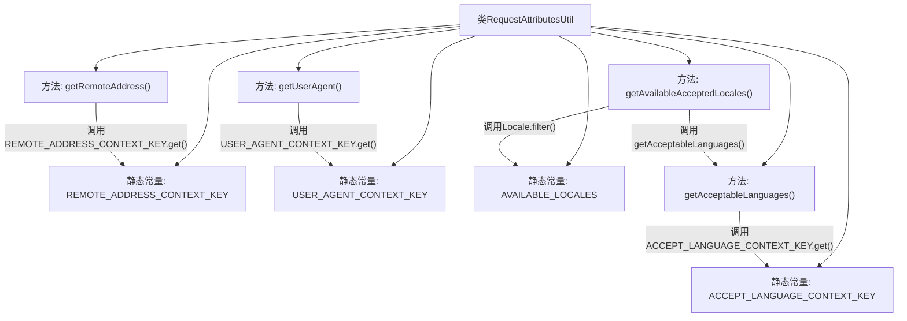

# 基础信息

|      |      |
|------|------|
| 名称 | RequestAttributesUtil |
| 编码语言 | .java |
| 代码路径 | Signal-Server/service/src/main/java/org/whispersystems/textsecuregcm/grpc/RequestAttributesUtil.java |
| 包名 | org.whispersystems.textsecuregcm.grpc |
| 依赖项 | ['io.grpc.Context', 'java.net.InetAddress', 'java.util.Arrays', 'java.util.Collections', 'java.util.List', 'java.util.Locale', 'java.util.Optional', 'org.whispersystems.textsecuregcm.util.ua.UserAgent'] |
| 概述说明 | RequestAttributesUtil类提取gRPC请求的客户端语言、远程地址和用户代理信息。 |

# 说明

RequestAttributesUtil类主要用于从gRPC请求中提取关键客户端信息，包括客户端使用的语言、远程地址以及用户代理信息。这些信息有助于分析和处理请求，确保系统能够根据客户端的具体情况进行适当的响应和优化。

# 类列表 Class Summary

| 名称   | 类型  | 说明 |
|-------|------|-------------|
| RequestAttributesUtil | class | RequestAttributesUtil类用于获取gRPC请求中的客户端语言、远程地址和用户代理信息。 |

## 类 RequestAttributesUtil

|      |      |
|------|------|
| 访问范围 | public |
| 类型 | class |
| 名称 | RequestAttributesUtil |
| 说明 | RequestAttributesUtil类用于获取gRPC请求中的客户端语言、远程地址和用户代理信息。 |

### UML类图

这段代码定义了一个名为 `RequestAttributesUtil` 的工具类，用于从 gRPC 请求上下文中获取客户端的一些属性，如可接受的语言列表、远程地址和用户代理信息。该类依赖于 `Context`、`Locale`、`UserAgent` 和 `InetAddress` 等类或接口。`RequestAttributesUtil` 提供了四个静态方法，分别用于获取可接受的语言、可用的接受语言列表、远程地址和用户代理信息。这些方法通过 `Context.Key` 从上下文中获取相应的数据，并进行处理或过滤。

### 内部方法调用关系图

这段代码定义了一个名为 `RequestAttributesUtil` 的工具类，用于从当前的 gRPC 请求上下文中获取客户端的语言偏好、远程地址和用户代理信息。类中包含四个静态常量，分别用于存储上下文中的语言范围、远程地址和用户代理信息，以及一个静态常量 `AVAILABLE_LOCALES` 存储 JVM 支持的所有语言环境。类中提供了四个方法：`getAcceptableLanguages()` 用于获取客户端接受的语言范围，`getAvailableAcceptedLocales()` 用于获取客户端接受且 JVM 支持的语言环境，`getRemoteAddress()` 用于获取客户端的远程地址，`getUserAgent()` 用于获取客户端的用户代理信息。

### 字段列表 Field List

| 名称  | 类型  | 说明 |
|-------|-------|------|
| ACCEPT_LANGUAGE_CONTEXT_KEY = Context.key("accept-language") | Context.Key<List<Locale.LanguageRange>> | 定义静态常量ACCEPT_LANGUAGE_CONTEXT_KEY，用于存储语言范围列表。 |
| AVAILABLE_LOCALES = Arrays.asList(Locale.getAvailableLocales()) | List<Locale> | 定义静态常量AVAILABLE_LOCALES，存储所有可用区域设置列表。 |
| USER_AGENT_CONTEXT_KEY = Context.key("user-agent") | Context.Key<UserAgent> | 定义静态常量USER_AGENT_CONTEXT_KEY，用于存储用户代理信息。 |
| REMOTE_ADDRESS_CONTEXT_KEY = Context.key("remote-address") | Context.Key<InetAddress> | 定义静态常量REMOTE_ADDRESS_CONTEXT_KEY，用于存储远程地址的上下文键。 |

### 方法列表 Method List

| 名称  | 类型  | 说明 |
|-------|-------|------|
| getRemoteAddress | InetAddress | 获取远程地址的静态方法。 |
| getUserAgent | Optional<UserAgent> | 获取当前用户代理的可选对象。 |
| getAvailableAcceptedLocales | List<Locale> | 获取可用语言的列表，返回过滤后的区域设置或空列表。 |
| getAcceptableLanguages | Optional<List<Locale.LanguageRange>> | 获取可接受语言列表的静态方法，返回Optional包装的Locale.LanguageRange列表。 |

