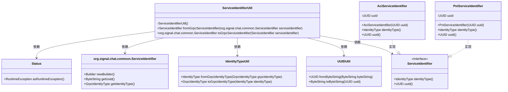

# 基础信息

|      |      |
|------|------|
| 名称 | ServiceIdentifierUtil |
| 编码语言 | .java |
| 代码路径 | Signal-Server/service/src/main/java/org/whispersystems/textsecuregcm/grpc/ServiceIdentifierUtil.java |
| 包名 | org.whispersystems.textsecuregcm.grpc |
| 依赖项 | ['com.google.protobuf.ByteString', 'io.grpc.Status', 'java.util.UUID', 'org.signal.chat.common.IdentityType', 'org.whispersystems.textsecuregcm.identity.AciServiceIdentifier', 'org.whispersystems.textsecuregcm.identity.PniServiceIdentifier', 'org.whispersystems.textsecuregcm.identity.ServiceIdentifier', 'org.whispersystems.textsecuregcm.util.UUIDUtil'] |
| 概述说明 | ServiceIdentifierUtil类实现gRPC与服务标识符的互转。 |

# 说明

ServiceIdentifierUtil类主要用于实现gRPC与服务标识符之间的相互转换功能。该类通过封装转换逻辑，简化了gRPC通信中服务标识符的处理流程，确保服务标识符能够准确地在不同系统或组件之间传递和识别。这一功能对于构建高效、可靠的gRPC服务架构至关重要，有助于提升系统的整体兼容性和可维护性。

# 类列表 Class Summary

| 名称   | 类型  | 说明 |
|-------|------|-------------|
| ServiceIdentifierUtil | class | ServiceIdentifierUtil类提供gRPC与服务标识符之间的转换功能。 |

## 类 ServiceIdentifierUtil

|      |      |
|------|------|
| 访问范围 | public |
| 类型 | class |
| 名称 | ServiceIdentifierUtil |
| 说明 | ServiceIdentifierUtil类提供gRPC与服务标识符之间的转换功能。 |

### UML类图

**描述：**
`ServiceIdentifierUtil` 是一个工具类，用于在 gRPC 服务标识符和内部服务标识符之间进行转换。它依赖于 `UUIDUtil` 和 `IdentityTypeUtil` 来处理 UUID 和身份类型的转换。`ServiceIdentifier` 是一个接口，由 `AciServiceIdentifier` 和 `PniServiceIdentifier` 实现。该类还处理异常情况，并在转换失败时抛出 `Status.INVALID_ARGUMENT` 异常。

### 内部方法调用关系图

这段代码定义了一个名为 `ServiceIdentifierUtil` 的工具类，包含两个静态方法：`fromGrpcServiceIdentifier` 和 `toGrpcServiceIdentifier`。`fromGrpcServiceIdentifier` 方法用于将 gRPC 服务标识符转换为本地服务标识符，处理可能的异常并返回不同类型的服务标识符对象。`toGrpcServiceIdentifier` 方法则用于将本地服务标识符转换为 gRPC 服务标识符，通过构建器模式设置相关属性并返回构建结果。

### 字段列表 Field List

| 名称  | 类型  | 说明 |
|-------|-------|------|

### 方法列表 Method List

| 名称  | 类型  | 说明 |
|-------|-------|------|
| toGrpcServiceIdentifier | org.signal.chat.common.ServiceIdentifier | 将ServiceIdentifier转换为gRPC服务标识符。 |
| fromGrpcServiceIdentifier | ServiceIdentifier | 将gRPC服务标识符转换为本地服务标识符，处理UUID并返回对应类型实例。 |

