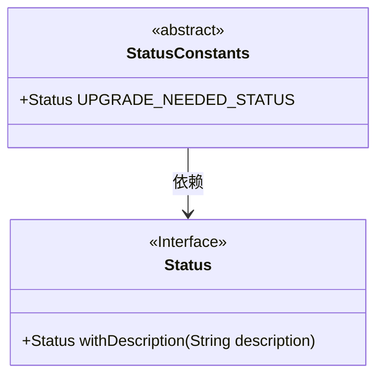
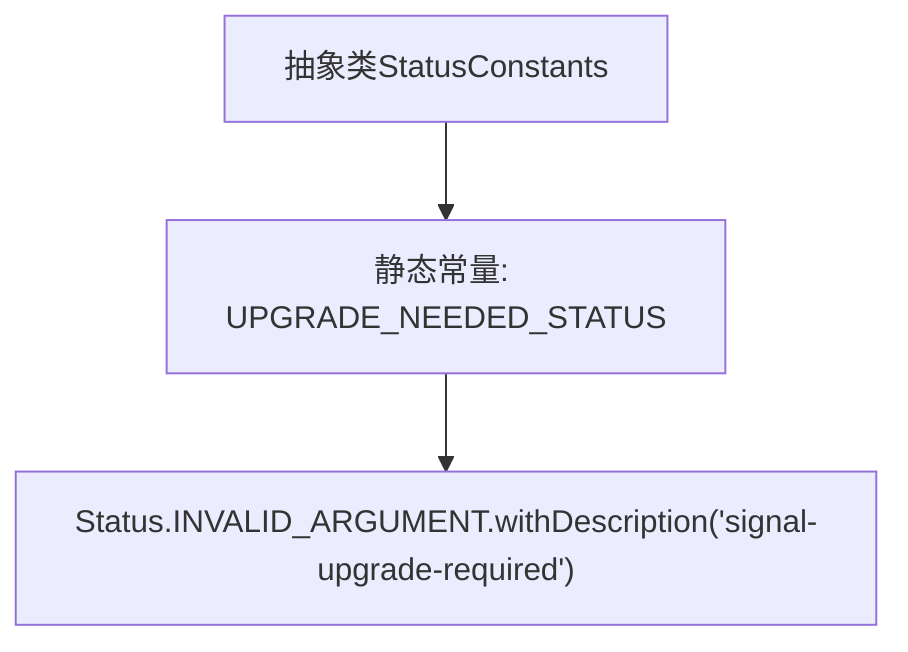

# 基础信息

|      |      |
|------|------|
| 名称 | StatusConstants |
| 编码语言 | .java |
| 代码路径 | Signal-Server/service/src/main/java/org/whispersystems/textsecuregcm/grpc/StatusConstants.java |
| 包名 | org.whispersystems.textsecuregcm.grpc |
| 依赖项 | ['io.grpc.Status'] |
| 概述说明 | 状态常量类定义无效参数状态及描述。 |

# 说明

状态常量类定义了一个升级需求状态，将其标记为无效参数，并附带了相关描述。该状态常量用于标识在升级过程中遇到的无效参数情况，确保系统能够识别并处理此类异常状态。通过明确的描述，开发人员可以快速理解该状态的含义及其在系统中的使用场景，从而提高代码的可维护性和系统的稳定性。

# 类列表 Class Summary

| 名称   | 类型  | 说明 |
|-------|------|-------------|
| StatusConstants | class | 状态常量类定义升级需求状态为无效参数并附描述。 |

## 类 StatusConstants

|      |      |
|------|------|
| 访问范围 | public abstract |
| 类型 | class |
| 名称 | StatusConstants |
| 说明 | 状态常量类定义升级需求状态为无效参数并附描述。 |

### UML类图

这段代码定义了一个抽象类 `StatusConstants`，其中包含一个公有的静态常量 `UPGRADE_NEEDED_STATUS`，该常量通过调用 `Status` 接口的 `withDescription` 方法进行初始化。`StatusConstants` 类依赖于 `Status` 接口来创建 `UPGRADE_NEEDED_STATUS` 实例。代码的主要作用是提供一个常量状态，用于表示需要升级的信号。

### 内部方法调用关系图

这段代码定义了一个抽象类 `StatusConstants`，其中包含一个静态常量 `UPGRADE_NEEDED_STATUS`。该常量通过调用 `Status.INVALID_ARGUMENT.withDescription` 方法生成，描述为 `'signal-upgrade-required'`。此代码主要用于定义状态常量，通常用于表示系统或应用程序中的特定状态或错误情况。

### 字段列表 Field List

| 名称  | 类型  | 说明 |
|-------|-------|------|
| UPGRADE_NEEDED_STATUS = Status.INVALID_ARGUMENT.withDescription("signal-upgrade-required") | Status | 定义静态常量UPGRADE_NEEDED_STATUS，表示升级需要的状态。 |

### 方法列表 Method List

| 名称  | 类型  | 说明 |
|-------|-------|------|

