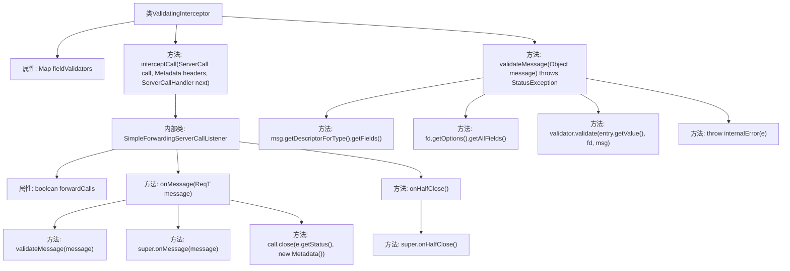

# 基础信息

|      |      |
|------|------|
| 名称 | ValidatingInterceptor |
| 编码语言 | .java |
| 代码路径 | Signal-Server/service/src/main/java/org/whispersystems/textsecuregcm/grpc/ValidatingInterceptor.java |
| 包名 | org.whispersystems.textsecuregcm.grpc |
| 依赖项 | ['org.whispersystems.textsecuregcm.grpc.validators.ValidatorUtils.internalError', 'com.google.protobuf.Descriptors', 'com.google.protobuf.GeneratedMessageV3', 'io.grpc.ForwardingServerCallListener', 'io.grpc.Metadata', 'io.grpc.ServerCall', 'io.grpc.ServerCallHandler', 'io.grpc.ServerInterceptor', 'io.grpc.StatusException', 'java.util.Map', 'org.whispersystems.textsecuregcm.grpc.validators.E164FieldValidator', 'org.whispersystems.textsecuregcm.grpc.validators.EnumSpecifiedFieldValidator', 'org.whispersystems.textsecuregcm.grpc.validators.ExactlySizeFieldValidator', 'org.whispersystems.textsecuregcm.grpc.validators.FieldValidator', 'org.whispersystems.textsecuregcm.grpc.validators.NonEmptyFieldValidator', 'org.whispersystems.textsecuregcm.grpc.validators.PresentFieldValidator', 'org.whispersystems.textsecuregcm.grpc.validators.RangeFieldValidator', 'org.whispersystems.textsecuregcm.grpc.validators.SizeFieldValidator'] |
| 概述说明 | ValidatingInterceptor实现服务器拦截器，验证消息字段，处理异常并控制调用转发。 |

# 说明

ValidatingInterceptor是一个服务器拦截器，主要用于验证消息字段的有效性。它在处理请求时，会检查消息中的各个字段是否符合预定的规则和标准。如果发现字段不符合要求，拦截器会捕获并处理相应的异常，确保系统不会因为无效数据而崩溃或产生错误。此外，ValidatingInterceptor还负责控制调用的转发，确保只有经过验证的消息才会被传递到后续的处理流程中，从而提高系统的安全性和稳定性。

# 类列表 Class Summary

| 名称   | 类型  | 说明 |
|-------|------|-------------|
| ValidatingInterceptor | class | ValidatingInterceptor实现服务器拦截器，验证消息字段，处理异常并控制调用转发。 |

## 类 ValidatingInterceptor

|      |      |
|------|------|
| 访问范围 | public |
| 类型 | class |
| 名称 | ValidatingInterceptor |
| 说明 | ValidatingInterceptor实现服务器拦截器，验证消息字段，处理异常并控制调用转发。 |

### UML类图

```mermaid
classDiagram
    class ValidatingInterceptor {
        -Map~String, FieldValidator~ fieldValidators
        +interceptCall(ServerCall~ReqT, RespT~ call, Metadata headers, ServerCallHandler~ReqT, RespT~ next) ServerCall.Listener~ReqT~
        -validateMessage(Object message) void
    }

    class FieldValidator {
        <<Interface>>
        +validate(Object value, Descriptors.FieldDescriptor fd, GeneratedMessageV3 msg) void
    }

    class NonEmptyFieldValidator {
        +validate(Object value, Descriptors.FieldDescriptor fd, GeneratedMessageV3 msg) void
    }

    class PresentFieldValidator {
        +validate(Object value, Descriptors.FieldDescriptor fd, GeneratedMessageV3 msg) void
    }

    class EnumSpecifiedFieldValidator {
        +validate(Object value, Descriptors.FieldDescriptor fd, GeneratedMessageV3 msg) void
    }

    class E164FieldValidator {
        +validate(Object value, Descriptors.FieldDescriptor fd, GeneratedMessageV3 msg) void
    }

    class ExactlySizeFieldValidator {
        +validate(Object value, Descriptors.FieldDescriptor fd, GeneratedMessageV3 msg) void
    }

    class RangeFieldValidator {
        +validate(Object value, Descriptors.FieldDescriptor fd, GeneratedMessageV3 msg) void
    }

    class SizeFieldValidator {
        +validate(Object value, Descriptors.FieldDescriptor fd, GeneratedMessageV3 msg) void
    }

    ValidatingInterceptor --> FieldValidator : 依赖
    NonEmptyFieldValidator ..|> FieldValidator : 实现
    PresentFieldValidator ..|> FieldValidator : 实现
    EnumSpecifiedFieldValidator ..|> FieldValidator : 实现
    E164FieldValidator ..|> FieldValidator : 实现
    ExactlySizeFieldValidator ..|> FieldValidator : 实现
    RangeFieldValidator ..|> FieldValidator : 实现
    SizeFieldValidator ..|> FieldValidator : 实现
```

**描述：**  
`ValidatingInterceptor` 是一个服务器拦截器，用于在服务器调用时验证消息的有效性。它包含一个 `fieldValidators` 映射，用于存储不同类型的字段验证器。`interceptCall` 方法拦截服务器调用，并在消息到达时进行验证。`validateMessage` 方法负责具体的验证逻辑，通过调用 `FieldValidator` 接口的实现类来完成验证。每个具体的验证器类（如 `NonEmptyFieldValidator`、`PresentFieldValidator` 等）实现了 `FieldValidator` 接口，提供了不同的验证规则。

### 内部方法调用关系图

这段代码实现了一个`ValidatingInterceptor`类，用于在服务器调用时对消息进行验证。`interceptCall`方法返回一个`SimpleForwardingServerCallListener`实例，该实例在`onMessage`方法中调用`validateMessage`方法进行消息验证，如果验证失败则关闭调用。`validateMessage`方法通过遍历消息的字段描述符和选项，使用预定义的验证器进行验证。如果验证过程中发生异常，会抛出相应的状态异常或内部错误。

### 字段列表 Field List

| 名称  | 类型  | 说明 |
|-------|-------|------|
| fieldValidators = Map.of(      "org.signal.chat.require.nonEmpty", new NonEmptyFieldValidator(),      "org.signal.chat.require.present", new PresentFieldValidator(),      "org.signal.chat.require.specified", new EnumSpecifiedFieldValidator(),      "org.signal.chat.require.e164", new E164FieldValidator(),      "org.signal.chat.require.exactlySize", new ExactlySizeFieldValidator(),      "org.signal.chat.require.range", new RangeFieldValidator(),      "org.signal.chat.require.size", new SizeFieldValidator()  ) | Map<String, FieldValidator> | 创建字段验证器映射，包含非空、存在、枚举、E164、精确大小、范围和大小的验证器。 |

### 方法列表 Method List

| 名称  | 类型  | 说明 |
|-------|-------|------|
| validateMessage | void | 验证消息字段，检查扩展字段并调用相应验证器。 |
| interceptCall | ServerCall.Listener<ReqT> | 拦截器验证消息，失败时关闭调用并停止转发。 |

