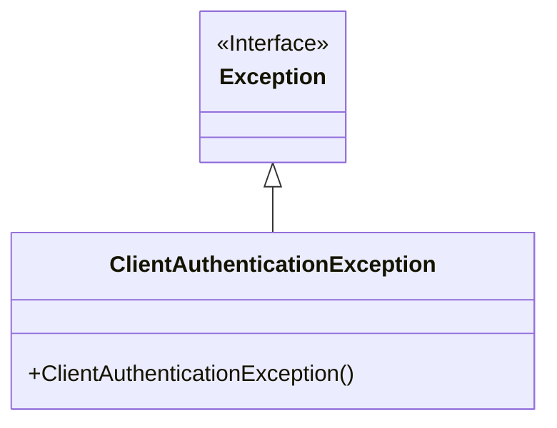
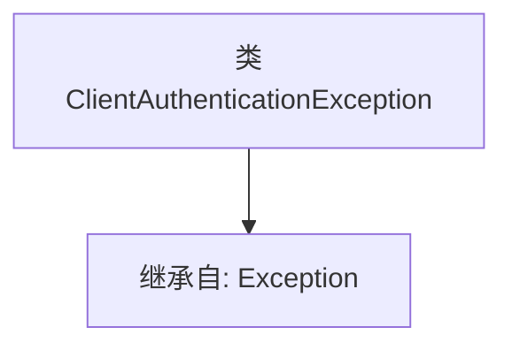

# 基础信息

|      |      |
|------|------|
| 名称 | ClientAuthenticationException |
| 编码语言 | .java |
| 代码路径 | Signal-Server/service/src/main/java/org/whispersystems/textsecuregcm/grpc/net/ClientAuthenticationException.java |
| 包名 | org.whispersystems.textsecuregcm.grpc.net |
| 依赖项 | [] |
| 概述说明 | 客户端认证异常类继承自Exception类。 |

# 说明

客户端认证异常类是一个自定义的异常类，它继承自Python中的内置Exception类。这种设计使得该异常类能够捕获和处理与客户端认证相关的错误或异常情况。通过继承Exception类，客户端认证异常类具备了异常处理的基本功能，可以在程序中抛出并捕获，以便在认证失败时提供特定的错误信息或执行相应的处理逻辑。这种继承关系确保了异常类的灵活性和可扩展性，使其能够适应不同的应用场景和需求。

# 类列表 Class Summary

| 名称   | 类型  | 说明 |
|-------|------|-------------|
| ClientAuthenticationException | class | 客户端认证异常类继承自Exception类。 |

## 类 ClientAuthenticationException

|      |      |
|------|------|
| 访问范围 | None |
| 类型 | class |
| 名称 | ClientAuthenticationException |
| 说明 | 客户端认证异常类继承自Exception类。 |

### UML类图

这段代码定义了一个名为 `ClientAuthenticationException` 的类，它继承自 `Exception` 类。`ClientAuthenticationException` 是一个自定义异常类，通常用于处理客户端认证失败的情况。通过继承 `Exception`，它继承了异常处理的基本功能，并可以扩展或自定义异常行为。类图中清晰地展示了 `ClientAuthenticationException` 与 `Exception` 之间的继承关系。

### 内部方法调用关系图

这段代码定义了一个名为 `ClientAuthenticationException` 的类，该类继承自 `Exception` 类。通过继承，`ClientAuthenticationException` 类具备了 `Exception` 类的所有属性和方法，并且可以用于处理客户端认证过程中可能出现的异常情况。这种设计使得异常处理更加模块化和可扩展，便于在代码中捕获和处理特定的认证异常。

### 字段列表 Field List

| 名称  | 类型  | 说明 |
|-------|-------|------|

### 方法列表 Method List

| 名称  | 类型  | 说明 |
|-------|-------|------|

