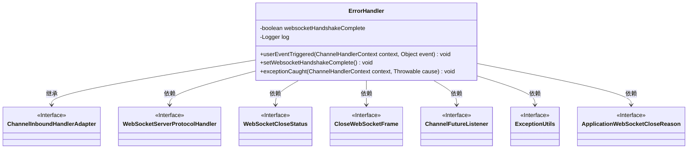
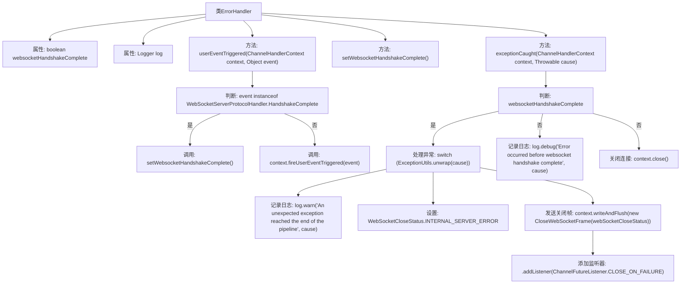

# 基础信息

|      |      |
|------|------|
| 名称 | ErrorHandler |
| 编码语言 | .java |
| 代码路径 | Signal-Server/service/src/main/java/org/whispersystems/textsecuregcm/grpc/net/ErrorHandler.java |
| 包名 | org.whispersystems.textsecuregcm.grpc.net |
| 依赖项 | ['io.netty.channel.ChannelFutureListener', 'io.netty.channel.ChannelHandlerContext', 'io.netty.channel.ChannelInboundHandlerAdapter', 'io.netty.handler.codec.http.websocketx.CloseWebSocketFrame', 'io.netty.handler.codec.http.websocketx.WebSocketCloseStatus', 'io.netty.handler.codec.http.websocketx.WebSocketServerProtocolHandler', 'javax.crypto.BadPaddingException', 'org.slf4j.Logger', 'org.slf4j.LoggerFactory', 'org.whispersystems.textsecuregcm.util.ExceptionUtils'] |
| 概述说明 | ErrorHandler处理WebSocket握手异常，返回关闭状态并记录日志。 |

# 说明

ErrorHandler负责处理WebSocket握手过程中的异常情况，根据不同类型的异常返回相应的关闭状态，并将异常信息记录到日志中，以确保系统能够及时识别和处理错误。

# 类列表 Class Summary

| 名称   | 类型  | 说明 |
|-------|------|-------------|
| ErrorHandler | class | ErrorHandler处理WebSocket握手及异常，根据异常类型返回关闭状态并记录日志。 |

## 类 ErrorHandler

|      |      |
|------|------|
| 访问范围 | None |
| 类型 | class |
| 名称 | ErrorHandler |
| 说明 | ErrorHandler处理WebSocket握手及异常，根据异常类型返回关闭状态并记录日志。 |

### UML类图

这段代码定义了一个 `ErrorHandler` 类，继承自 `ChannelInboundHandlerAdapter`，用于处理 WebSocket 连接中的错误。该类通过 `userEventTriggered` 方法检测 WebSocket 握手是否完成，并在 `exceptionCaught` 方法中根据不同的异常类型发送相应的 WebSocket 关闭状态。如果握手未完成，则直接关闭连接。代码中依赖了多个接口和工具类来处理异常和关闭 WebSocket 连接。

### 内部方法调用关系图

这段代码定义了一个名为`ErrorHandler`的类，继承自`ChannelInboundHandlerAdapter`，用于处理WebSocket连接中的错误和异常。它通过`userEventTriggered`方法检测WebSocket握手是否完成，并在`exceptionCaught`方法中根据握手状态处理不同类型的异常。如果握手完成，会发送适当的关闭帧并关闭连接；如果未完成，则直接关闭连接并记录日志。

### 字段列表 Field List

| 名称  | 类型  | 说明 |
|-------|-------|------|
| log = LoggerFactory.getLogger(ErrorHandler.class) | Logger | 定义私有静态日志记录器，用于ErrorHandler类。 |
| websocketHandshakeComplete = false | boolean | websocket握手未完成标志。 |

### 方法列表 Method List

| 名称  | 类型  | 说明 |
|-------|-------|------|
| setWebsocketHandshakeComplete | void | 设置WebSocket握手完成状态为真。 |
| userEventTriggered | void | 处理WebSocket握手完成事件并继续传递事件。 |
| exceptionCaught | void | 捕获异常后，根据类型设置WebSocket关闭状态并处理连接。 |

