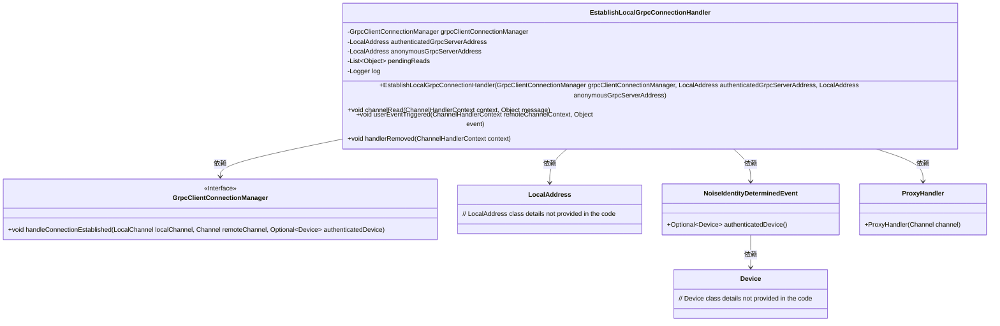
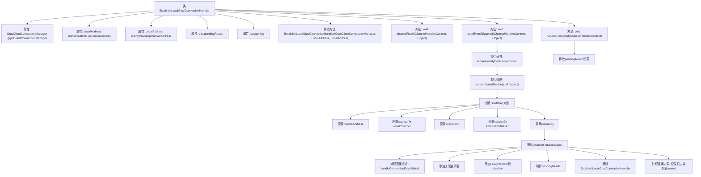

# 基础信息

|      |      |
|------|------|
| 名称 | EstablishLocalGrpcConnectionHandler |
| 编码语言 | .java |
| 代码路径 | Signal-Server/service/src/main/java/org/whispersystems/textsecuregcm/grpc/net/EstablishLocalGrpcConnectionHandler.java |
| 包名 | org.whispersystems.textsecuregcm.grpc.net |
| 依赖项 | ['io.netty.bootstrap.Bootstrap', 'io.netty.channel.ChannelFutureListener', 'io.netty.channel.ChannelHandlerContext', 'io.netty.channel.ChannelInboundHandlerAdapter', 'io.netty.channel.ChannelInitializer', 'io.netty.channel.local.LocalAddress', 'io.netty.channel.local.LocalChannel', 'io.netty.handler.codec.http.websocketx.CloseWebSocketFrame', 'io.netty.handler.codec.http.websocketx.WebSocketCloseStatus', 'io.netty.util.ReferenceCountUtil', 'java.util.ArrayList', 'java.util.List', 'org.slf4j.Logger', 'org.slf4j.LoggerFactory'] |
| 概述说明 | 类EstablishLocalGrpcConnectionHandler管理本地gRPC连接，处理认证、地址、读写及资源清理。 |

# 说明

类EstablishLocalGrpcConnectionHandler负责处理本地gRPC连接，包括管理认证和匿名服务地址。它处理读取操作和事件触发，确保连接成功建立，并在必要时清理资源。该类的核心功能是维护连接的稳定性和安全性，确保通信过程顺利进行。

# 类列表 Class Summary

| 名称   | 类型  | 说明 |
|-------|------|-------------|
| EstablishLocalGrpcConnectionHandler | class | 类EstablishLocalGrpcConnectionHandler处理本地gRPC连接，管理认证和匿名服务地址，处理读取和事件触发，确保连接成功并清理资源。 |

## 类 EstablishLocalGrpcConnectionHandler

|      |      |
|------|------|
| 访问范围 | None |
| 类型 | class |
| 名称 | EstablishLocalGrpcConnectionHandler |
| 说明 | 类EstablishLocalGrpcConnectionHandler处理本地gRPC连接，管理认证和匿名服务地址，处理读取和事件触发，确保连接成功并清理资源。 |

### UML类图

### 描述
`EstablishLocalGrpcConnectionHandler` 类负责管理与本地 gRPC 服务器的连接。它依赖于 `GrpcClientConnectionManager` 接口来处理连接建立后的逻辑，并使用 `LocalAddress` 来确定连接的服务器地址。该类通过 `NoiseIdentityDeterminedEvent` 事件来确定是否使用认证的服务器地址，并通过 `ProxyHandler` 来处理通道的代理逻辑。`pendingReads` 用于暂存等待处理的读取消息，确保在连接建立后能够正确处理这些消息。

### 内部方法调用关系图

这段代码定义了一个`EstablishLocalGrpcConnectionHandler`类，用于处理本地gRPC连接的建立。类中包含多个属性和方法，主要功能包括处理通道读取事件、用户触发事件以及处理器移除事件。在`userEventTriggered`方法中，根据事件类型和认证状态，决定连接到认证或匿名gRPC服务器，并在连接成功后进行一系列处理，如添加代理处理器、刷新待处理读取数据等。如果连接失败，则记录日志并关闭上下文。

### 字段列表 Field List

| 名称  | 类型  | 说明 |
|-------|-------|------|
| grpcClientConnectionManager | GrpcClientConnectionManager | 私有GRPC客户端连接管理器实例。 |
| authenticatedGrpcServerAddress | LocalAddress | 私有且不可变的已验证gRPC服务器地址变量。 |
| pendingReads = new ArrayList<>() | List<Object> | 声明一个私有的不可变列表对象pendingReads。 |
| log = LoggerFactory.getLogger(EstablishLocalGrpcConnectionHandler.class) | Logger | 类EstablishLocalGrpcConnectionHandler中声明了静态日志对象log。 |
| anonymousGrpcServerAddress | LocalAddress | 匿名gRPC服务器的本地地址为私有常量。 |

### 方法列表 Method List

| 名称  | 类型  | 说明 |
|-------|-------|------|
| handlerRemoved | void | 处理程序移除时释放并清空待处理读取数据。 |
| channelRead | void | 重写channelRead方法，将接收的消息添加到pendingReads队列中。 |
| userEventTriggered | void | 根据事件类型确定身份，连接gRPC服务器，处理成功或失败情况，管理连接生命周期。 |

