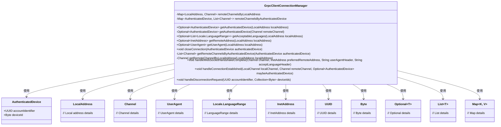

# 基础信息

|      |      |
|------|------|
| 名称 | GrpcClientConnectionManager |
| 编码语言 | .java |
| 代码路径 | Signal-Server/service/src/main/java/org/whispersystems/textsecuregcm/grpc/net/GrpcClientConnectionManager.java |
| 包名 | org.whispersystems.textsecuregcm.grpc.net |
| 依赖项 | ['com.google.common.annotations.VisibleForTesting', 'io.netty.channel.Channel', 'io.netty.channel.ChannelFutureListener', 'io.netty.channel.local.LocalAddress', 'io.netty.channel.local.LocalChannel', 'io.netty.handler.codec.http.websocketx.CloseWebSocketFrame', 'io.netty.util.AttributeKey', 'java.net.InetAddress', 'java.util.ArrayList', 'java.util.Collection', 'java.util.Collections', 'java.util.List', 'java.util.Locale', 'java.util.Map', 'java.util.Optional', 'java.util.UUID', 'java.util.concurrent.ConcurrentHashMap', 'javax.annotation.Nullable', 'org.apache.commons.lang3.StringUtils', 'org.slf4j.Logger', 'org.slf4j.LoggerFactory', 'org.whispersystems.textsecuregcm.auth.DisconnectionRequestListener', 'org.whispersystems.textsecuregcm.auth.grpc.AuthenticatedDevice', 'org.whispersystems.textsecuregcm.util.ua.UnrecognizedUserAgentException', 'org.whispersystems.textsecuregcm.util.ua.UserAgent', 'org.whispersystems.textsecuregcm.util.ua.UserAgentUtil'] |
| 概述说明 | GrpcClientConnectionManager负责管理gRPC客户端连接及认证信息。 |

# 说明

GrpcClientConnectionManager负责管理gRPC客户端连接，处理包括认证设备、远程地址、用户代理和语言偏好等关键信息，确保连接的安全性和配置的准确性。

# 类列表 Class Summary

| 名称   | 类型  | 说明 |
|-------|------|-------------|
| GrpcClientConnectionManager | class | GrpcClientConnectionManager管理gRPC客户端连接，处理认证设备、远程地址、用户代理和语言偏好信息。 |

## 类 GrpcClientConnectionManager

|      |      |
|------|------|
| 访问范围 | public |
| 类型 | class |
| 名称 | GrpcClientConnectionManager |
| 说明 | GrpcClientConnectionManager管理gRPC客户端连接，处理认证设备、远程地址、用户代理和语言偏好信息。 |

### UML类图

### 描述
`GrpcClientConnectionManager` 类负责管理 gRPC 客户端连接，处理 WebSocket 握手完成后的操作，并管理与本地地址和认证设备相关的远程通道。它通过两个 `ConcurrentHashMap` 来维护本地地址与远程通道的映射关系，以及认证设备与远程通道列表的映射关系。该类提供了多个方法来获取与本地地址相关的认证设备、可接受语言、远程地址和用户代理等信息，并能够根据认证设备关闭连接。此外，它还实现了 `DisconnectionRequestListener` 接口，用于处理断开连接的请求。

### 内部方法调用关系图

```mermaid
graph TD
    A["类GrpcClientConnectionManager"]
    B["属性: Map<LocalAddress, Channel> remoteChannelsByLocalAddress"]
    C["属性: Map<AuthenticatedDevice, List<Channel>> remoteChannelsByAuthenticatedDevice"]
    D["属性: AttributeKey<AuthenticatedDevice> AUTHENTICATED_DEVICE_ATTRIBUTE_KEY"]
    E["属性: AttributeKey<InetAddress> REMOTE_ADDRESS_ATTRIBUTE_KEY"]
    F["属性: AttributeKey<String> RAW_USER_AGENT_ATTRIBUTE_KEY"]
    G["属性: AttributeKey<UserAgent> PARSED_USER_AGENT_ATTRIBUTE_KEY"]
    H["属性: AttributeKey<List<Locale.LanguageRange>> ACCEPT_LANGUAGE_ATTRIBUTE_KEY"]
    I["属性: Logger log"]
    J["方法: Optional<AuthenticatedDevice> getAuthenticatedDevice(LocalAddress localAddress)"]
    K["方法: Optional<AuthenticatedDevice> getAuthenticatedDevice(Channel remoteChannel)"]
    L["方法: Optional<List<Locale.LanguageRange>> getAcceptableLanguages(LocalAddress localAddress)"]
    M["方法: Optional<InetAddress> getRemoteAddress(LocalAddress localAddress)"]
    N["方法: Optional<UserAgent> getUserAgent(LocalAddress localAddress)"]
    O["方法: void closeConnection(AuthenticatedDevice authenticatedDevice)"]
    P["方法: List<Channel> getRemoteChannelsByAuthenticatedDevice(AuthenticatedDevice authenticatedDevice)"]
    Q["方法: Channel getRemoteChannelByLocalAddress(LocalAddress localAddress)"]
    R["方法: static void handleWebSocketHandshakeComplete(Channel channel, InetAddress preferredRemoteAddress, String userAgentHeader, String acceptLanguageHeader)"]
    S["方法: void handleConnectionEstablished(LocalChannel localChannel, Channel remoteChannel, Optional<AuthenticatedDevice> maybeAuthenticatedDevice)"]
    T["方法: void handleDisconnectionRequest(UUID accountIdentifier, Collection<Byte> deviceIds)"]

    A --> B
    A --> C
    A --> D
    A --> E
    A --> F
    A --> G
    A --> H
    A --> I
    A --> J
    A --> K
    A --> L
    A --> M
    A --> N
    A --> O
    A --> P
    A --> Q
    A --> R
    A --> S
    A --> T
```

这段代码定义了一个名为 `GrpcClientConnectionManager` 的类，用于管理与远程客户端的gRPC连接。它通过两个 `ConcurrentHashMap` 来管理本地地址与通道、认证设备与通道列表的映射关系。类中提供了多个方法来获取认证设备、可接受语言、远程地址、用户代理等信息，并提供了处理WebSocket握手完成、连接建立和断开请求的方法。这些方法通过操作通道属性来维护连接状态，并在必要时关闭连接。

### 字段列表 Field List

| 名称  | 类型  | 说明 |
|-------|-------|------|
| remoteChannelsByLocalAddress = new ConcurrentHashMap<>() | Map<LocalAddress, Channel> | 私有并发映射存储本地地址与远程通道的对应关系。 |
| remoteChannelsByAuthenticatedDevice = new ConcurrentHashMap<>() | Map<AuthenticatedDevice, List<Channel>> | 存储已验证设备与其对应通道列表的并发映射。 |
| AUTHENTICATED_DEVICE_ATTRIBUTE_KEY =      AttributeKey.valueOf(GrpcClientConnectionManager.class, "authenticatedDevice") | AttributeKey<AuthenticatedDevice> | 测试可见的静态属性键，用于认证设备。 |
| PARSED_USER_AGENT_ATTRIBUTE_KEY =      AttributeKey.valueOf(WebsocketHandshakeCompleteHandler.class, "userAgent") | AttributeKey<UserAgent> | 测试可见的静态常量，用于存储用户代理属性键。 |
| log = LoggerFactory.getLogger(GrpcClientConnectionManager.class) | Logger | GrpcClientConnectionManager类中定义了一个私有静态日志记录器log。 |
| REMOTE_ADDRESS_ATTRIBUTE_KEY =      AttributeKey.valueOf(WebsocketHandshakeCompleteHandler.class, "remoteAddress") | AttributeKey<InetAddress> | 用于测试的静态常量REMOTE_ADDRESS_ATTRIBUTE_KEY，存储远程地址属性。 |
| RAW_USER_AGENT_ATTRIBUTE_KEY =      AttributeKey.valueOf(WebsocketHandshakeCompleteHandler.class, "rawUserAgent") | AttributeKey<String> | 测试可见的静态常量RAW_USER_AGENT_ATTRIBUTE_KEY用于存储原始用户代理信息。 |
| ACCEPT_LANGUAGE_ATTRIBUTE_KEY =      AttributeKey.valueOf(WebsocketHandshakeCompleteHandler.class, "acceptLanguage") | AttributeKey<List<Locale.LanguageRange>> | 测试可见的静态常量，用于存储WebSocket握手完成处理器的接受语言属性键。 |

### 方法列表 Method List

| 名称  | 类型  | 说明 |
|-------|-------|------|
| getAuthenticatedDevice | Optional<AuthenticatedDevice> | 获取本地地址对应的认证设备信息。 |
| getAuthenticatedDevice | Optional<AuthenticatedDevice> | 获取远程通道中已验证设备信息的可选方法。 |
| getAcceptableLanguages | Optional<List<Locale.LanguageRange>> | 方法获取指定本地地址的可接受语言列表，返回Optional类型结果。 |
| getRemoteChannelsByAuthenticatedDevice | List<Channel> | 通过认证设备获取远程频道列表的方法。 |
| handleDisconnectionRequest | void | 处理断开连接请求，关闭指定账户和设备的已验证连接。 |
| closeConnection | void | 关闭设备连接，发送关闭帧并监听失败时关闭。 |
| getRemoteChannelByLocalAddress | Channel | 测试可见方法：通过本地地址获取远程通道。 |
| getRemoteAddress | Optional<InetAddress> | 方法获取本地地址对应的远程地址，返回Optional封装的结果。 |
| getUserAgent | Optional<UserAgent> | 方法根据本地地址获取用户代理信息，返回可选值。 |
| handleWebSocketHandshakeComplete | void | 处理WebSocket握手完成，设置远程地址、用户代理和语言偏好属性。 |
| handleConnectionEstablished | void | 处理连接建立，管理认证设备和远程通道映射，监听关闭事件并清理相关映射。 |

