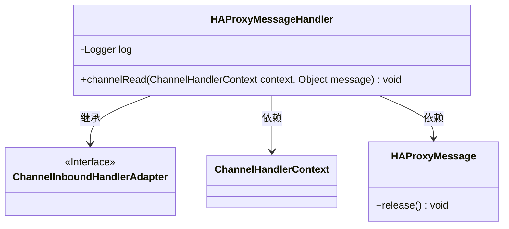
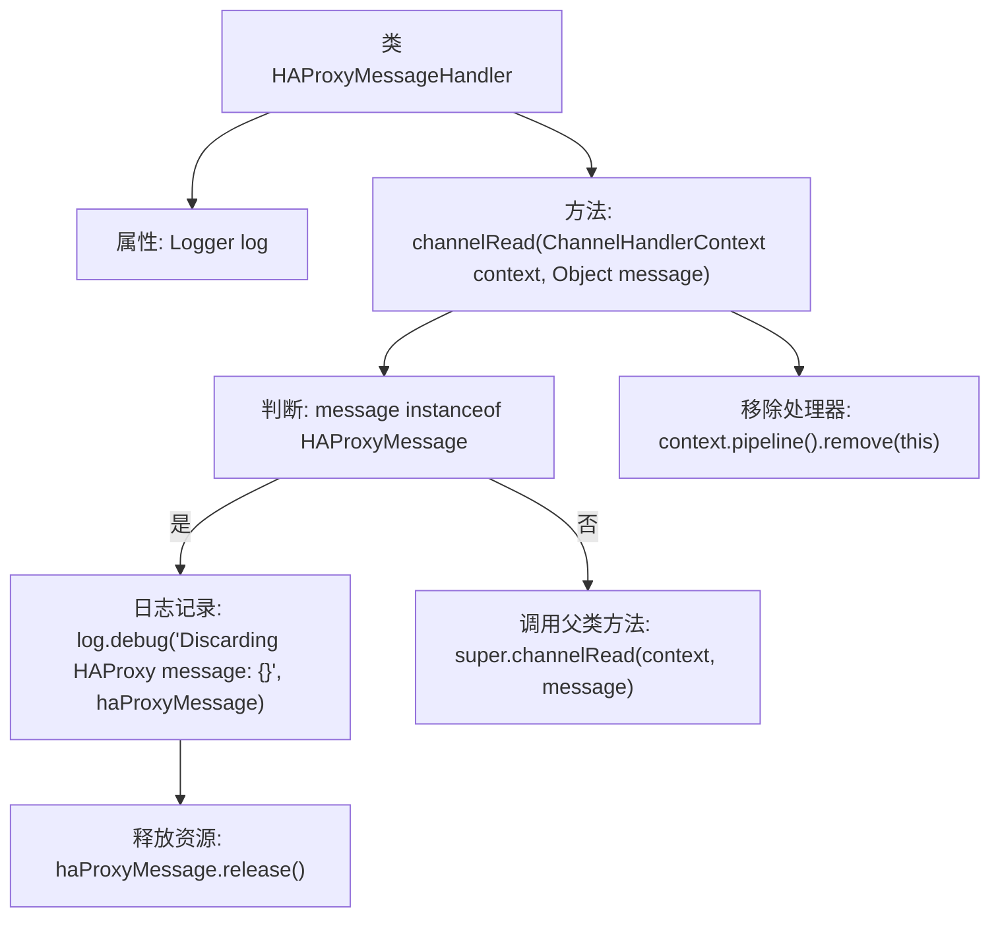

# 基础信息

|      |      |
|------|------|
| 名称 | HAProxyMessageHandler |
| 编码语言 | .java |
| 代码路径 | Signal-Server/service/src/main/java/org/whispersystems/textsecuregcm/grpc/net/HAProxyMessageHandler.java |
| 包名 | org.whispersystems.textsecuregcm.grpc.net |
| 依赖项 | ['io.netty.channel.ChannelHandlerContext', 'io.netty.channel.ChannelInboundHandlerAdapter', 'io.netty.handler.codec.haproxy.HAProxyMessage', 'org.slf4j.Logger', 'org.slf4j.LoggerFactory'] |
| 概述说明 | HAProxyMessageHandler处理并丢弃消息，清理管道后自移除。 |

# 说明

HAProxyMessageHandler负责处理并丢弃HAProxy消息，执行清理管道的操作，随后从系统中移除自身。这一过程确保了消息处理的完整性和系统的资源管理，避免不必要的内存占用和潜在的错误。通过这种方式，系统能够高效地处理消息并维持稳定的运行状态。

# 类列表 Class Summary

| 名称   | 类型  | 说明 |
|-------|------|-------------|
| HAProxyMessageHandler | class | HAProxyMessageHandler处理并丢弃HAProxy消息，清理管道后移除自身。 |

## 类 HAProxyMessageHandler

|      |      |
|------|------|
| 访问范围 | public |
| 类型 | class |
| 名称 | HAProxyMessageHandler |
| 说明 | HAProxyMessageHandler处理并丢弃HAProxy消息，清理管道后移除自身。 |

### UML类图

**描述**：`HAProxyMessageHandler`类继承自`ChannelInboundHandlerAdapter`，用于处理来自网络通道的消息。它通过`channelRead`方法检查消息是否为`HAProxyMessage`类型，如果是，则记录并释放该消息，否则将消息传递给父类处理。处理完第一个消息后，`HAProxyMessageHandler`会从管道中移除自身，确保后续消息不会被其处理。

### 内部方法调用关系图

这段代码定义了一个`HAProxyMessageHandler`类，继承自`ChannelInboundHandlerAdapter`，用于处理网络消息。`channelRead`方法首先检查传入的消息是否为`HAProxyMessage`类型，如果是，则记录日志并释放资源；如果不是，则调用父类的`channelRead`方法。无论消息类型如何，该方法都会在处理完第一个消息后从管道中移除自身处理器。

### 字段列表 Field List

| 名称  | 类型  | 说明 |
|-------|-------|------|
| log = LoggerFactory.getLogger(HAProxyMessageHandler.class) | Logger | HAProxyMessageHandler类中定义了一个静态的日志记录器。 |

### 方法列表 Method List

| 名称  | 类型  | 说明 |
|-------|-------|------|
| channelRead | void | 处理HAProxy消息并移除管道处理器。 |

