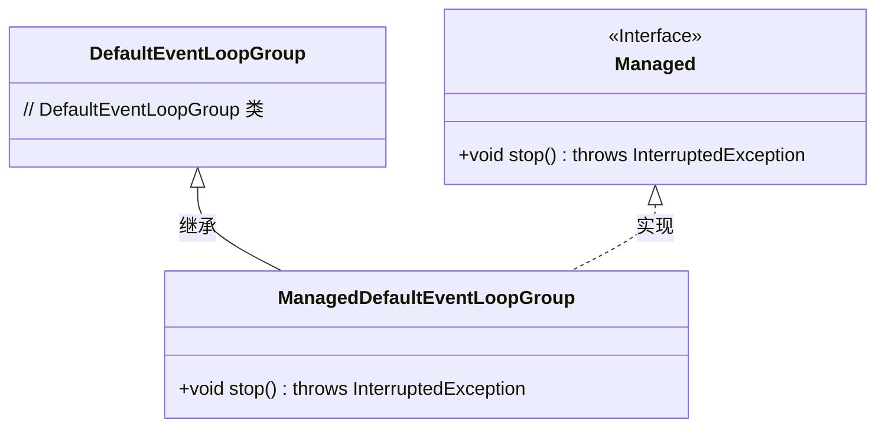
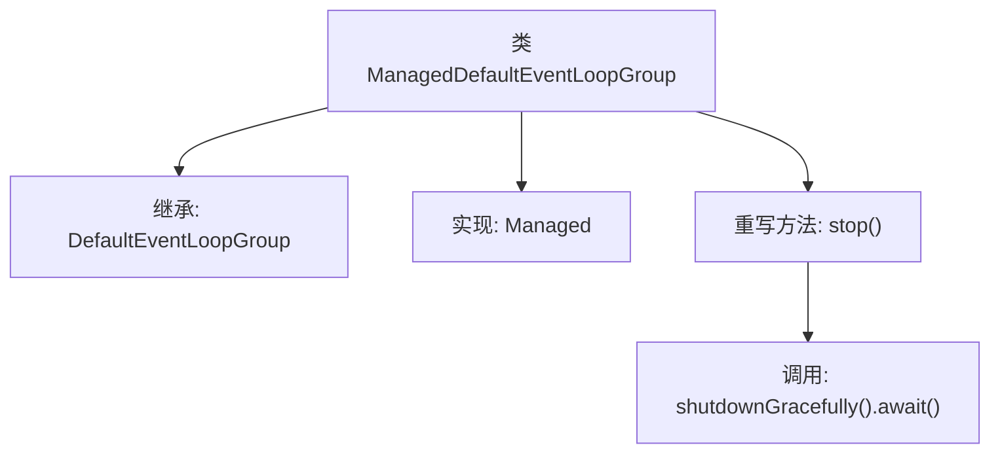

# 基础信息

|      |      |
|------|------|
| 名称 | ManagedDefaultEventLoopGroup |
| 编码语言 | .java |
| 代码路径 | Signal-Server/service/src/main/java/org/whispersystems/textsecuregcm/grpc/net/ManagedDefaultEventLoopGroup.java |
| 包名 | org.whispersystems.textsecuregcm.grpc.net |
| 依赖项 | ['io.dropwizard.lifecycle.Managed', 'io.netty.channel.DefaultEventLoopGroup'] |
| 概述说明 | ManagedDefaultEventLoopGroup继承DefaultEventLoopGroup，重写stop方法，实现优雅关闭线程组。 |

# 说明

ManagedDefaultEventLoopGroup继承自DefaultEventLoopGroup，并实现了Managed接口。该类重写了stop方法，以确保线程组能够优雅地关闭。通过这种方式，ManagedDefaultEventLoopGroup提供了对线程组生命周期的更好控制，确保资源在不再需要时能够被正确释放，从而提高系统的稳定性和可靠性。

# 类列表 Class Summary

| 名称   | 类型  | 说明 |
|-------|------|-------------|
| ManagedDefaultEventLoopGroup | class | ManagedDefaultEventLoopGroup继承DefaultEventLoopGroup，实现Managed接口，重写stop方法，优雅关闭线程组。 |

## 类 ManagedDefaultEventLoopGroup

|      |      |
|------|------|
| 访问范围 | public |
| 类型 | class |
| 名称 | ManagedDefaultEventLoopGroup |
| 说明 | ManagedDefaultEventLoopGroup继承DefaultEventLoopGroup，实现Managed接口，重写stop方法，优雅关闭线程组。 |

### UML类图

这段代码定义了一个 `ManagedDefaultEventLoopGroup` 类，该类继承了 `DefaultEventLoopGroup` 并实现了 `Managed` 接口。`ManagedDefaultEventLoopGroup` 类重写了 `stop` 方法，该方法会调用 `shutdownGracefully` 并等待其完成。`Managed` 接口定义了一个 `stop` 方法，要求实现类必须提供该方法。通过继承和实现，`ManagedDefaultEventLoopGroup` 类既拥有了 `DefaultEventLoopGroup` 的功能，又满足了 `Managed` 接口的契约。

### 内部方法调用关系图

这段代码定义了一个名为`ManagedDefaultEventLoopGroup`的类，它继承自`DefaultEventLoopGroup`并实现了`Managed`接口。类中重写了`stop()`方法，该方法调用了`shutdownGracefully().await()`来优雅地关闭事件循环组并等待其完成。流程图展示了类的继承关系、接口实现以及方法调用的逻辑顺序。

### 字段列表 Field List

| 名称  | 类型  | 说明 |
|-------|-------|------|

### 方法列表 Method List

| 名称  | 类型  | 说明 |
|-------|-------|------|
| stop | void | 重写stop方法，优雅关闭并等待完成。 |

