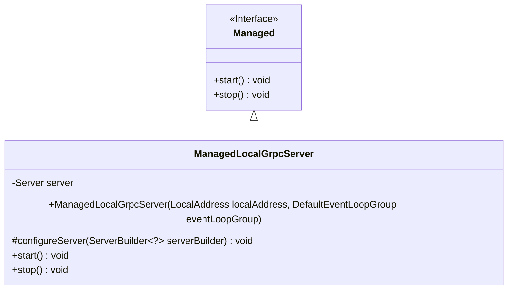
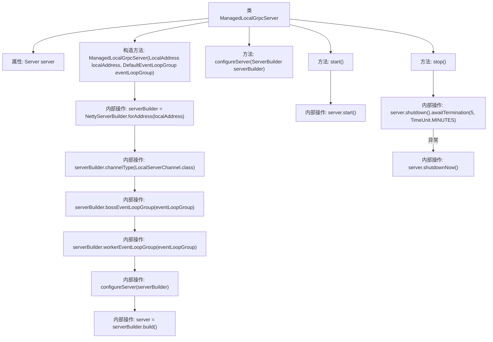

# 基础信息

|      |      |
|------|------|
| 名称 | ManagedLocalGrpcServer |
| 编码语言 | .java |
| 代码路径 | Signal-Server/service/src/main/java/org/whispersystems/textsecuregcm/grpc/net/ManagedLocalGrpcServer.java |
| 包名 | org.whispersystems.textsecuregcm.grpc.net |
| 依赖项 | ['io.dropwizard.lifecycle.Managed', 'io.grpc.Server', 'io.grpc.ServerBuilder', 'io.grpc.netty.NettyServerBuilder', 'io.netty.channel.DefaultEventLoopGroup', 'io.netty.channel.local.LocalAddress', 'io.netty.channel.local.LocalServerChannel', 'java.io.IOException', 'java.util.concurrent.TimeUnit'] |
| 概述说明 | ManagedLocalGrpcServer类负责本地gRPC服务器的启动、停止和配置管理。 |

# 说明

ManagedLocalGrpcServer类用于管理本地gRPC服务器，提供启动、停止和配置服务器的功能。该类支持对服务器进行全面的控制，确保服务器能够按照需求运行和停止，同时允许用户根据具体场景对服务器进行配置，以满足不同的使用需求。

# 类列表 Class Summary

| 名称   | 类型  | 说明 |
|-------|------|-------------|
| ManagedLocalGrpcServer | class | ManagedLocalGrpcServer类管理本地gRPC服务器，支持启动、停止及配置服务器。 |

## 类 ManagedLocalGrpcServer

|      |      |
|------|------|
| 访问范围 | public abstract |
| 类型 | class |
| 名称 | ManagedLocalGrpcServer |
| 说明 | ManagedLocalGrpcServer类管理本地gRPC服务器，支持启动、停止及配置服务器。 |

### UML类图

### 描述
`ManagedLocalGrpcServer` 是一个抽象类，实现了 `Managed` 接口，用于管理本地 gRPC 服务器的生命周期。它包含一个 `Server` 实例，并通过构造函数初始化该实例。`configureServer` 是一个抽象方法，允许子类自定义服务器配置。`start` 和 `stop` 方法分别用于启动和停止服务器，确保资源的正确释放。

### 内部方法调用关系图

这段代码定义了一个抽象类 `ManagedLocalGrpcServer`，用于管理gRPC服务器的生命周期。构造函数初始化服务器配置，包括地址、事件循环组和通道类型。`configureServer` 方法由子类实现以进一步配置服务器。`start` 方法启动服务器，`stop` 方法则尝试优雅关闭服务器，若超时则强制关闭。

### 字段列表 Field List

| 名称  | 类型  | 说明 |
|-------|-------|------|
| server | Server | 私有且不可变的服务器实例。 |

### 方法列表 Method List

| 名称  | 类型  | 说明 |
|-------|-------|------|
| stop | void | 服务器停止方法，等待5分钟或立即关闭。 |
| start | void | 重写start方法，调用server.start()启动服务器。 |
| configureServer | void | 配置服务器抽象方法，需实现具体逻辑。 |

