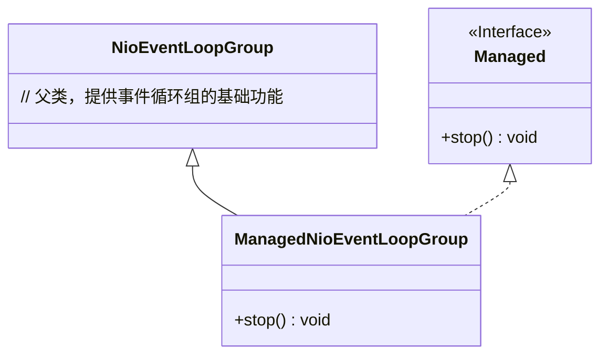
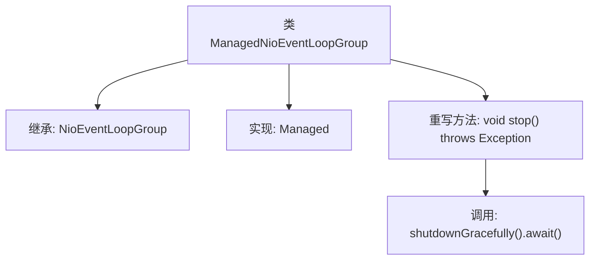

# 基础信息

|      |      |
|------|------|
| 名称 | ManagedNioEventLoopGroup |
| 编码语言 | .java |
| 代码路径 | Signal-Server/service/src/main/java/org/whispersystems/textsecuregcm/grpc/net/ManagedNioEventLoopGroup.java |
| 包名 | org.whispersystems.textsecuregcm.grpc.net |
| 依赖项 | ['io.dropwizard.lifecycle.Managed', 'io.netty.channel.nio.NioEventLoopGroup'] |
| 概述说明 | ManagedNioEventLoopGroup继承NioEventLoopGroup，实现Managed接口，重写stop方法以优雅关闭。 |

# 说明

ManagedNioEventLoopGroup是NioEventLoopGroup的子类，同时实现了Managed接口。该类的主要特点是重写了stop方法，以确保在关闭时能够进行优雅的终止操作。通过这种方式，ManagedNioEventLoopGroup不仅继承了NioEventLoopGroup的功能，还增强了其管理和控制能力，特别是在资源释放和线程终止方面，提供了更为安全和可控的关闭机制。

# 类列表 Class Summary

| 名称   | 类型  | 说明 |
|-------|------|-------------|
| ManagedNioEventLoopGroup | class | ManagedNioEventLoopGroup继承NioEventLoopGroup，实现Managed接口，重写stop方法以优雅关闭。 |

## 类 ManagedNioEventLoopGroup

|      |      |
|------|------|
| 访问范围 | public |
| 类型 | class |
| 名称 | ManagedNioEventLoopGroup |
| 说明 | ManagedNioEventLoopGroup继承NioEventLoopGroup，实现Managed接口，重写stop方法以优雅关闭。 |

### UML类图

这段代码定义了一个 `ManagedNioEventLoopGroup` 类，它继承自 `NioEventLoopGroup` 并实现了 `Managed` 接口。`ManagedNioEventLoopGroup` 类重写了 `stop` 方法，该方法调用 `shutdownGracefully` 并等待其完成。`Managed` 接口定义了 `stop` 方法，`ManagedNioEventLoopGroup` 类通过实现该接口来提供停止功能。类图清晰地展示了类之间的继承和实现关系。

### 内部方法调用关系图

这段代码定义了一个名为 `ManagedNioEventLoopGroup` 的类，它继承自 `NioEventLoopGroup` 并实现了 `Managed` 接口。类中重写了 `stop` 方法，该方法调用 `shutdownGracefully().await()` 来优雅地关闭事件循环组。流程图展示了类的继承关系、接口实现以及方法调用的逻辑流程。

### 字段列表 Field List

| 名称  | 类型  | 说明 |
|-------|-------|------|

### 方法列表 Method List

| 名称  | 类型  | 说明 |
|-------|-------|------|
| stop | void | 重写stop方法，优雅关闭并等待完成。 |

