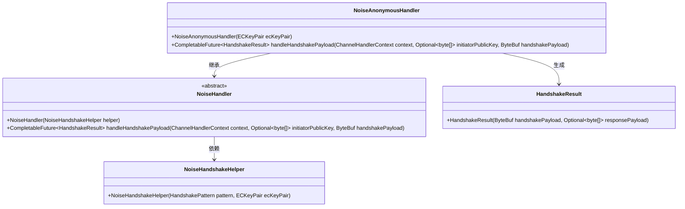
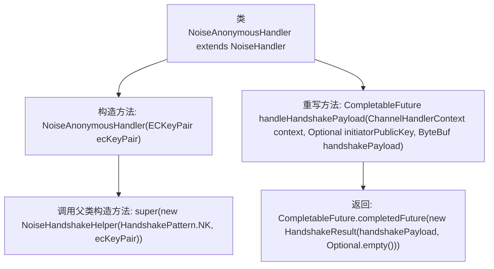

# 基础信息

|      |      |
|------|------|
| 名称 | NoiseAnonymousHandler |
| 编码语言 | .java |
| 代码路径 | Signal-Server/service/src/main/java/org/whispersystems/textsecuregcm/grpc/net/NoiseAnonymousHandler.java |
| 包名 | org.whispersystems.textsecuregcm.grpc.net |
| 依赖项 | ['io.netty.buffer.ByteBuf', 'io.netty.channel.ChannelHandlerContext', 'java.util.Optional', 'java.util.concurrent.CompletableFuture', 'org.signal.libsignal.protocol.ecc.ECKeyPair'] |
| 概述说明 | NoiseAnonymousHandler继承NoiseHandler，处理握手载荷并返回结果。 |

# 说明

NoiseAnonymousHandler是NoiseHandler的子类，专门用于处理握手过程中的载荷数据，并返回相应的处理结果。该处理器在匿名通信场景中发挥作用，确保握手信息的正确解析和响应。通过继承NoiseHandler，它继承了处理噪声协议的基本功能，同时针对匿名通信的需求进行了特定实现，以优化握手流程和结果返回。

# 类列表 Class Summary

| 名称   | 类型  | 说明 |
|-------|------|-------------|
| NoiseAnonymousHandler | class | NoiseAnonymousHandler继承NoiseHandler，处理握手载荷并返回结果。 |

## 类 NoiseAnonymousHandler

|      |      |
|------|------|
| 访问范围 | None |
| 类型 | class |
| 名称 | NoiseAnonymousHandler |
| 说明 | NoiseAnonymousHandler继承NoiseHandler，处理握手载荷并返回结果。 |

### UML类图

这段代码描述了一个继承自 `NoiseHandler` 的 `NoiseAnonymousHandler` 类。`NoiseAnonymousHandler` 通过构造函数接受 `ECKeyPair` 参数，并调用父类 `NoiseHandler` 的构造函数，传入一个 `NoiseHandshakeHelper` 实例。`NoiseAnonymousHandler` 重写了 `handleHandshakePayload` 方法，返回一个包含 `HandshakeResult` 的 `CompletableFuture`。`HandshakeResult` 包含握手负载和可选的响应负载。整体结构展示了类之间的继承和依赖关系。

### 内部方法调用关系图

这段代码定义了一个名为 `NoiseAnonymousHandler` 的类，该类继承自 `NoiseHandler`。构造函数 `NoiseAnonymousHandler` 接收一个 `ECKeyPair` 参数，并调用父类的构造函数，传入一个 `NoiseHandshakeHelper` 实例。类中重写了 `handleHandshakePayload` 方法，该方法接收 `ChannelHandlerContext`、`Optional<byte[]>` 和 `ByteBuf` 作为参数，并返回一个包含 `HandshakeResult` 的 `CompletableFuture` 对象。`HandshakeResult` 包含 `handshakePayload` 和一个空的 `Optional`。

### 字段列表 Field List

| 名称  | 类型  | 说明 |
|-------|-------|------|

### 方法列表 Method List

| 名称  | 类型  | 说明 |
|-------|-------|------|
| handleHandshakePayload | CompletableFuture<HandshakeResult> | 重写方法处理握手负载，返回包含负载和空公钥的握手结果。 |

