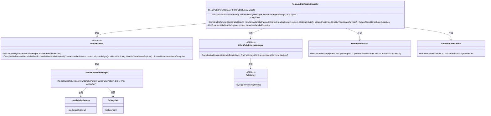
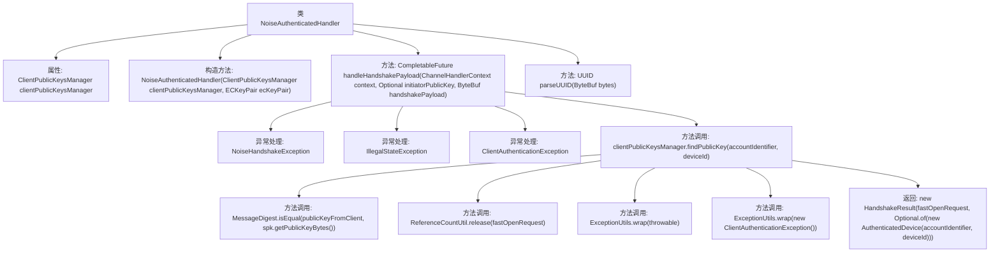

# 基础信息

|      |      |
|------|------|
| 名称 | NoiseAuthenticatedHandler |
| 编码语言 | .java |
| 代码路径 | Signal-Server/service/src/main/java/org/whispersystems/textsecuregcm/grpc/net/NoiseAuthenticatedHandler.java |
| 包名 | org.whispersystems.textsecuregcm.grpc.net |
| 依赖项 | ['io.netty.buffer.ByteBuf', 'io.netty.channel.ChannelHandlerContext', 'io.netty.util.ReferenceCountUtil', 'java.security.MessageDigest', 'java.util.Optional', 'java.util.UUID', 'java.util.concurrent.CompletableFuture', 'org.signal.libsignal.protocol.ecc.ECKeyPair', 'org.whispersystems.textsecuregcm.auth.grpc.AuthenticatedDevice', 'org.whispersystems.textsecuregcm.storage.ClientPublicKeysManager', 'org.whispersystems.textsecuregcm.util.ExceptionUtils'] |
| 概述说明 | NoiseAuthenticatedHandler类负责握手认证，验证客户端公钥并返回结果。 |

# 说明

NoiseAuthenticatedHandler类负责处理握手认证过程，主要功能是验证客户端的公钥，并根据验证结果返回相应的认证结果。该类确保在握手阶段对客户端身份进行有效验证，以保障通信的安全性和可靠性。

# 类列表 Class Summary

| 名称   | 类型  | 说明 |
|-------|------|-------------|
| NoiseAuthenticatedHandler | class | NoiseAuthenticatedHandler类处理握手认证，验证客户端公钥并返回认证结果。 |

## 类 NoiseAuthenticatedHandler

|      |      |
|------|------|
| 访问范围 | None |
| 类型 | class |
| 名称 | NoiseAuthenticatedHandler |
| 说明 | NoiseAuthenticatedHandler类处理握手认证，验证客户端公钥并返回认证结果。 |

### UML类图

### 描述
`NoiseAuthenticatedHandler` 是一个继承自 `NoiseHandler` 的类，用于处理加密握手过程中的认证逻辑。它依赖于 `ClientPublicKeysManager` 来查找客户端的公钥，并通过 `NoiseHandshakeHelper` 进行握手操作。`handleHandshakePayload` 方法负责解析握手负载，验证客户端公钥，并生成 `HandshakeResult` 和 `AuthenticatedDevice` 对象。整个流程涉及多个类的协作，确保握手过程的安全性和正确性。

### 内部方法调用关系图

这段代码定义了一个名为 `NoiseAuthenticatedHandler` 的类，继承自 `NoiseHandler`。该类负责处理握手过程中的认证逻辑，主要方法 `handleHandshakePayload` 用于验证客户端发送的公钥和账户标识符，并返回握手结果。代码中还包含了对异常情况的处理，如无效的握手负载、缺失的远程公钥以及客户端认证失败等。流程图展示了类的主要结构、方法调用关系以及异常处理流程。

### 字段列表 Field List

| 名称  | 类型  | 说明 |
|-------|-------|------|
| clientPublicKeysManager | ClientPublicKeysManager | 私有客户端公钥管理器实例。 |

### 方法列表 Method List

| 名称  | 类型  | 说明 |
|-------|-------|------|
| handleHandshakePayload | CompletableFuture<HandshakeResult> | 处理握手负载，验证客户端公钥，返回握手结果。 |
| parseUUID | UUID | 解析16字节生成UUID，不足则抛出异常。 |

