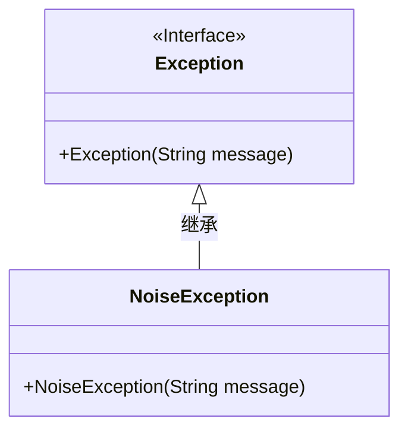
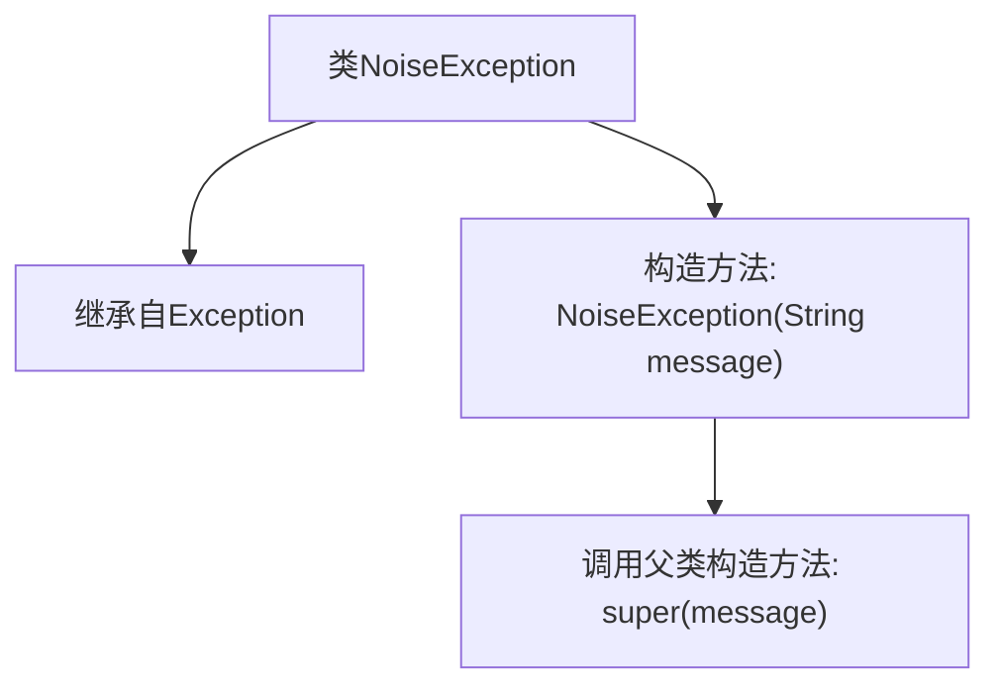

# 基础信息

|      |      |
|------|------|
| 名称 | NoiseException |
| 编码语言 | .java |
| 代码路径 | Signal-Server/service/src/main/java/org/whispersystems/textsecuregcm/grpc/net/NoiseException.java |
| 包名 | org.whispersystems.textsecuregcm.grpc.net |
| 依赖项 | [] |
| 概述说明 | NoiseException继承Exception，具有带参构造方法。 |

# 说明

NoiseException是一个继承自Exception的自定义异常类。它包含一个带参数的构造方法，用于在创建异常实例时传递特定的信息。通过继承Exception，NoiseException具备了标准异常类的特性，可以在程序中用于捕获和处理特定的错误情况。带参构造方法使得在抛出异常时能够附带详细的错误信息，便于开发者进行调试和问题定位。

# 类列表 Class Summary

| 名称   | 类型  | 说明 |
|-------|------|-------------|
| NoiseException | class | NoiseException继承Exception，含带参构造方法。 |

## 类 NoiseException

|      |      |
|------|------|
| 访问范围 | None |
| 类型 | class |
| 名称 | NoiseException |
| 说明 | NoiseException继承Exception，含带参构造方法。 |

### UML类图

这段代码定义了一个名为 `NoiseException` 的异常类，它继承自 `Exception` 类。`NoiseException` 类有一个构造函数，接受一个 `String` 类型的参数 `message`，并将其传递给父类 `Exception` 的构造函数。这个异常类用于表示与噪声相关的错误或异常情况。通过继承 `Exception`，`NoiseException` 具备了标准异常的所有功能，并且可以自定义异常信息。

### 内部方法调用关系图

这段代码定义了一个名为 `NoiseException` 的自定义异常类，它继承自 Java 的 `Exception` 类。`NoiseException` 类包含一个构造方法，该方法接受一个字符串参数 `message`，并通过 `super(message)` 调用父类 `Exception` 的构造方法来初始化异常信息。该流程图展示了类的继承关系和构造方法的调用流程。

### 字段列表 Field List

| 名称  | 类型  | 说明 |
|-------|-------|------|

### 方法列表 Method List

| 名称  | 类型  | 说明 |
|-------|-------|------|

