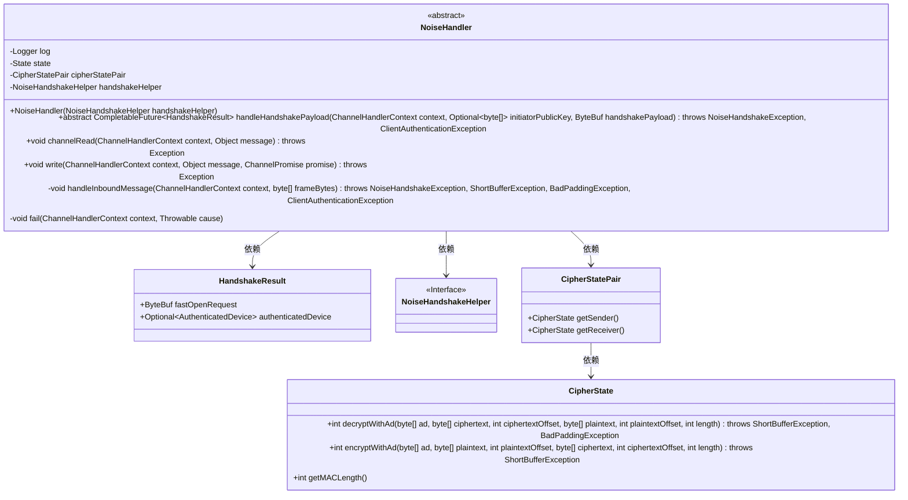
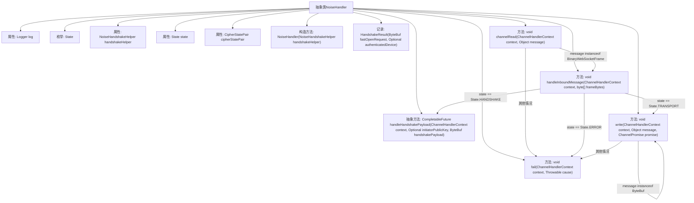

# 基础信息

|      |      |
|------|------|
| 名称 | NoiseHandler |
| 编码语言 | .java |
| 代码路径 | Signal-Server/service/src/main/java/org/whispersystems/textsecuregcm/grpc/net/NoiseHandler.java |
| 包名 | org.whispersystems.textsecuregcm.grpc.net |
| 依赖项 | ['com.southernstorm.noise.protocol.CipherState', 'com.southernstorm.noise.protocol.CipherStatePair', 'com.southernstorm.noise.protocol.Noise', 'io.netty.buffer.ByteBuf', 'io.netty.buffer.ByteBufUtil', 'io.netty.buffer.Unpooled', 'io.netty.channel.ChannelDuplexHandler', 'io.netty.channel.ChannelFutureListener', 'io.netty.channel.ChannelHandlerContext', 'io.netty.channel.ChannelPromise', 'io.netty.handler.codec.http.websocketx.BinaryWebSocketFrame', 'io.netty.handler.codec.http.websocketx.WebSocketFrame', 'io.netty.util.ReferenceCountUtil', 'io.netty.util.concurrent.PromiseCombiner', 'io.netty.util.internal.EmptyArrays', 'java.util.Optional', 'java.util.concurrent.CompletableFuture', 'javax.crypto.BadPaddingException', 'javax.crypto.ShortBufferException', 'org.slf4j.Logger', 'org.slf4j.LoggerFactory', 'org.whispersystems.textsecuregcm.auth.grpc.AuthenticatedDevice', 'org.whispersystems.textsecuregcm.util.ExceptionUtils'] |
| 概述说明 | NoiseHandler类负责加密通信，处理握手、传输及加解密操作。 |

# 说明

NoiseHandler类专门用于处理加密通信，主要功能包括支持握手过程和传输状态管理，同时负责加密和解密操作的管理。该类确保通信过程的安全性和数据的完整性，通过握手机制建立安全连接，并在传输过程中维护状态，以高效处理加密和解密任务。

# 类列表 Class Summary

| 名称   | 类型  | 说明 |
|-------|------|-------------|
| NoiseHandler | class | NoiseHandler类用于处理加密通信，支持握手和传输状态，管理加密解密操作。 |

## 类 NoiseHandler

|      |      |
|------|------|
| 访问范围 | abstract |
| 类型 | class |
| 名称 | NoiseHandler |
| 说明 | NoiseHandler类用于处理加密通信，支持握手和传输状态，管理加密解密操作。 |

### UML类图

**描述：**  
`NoiseHandler` 是一个抽象类，继承自 `ChannelDuplexHandler`，用于处理噪声协议的握手和消息传输。它依赖于 `NoiseHandshakeHelper` 来处理握手逻辑，并使用 `CipherStatePair` 和 `CipherState` 进行消息的加密和解密。`HandshakeResult` 是一个记录类，用于存储握手结果。`NoiseHandler` 通过 `channelRead` 和 `write` 方法处理入站和出站消息，并在握手完成后切换到传输状态，继续处理加密消息。

### 内部方法调用关系图

这段代码定义了一个抽象类 `NoiseHandler`，用于处理噪声协议（Noise Protocol）的握手和消息加密/解密过程。类中包含多个方法，如 `channelRead` 用于读取消息并根据当前状态进行处理，`handleInboundMessage` 用于处理不同类型的消息，`fail` 用于处理错误状态，`write` 用于加密并发送消息。代码通过状态机（`State` 枚举）来管理不同的处理阶段，包括握手、传输和错误状态。

### 字段列表 Field List

| 名称  | 类型  | 说明 |
|-------|-------|------|
| handshakeHelper | NoiseHandshakeHelper | 私有不可变的NoiseHandshakeHelper握手助手实例。 |
| log = LoggerFactory.getLogger(NoiseHandler.class) | Logger | NoiseHandler类中声明了一个静态的日志记录器。 |
| state = State.HANDSHAKE | State | 私有变量state初始化为HANDSHAKE状态。 |
| cipherStatePair | CipherStatePair | 私有变量cipherStatePair存储加密状态对。 |

### 方法列表 Method List

| 名称  | 类型  | 说明 |
|-------|-------|------|
| fail | void | 方法fail设置状态为ERROR并触发异常处理。 |
| channelRead | void | 处理WebSocket二进制帧，验证长度，转换缓冲区，异常处理并释放资源。 |
| write | void | 处理字节流加密并分块发送，确保数据完整性和安全性。 |
| handleInboundMessage | void | 处理入站消息，包括握手、解密和转发，根据状态执行相应操作。 |
| handleHandshakePayload | CompletableFuture<HandshakeResult> | 处理握手负载，返回握手结果，可能抛出异常。 |

