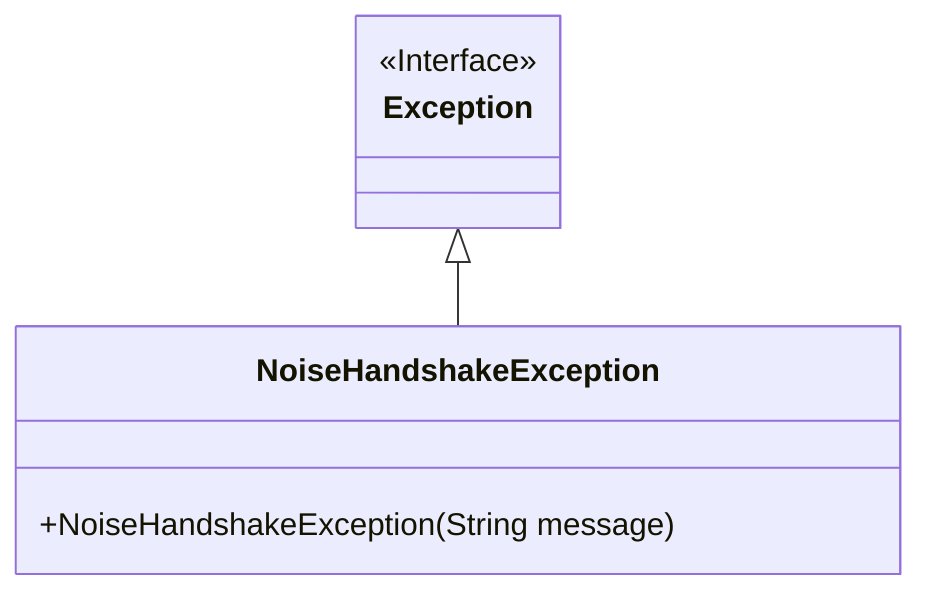
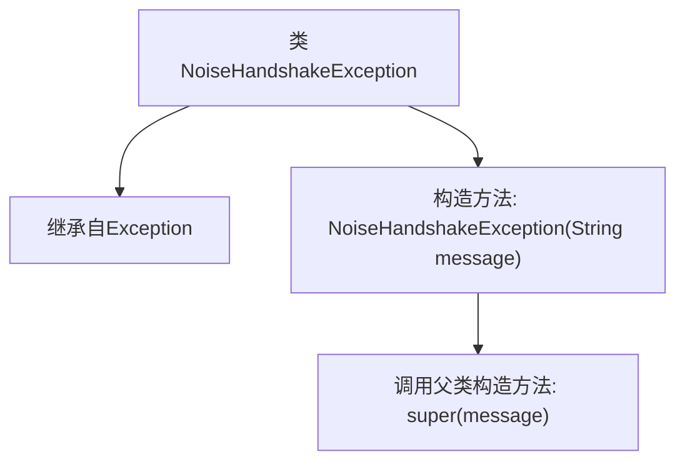

# 基础信息

|      |      |
|------|------|
| 名称 | NoiseHandshakeException |
| 编码语言 | .java |
| 代码路径 | Signal-Server/service/src/main/java/org/whispersystems/textsecuregcm/grpc/net/NoiseHandshakeException.java |
| 包名 | org.whispersystems.textsecuregcm.grpc.net |
| 依赖项 | [] |
| 概述说明 | NoiseHandshakeException继承Exception，构造函数接受字符串参数。 |

# 说明

NoiseHandshakeException是一个继承自Exception的异常类，它包含一个带字符串参数的构造函数。这个构造函数允许在创建异常实例时传递一个字符串消息，用于描述异常的具体情况或原因。通过继承Exception类，NoiseHandshakeException具备了标准异常的基本功能，并可以通过自定义的构造函数提供更详细的异常信息。

# 类列表 Class Summary

| 名称   | 类型  | 说明 |
|-------|------|-------------|
| NoiseHandshakeException | class | NoiseHandshakeException继承Exception，带字符串参数的构造函数。 |

## 类 NoiseHandshakeException

|      |      |
|------|------|
| 访问范围 | None |
| 类型 | class |
| 名称 | NoiseHandshakeException |
| 说明 | NoiseHandshakeException继承Exception，带字符串参数的构造函数。 |

### UML类图

**描述：**  
该代码定义了一个名为 `NoiseHandshakeException` 的异常类，它继承自 `Exception` 类。`NoiseHandshakeException` 类包含一个构造函数，接受一个 `String` 类型的参数 `message`，并将其传递给父类 `Exception` 的构造函数。这个异常类通常用于处理在噪声握手过程中出现的错误情况。

### 内部方法调用关系图

这段代码定义了一个名为 `NoiseHandshakeException` 的类，该类继承自 `Exception`。`NoiseHandshakeException` 类包含一个构造方法，该构造方法接受一个 `String` 类型的参数 `message`，并通过 `super(message)` 调用父类 `Exception` 的构造方法。这个类的主要作用是创建一个自定义的异常类型，用于处理与噪声握手相关的错误情况。

### 字段列表 Field List

| 名称  | 类型  | 说明 |
|-------|-------|------|

### 方法列表 Method List

| 名称  | 类型  | 说明 |
|-------|-------|------|

