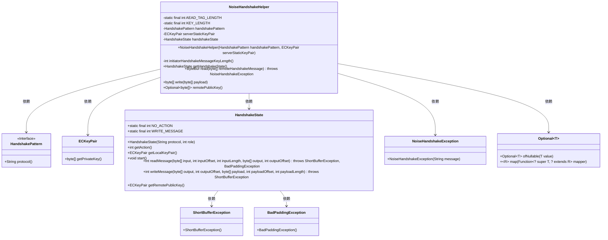
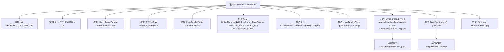

# 基础信息

|      |      |
|------|------|
| 名称 | NoiseHandshakeHelper |
| 编码语言 | .java |
| 代码路径 | Signal-Server/service/src/main/java/org/whispersystems/textsecuregcm/grpc/net/NoiseHandshakeHelper.java |
| 包名 | org.whispersystems.textsecuregcm.grpc.net |
| 依赖项 | ['com.southernstorm.noise.protocol.HandshakeState', 'com.southernstorm.noise.protocol.Noise', 'io.netty.buffer.ByteBuf', 'io.netty.buffer.Unpooled', 'java.security.NoSuchAlgorithmException', 'java.util.Optional', 'javax.crypto.BadPaddingException', 'javax.crypto.ShortBufferException', 'org.signal.libsignal.protocol.ecc.ECKeyPair'] |
| 概述说明 | NoiseHandshakeHelper类负责Noise协议握手，管理密钥、状态和消息读写。 |

# 说明

NoiseHandshakeHelper类负责处理Noise协议的握手过程，主要功能包括管理密钥、维护握手状态以及处理消息的读写操作。该类确保握手过程中的安全性和正确性，为后续通信提供必要的密钥和状态支持。

# 类列表 Class Summary

| 名称   | 类型  | 说明 |
|-------|------|-------------|
| NoiseHandshakeHelper | class | NoiseHandshakeHelper类处理Noise协议握手，管理密钥、状态和消息读写。 |

## 类 NoiseHandshakeHelper

|      |      |
|------|------|
| 访问范围 | None |
| 类型 | class |
| 名称 | NoiseHandshakeHelper |
| 说明 | NoiseHandshakeHelper类处理Noise协议握手，管理密钥、状态和消息读写。 |

### UML类图

这段代码定义了一个 `NoiseHandshakeHelper` 类，用于处理 Noise 协议中的握手过程。该类依赖于 `HandshakePattern`、`ECKeyPair` 和 `HandshakeState` 等类，并通过 `read` 和 `write` 方法处理握手消息的读取和写入。`NoiseHandshakeHelper` 还提供了 `remotePublicKey` 方法来获取远程公钥。代码中处理了多种异常情况，如 `ShortBufferException` 和 `BadPaddingException`，确保握手过程的安全性。

### 内部方法调用关系图

**描述：** 该流程图展示了`NoiseHandshakeHelper`类的结构及其内部方法调用关系。类中包含两个常量、三个属性、一个构造方法和四个主要方法。其中，`read`方法用于读取远程握手消息并处理可能的异常，`write`方法用于生成握手响应并处理可能的异常。`remotePublicKey`方法用于获取远程公钥。流程图清晰地展示了类中各部分的依赖关系和调用流程。

### 字段列表 Field List

| 名称  | 类型  | 说明 |
|-------|-------|------|
| handshakePattern | HandshakePattern | 私有不可变的握手模式变量。 |
| handshakeState | HandshakeState | 私有最终握手状态变量。 |
| AEAD_TAG_LENGTH = 16 | int | 定义了一个私有静态常量AEAD_TAG_LENGTH，值为16。 |
| serverStaticKeyPair | ECKeyPair | 服务器静态密钥对声明为私有不可变。 |
| KEY_LENGTH = 32 | int | 定义了长度为32的私有静态整型常量KEY_LENGTH。 |

### 方法列表 Method List

| 名称  | 类型  | 说明 |
|-------|-------|------|
| getHandshakeState | HandshakeState | 获取当前握手状态的方法。 |
| remotePublicKey | Optional<byte[]> | 方法返回远程公钥的字节数组，若存在则复制并返回。 |
| write | byte[] | write方法在握手完成前发送数据会抛出异常，支持已知服务器静态密钥的握手模式，返回加密响应。 |
| initiatorHandshakeMessageKeyLength | int | 方法返回握手消息密钥长度，IK模式包含临时密钥、静态密钥及AEAD标签，NK模式仅包含临时密钥。 |
| read | ByteBuf | 读取握手消息，验证长度，初始化加密握手，处理异常，返回有效负载。 |

