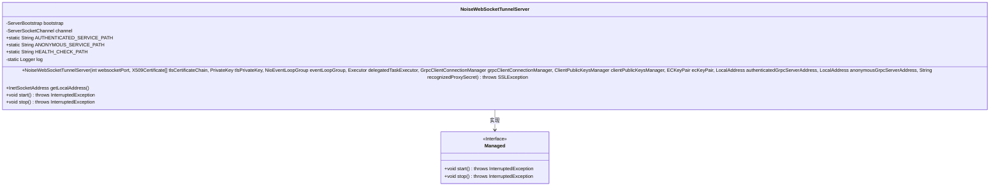
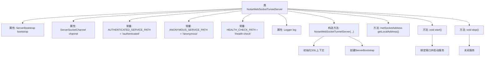

# 基础信息

|      |      |
|------|------|
| 名称 | NoiseWebSocketTunnelServer |
| 编码语言 | .java |
| 代码路径 | Signal-Server/service/src/main/java/org/whispersystems/textsecuregcm/grpc/net/NoiseWebSocketTunnelServer.java |
| 包名 | org.whispersystems.textsecuregcm.grpc.net |
| 依赖项 | ['com.google.common.annotations.VisibleForTesting', 'com.southernstorm.noise.protocol.Noise', 'io.dropwizard.lifecycle.Managed', 'io.netty.bootstrap.ServerBootstrap', 'io.netty.channel.ChannelInitializer', 'io.netty.channel.local.LocalAddress', 'io.netty.channel.nio.NioEventLoopGroup', 'io.netty.channel.socket.ServerSocketChannel', 'io.netty.channel.socket.SocketChannel', 'io.netty.channel.socket.nio.NioServerSocketChannel', 'io.netty.handler.codec.http.HttpObjectAggregator', 'io.netty.handler.codec.http.HttpServerCodec', 'io.netty.handler.codec.http.websocketx.WebSocketServerProtocolHandler', 'io.netty.handler.ssl.ClientAuth', 'io.netty.handler.ssl.OpenSsl', 'io.netty.handler.ssl.SslContext', 'io.netty.handler.ssl.SslContextBuilder', 'io.netty.handler.ssl.SslProtocols', 'io.netty.handler.ssl.SslProvider', 'java.net.InetSocketAddress', 'java.security.PrivateKey', 'java.security.cert.X509Certificate', 'java.util.concurrent.Executor', 'javax.annotation.Nullable', 'javax.net.ssl.SSLException', 'org.signal.libsignal.protocol.ecc.ECKeyPair', 'org.slf4j.Logger', 'org.slf4j.LoggerFactory', 'org.whispersystems.textsecuregcm.storage.ClientPublicKeysManager'] |
| 概述说明 | 实现WebSocket隧道服务器，支持TLS和gRPC连接管理。 |

# 说明

实现WebSocket隧道服务器，支持TLS加密和gRPC连接管理。该服务器能够通过WebSocket协议建立安全的通信隧道，确保数据传输的机密性和完整性。同时，集成TLS技术，为通信提供额外的加密层，防止数据被窃取或篡改。此外，服务器还支持gRPC连接管理，能够高效处理远程过程调用，提升系统性能和可扩展性。整体设计旨在提供安全、高效、可靠的通信解决方案，适用于多种网络应用场景。

# 类列表 Class Summary

| 名称   | 类型  | 说明 |
|-------|------|-------------|
| NoiseWebSocketTunnelServer | class | 实现WebSocket隧道服务器，支持TLS和gRPC连接管理。 |

## 类 NoiseWebSocketTunnelServer

|      |      |
|------|------|
| 访问范围 | public |
| 类型 | class |
| 名称 | NoiseWebSocketTunnelServer |
| 说明 | 实现WebSocket隧道服务器，支持TLS和gRPC连接管理。 |

### UML类图

**描述：**  
`NoiseWebSocketTunnelServer` 类实现 `Managed` 接口，用于管理基于 WebSocket 的隧道服务器。该类负责初始化服务器配置，包括 SSL/TLS 上下文、事件循环组、gRPC 连接管理等。通过 `start` 和 `stop` 方法，可以启动和停止服务器。类中还包含多个静态常量，用于定义服务路径和日志记录器。

### 内部方法调用关系图

这段代码定义了一个`NoiseWebSocketTunnelServer`类，用于管理和处理WebSocket隧道的服务器端逻辑。它包含多个常量和属性，用于配置和运行服务器。构造方法中初始化了SSL上下文和`ServerBootstrap`，用于处理WebSocket连接和协议。`start`方法用于启动服务器并绑定端口，`stop`方法用于关闭服务器。整个过程涉及SSL配置、WebSocket握手、本地gRPC连接建立等步骤。

### 字段列表 Field List

| 名称  | 类型  | 说明 |
|-------|-------|------|
| bootstrap | ServerBootstrap | 私有不可变的服务器引导实例。 |
| channel | ServerSocketChannel | 私有服务器套接字通道变量。 |
| HEALTH_CHECK_PATH = "/health-check" | String | 定义静态常量HEALTH_CHECK_PATH，值为"/health-check"。 |
| ANONYMOUS_SERVICE_PATH = "/anonymous" | String | 定义匿名服务路径为"/anonymous"。 |
| AUTHENTICATED_SERVICE_PATH = "/authenticated" | String | 定义静态常量AUTHENTICATED_SERVICE_PATH，值为"/authenticated"。 |
| log = LoggerFactory.getLogger(NoiseWebSocketTunnelServer.class) | Logger | 类NoiseWebSocketTunnelServer中定义了一个静态日志记录器。 |

### 方法列表 Method List

| 名称  | 类型  | 说明 |
|-------|-------|------|
| getLocalAddress | InetSocketAddress | 测试可见方法获取本地地址。 |
| start | void | 重写start方法，绑定并等待服务器通道。 |
| stop | void | 重写stop方法，关闭并等待channel完成。 |

