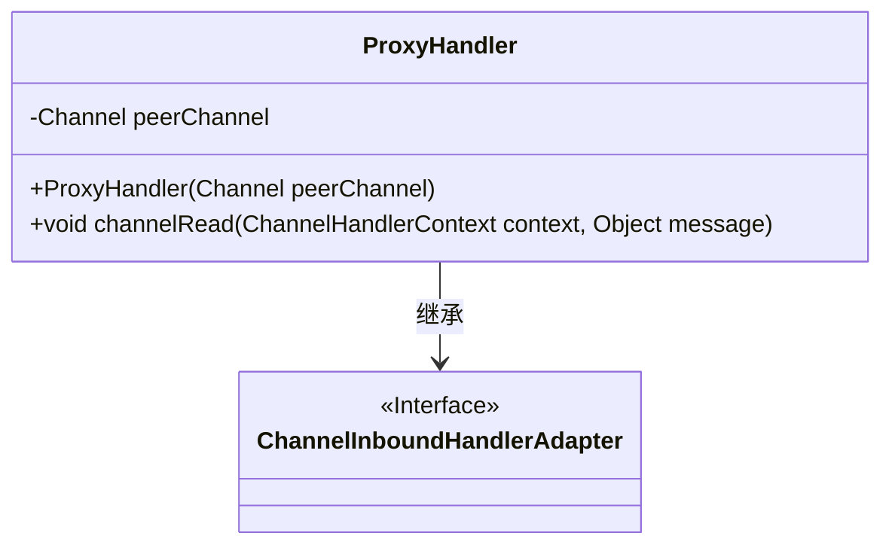
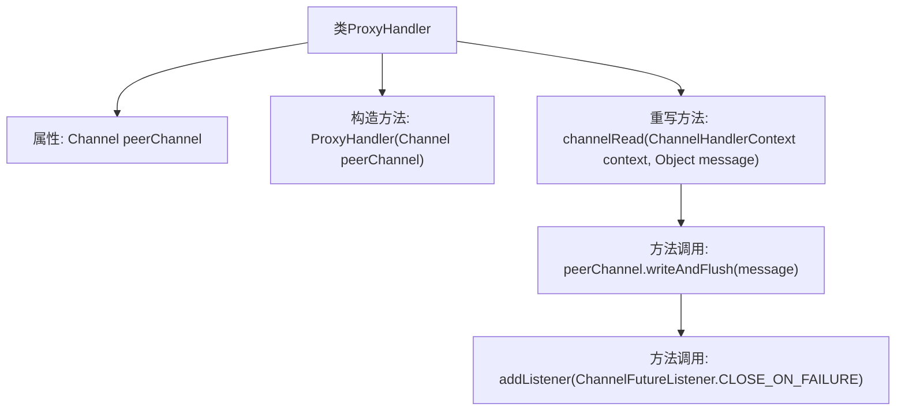

# 基础信息

|      |      |
|------|------|
| 名称 | ProxyHandler |
| 编码语言 | .java |
| 代码路径 | Signal-Server/service/src/main/java/org/whispersystems/textsecuregcm/grpc/net/ProxyHandler.java |
| 包名 | org.whispersystems.textsecuregcm.grpc.net |
| 依赖项 | ['io.netty.channel.Channel', 'io.netty.channel.ChannelFutureListener', 'io.netty.channel.ChannelHandlerContext', 'io.netty.channel.ChannelInboundHandlerAdapter'] |
| 概述说明 | ProxyHandler继承ChannelInboundHandlerAdapter，转发消息并在失败时关闭连接。 |

# 说明

ProxyHandler类继承自ChannelInboundHandlerAdapter，其主要功能是通过peerChannel转发消息。如果在消息转发过程中发生失败，该类会负责关闭相关连接，以确保系统稳定性和资源释放。

# 类列表 Class Summary

| 名称   | 类型  | 说明 |
|-------|------|-------------|
| ProxyHandler | class | ProxyHandler类继承ChannelInboundHandlerAdapter，通过peerChannel转发消息并在失败时关闭连接。 |

## 类 ProxyHandler

|      |      |
|------|------|
| 访问范围 | None |
| 类型 | class |
| 名称 | ProxyHandler |
| 说明 | ProxyHandler类继承ChannelInboundHandlerAdapter，通过peerChannel转发消息并在失败时关闭连接。 |

### UML类图

这段代码定义了一个 `ProxyHandler` 类，它继承自 `ChannelInboundHandlerAdapter` 接口。`ProxyHandler` 类包含一个私有的 `Channel` 类型的成员变量 `peerChannel`，并通过构造函数进行初始化。`channelRead` 方法用于处理从通道读取的消息，并将消息写入 `peerChannel`，同时在失败时关闭通道。该类的设计主要用于处理通道间的消息传递和异常处理。

### 内部方法调用关系图

这段代码定义了一个名为 `ProxyHandler` 的类，它继承自 `ChannelInboundHandlerAdapter`。该类包含一个 `Channel` 类型的属性 `peerChannel`，并通过构造函数进行初始化。`channelRead` 方法被重写，当接收到消息时，会将消息写入 `peerChannel` 并刷新，同时添加一个监听器以在失败时关闭通道。流程图展示了类的结构及其方法的调用关系。

### 字段列表 Field List

| 名称  | 类型  | 说明 |
|-------|-------|------|
| peerChannel | Channel | 私有且不可变的对等通道实例。 |

### 方法列表 Method List

| 名称  | 类型  | 说明 |
|-------|-------|------|
| channelRead | void | 重写channelRead方法，将消息写入peerChannel并在失败时关闭。 |

