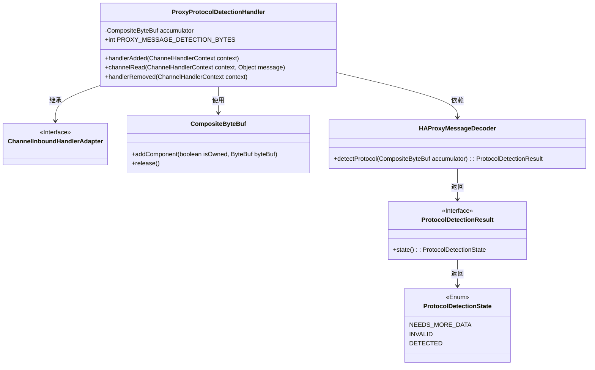
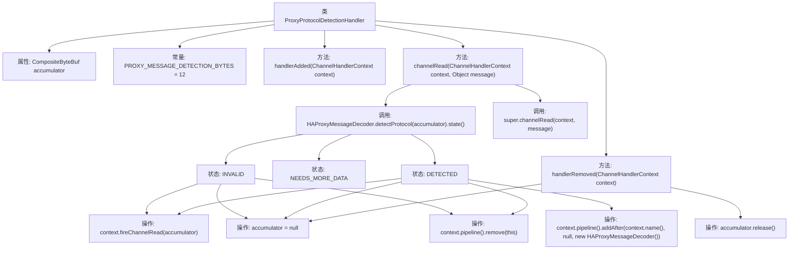

# 基础信息

|      |      |
|------|------|
| 名称 | ProxyProtocolDetectionHandler |
| 编码语言 | .java |
| 代码路径 | Signal-Server/service/src/main/java/org/whispersystems/textsecuregcm/grpc/net/ProxyProtocolDetectionHandler.java |
| 包名 | org.whispersystems.textsecuregcm.grpc.net |
| 依赖项 | ['com.google.common.annotations.VisibleForTesting', 'io.netty.buffer.ByteBuf', 'io.netty.buffer.CompositeByteBuf', 'io.netty.channel.ChannelHandlerContext', 'io.netty.channel.ChannelInboundHandlerAdapter', 'io.netty.handler.codec.haproxy.HAProxyMessageDecoder'] |
| 概述说明 | ProxyProtocolDetectionHandler负责检测代理协议，处理字节流并动态添加解码器。 |

# 说明

ProxyProtocolDetectionHandler负责检测代理协议，通过处理字节流来识别协议类型，并根据检测结果动态添加相应的解码器，以确保数据流的正确解析和处理。该组件在网络通信中起到关键作用，能够有效识别和处理不同代理协议，提升系统的兼容性和稳定性。

# 类列表 Class Summary

| 名称   | 类型  | 说明 |
|-------|------|-------------|
| ProxyProtocolDetectionHandler | class | ProxyProtocolDetectionHandler检测代理协议，处理字节流并动态添加解码器。 |

## 类 ProxyProtocolDetectionHandler

|      |      |
|------|------|
| 访问范围 | public |
| 类型 | class |
| 名称 | ProxyProtocolDetectionHandler |
| 说明 | ProxyProtocolDetectionHandler检测代理协议，处理字节流并动态添加解码器。 |

### UML类图

### 描述
`ProxyProtocolDetectionHandler` 是一个用于检测代理协议消息的处理器，继承自 `ChannelInboundHandlerAdapter`。它使用 `CompositeByteBuf` 来累积接收到的字节数据，并通过 `HAProxyMessageDecoder` 来检测协议。根据检测结果的不同状态（`NEEDS_MORE_DATA`、`INVALID`、`DETECTED`），处理器会采取不同的操作，如继续等待数据、移除自身或添加新的解码器。该处理器在网络通信中用于判断和处理代理协议消息。

### 内部方法调用关系图

这段代码定义了一个`ProxyProtocolDetectionHandler`类，用于检测和处理代理协议消息。它通过`handlerAdded`方法初始化一个`CompositeByteBuf`对象，并在`channelRead`方法中根据接收到的消息类型进行不同的处理。如果消息是`ByteBuf`类型，则将其添加到`accumulator`中，并根据`HAProxyMessageDecoder.detectProtocol`的返回状态决定是否继续接收数据、标记为无效或检测到代理协议消息。在`handlerRemoved`方法中，释放`accumulator`资源。

### 字段列表 Field List

| 名称  | 类型  | 说明 |
|-------|-------|------|
| accumulator | CompositeByteBuf | 私有组合字节缓冲区变量accumulator。 |
| PROXY_MESSAGE_DETECTION_BYTES = 12 | int | 测试可见的静态常量，用于代理消息检测，字节长度为12。 |

### 方法列表 Method List

| 名称  | 类型  | 说明 |
|-------|-------|------|
| handlerAdded | void | handlerAdded方法初始化CompositeByteBuf用于代理协议消息检测。 |
| handlerRemoved | void | 移除通道处理器时释放累加器资源。 |
| channelRead | void | 处理ByteBuf消息，根据协议状态决定是否添加解码器并传递数据。 |

