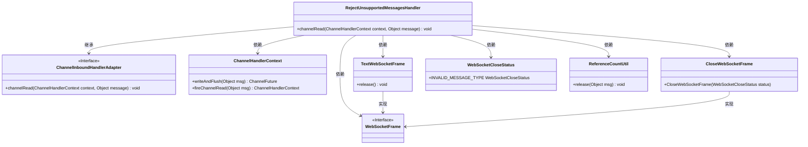
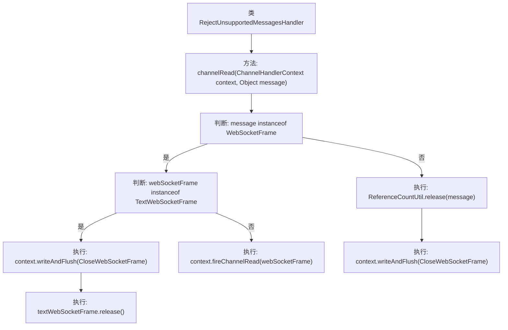

# 基础信息

|      |      |
|------|------|
| 名称 | RejectUnsupportedMessagesHandler |
| 编码语言 | .java |
| 代码路径 | Signal-Server/service/src/main/java/org/whispersystems/textsecuregcm/grpc/net/RejectUnsupportedMessagesHandler.java |
| 包名 | org.whispersystems.textsecuregcm.grpc.net |
| 依赖项 | ['io.netty.channel.ChannelHandlerContext', 'io.netty.channel.ChannelInboundHandlerAdapter', 'io.netty.handler.codec.http.websocketx.CloseWebSocketFrame', 'io.netty.handler.codec.http.websocketx.TextWebSocketFrame', 'io.netty.handler.codec.http.websocketx.WebSocketCloseStatus', 'io.netty.handler.codec.http.websocketx.WebSocketFrame', 'io.netty.util.ReferenceCountUtil'] |
| 概述说明 | 处理不支持WebSocket帧，释放资源并关闭连接。 |

# 说明

在处理不支持消息的WebSocket帧时，系统会执行一系列操作以确保资源的正确释放和连接的关闭。首先，系统会识别并处理这些不支持的帧类型，然后释放所有相关的资源，包括内存和其他系统资源。最后，系统会主动关闭与客户端的WebSocket连接，以确保通信的完整性和安全性。这一过程旨在防止资源泄漏，并确保系统在处理异常情况时的稳定性。

# 类列表 Class Summary

| 名称   | 类型  | 说明 |
|-------|------|-------------|
| RejectUnsupportedMessagesHandler | class | 处理不支持消息的WebSocket帧，释放资源并关闭连接。 |

## 类 RejectUnsupportedMessagesHandler

|      |      |
|------|------|
| 访问范围 | public |
| 类型 | class |
| 名称 | RejectUnsupportedMessagesHandler |
| 说明 | 处理不支持消息的WebSocket帧，释放资源并关闭连接。 |

### UML类图

这段代码定义了一个 `RejectUnsupportedMessagesHandler` 类，继承自 `ChannelInboundHandlerAdapter`，用于处理不支持的 WebSocket 消息。当接收到 `TextWebSocketFrame` 类型的消息时，它会发送一个 `CloseWebSocketFrame` 并释放资源；对于其他类型的 WebSocket 消息，则继续传递。对于非 WebSocket 消息，它会直接释放资源并发送关闭帧。类图中展示了类之间的继承和依赖关系，以及接口与实现类的关系。

### 内部方法调用关系图

这段代码定义了一个名为 `RejectUnsupportedMessagesHandler` 的类，它继承自 `ChannelInboundHandlerAdapter`。该类的主要作用是处理传入的消息，并拒绝不支持的 WebSocket 消息类型。具体来说，如果消息是 `TextWebSocketFrame` 类型，则发送一个关闭帧并释放资源；如果是其他类型的 WebSocket 帧，则继续传递该帧；如果不是 WebSocket 帧，则释放资源并发送关闭帧。该流程图清晰地展示了消息处理的分支逻辑和相应的操作步骤。

### 字段列表 Field List

| 名称  | 类型  | 说明 |
|-------|-------|------|

### 方法列表 Method List

| 名称  | 类型  | 说明 |
|-------|-------|------|
| channelRead | void | 处理WebSocket帧，关闭无效消息类型，释放资源。 |

