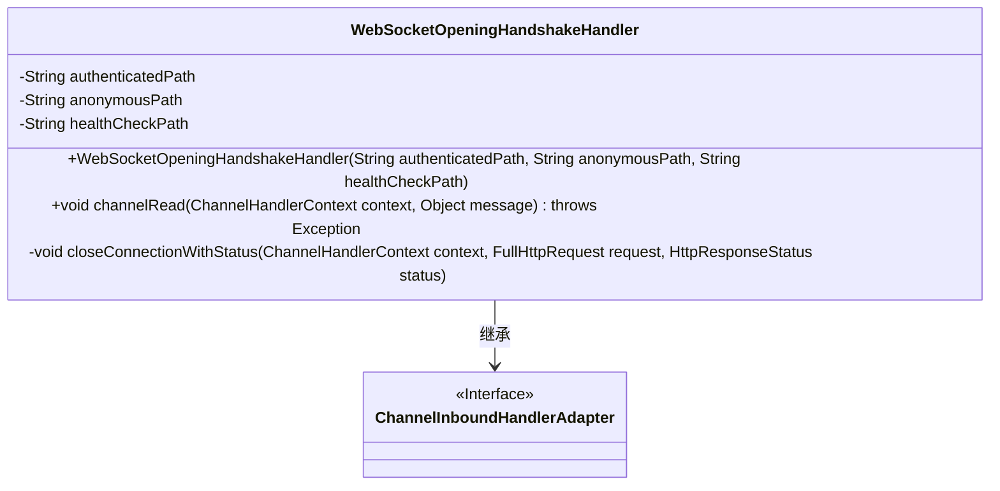
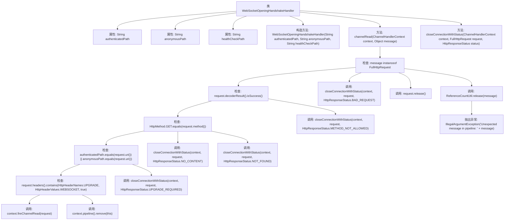

# 基础信息

|      |      |
|------|------|
| 名称 | WebSocketOpeningHandshakeHandler |
| 编码语言 | .java |
| 代码路径 | Signal-Server/service/src/main/java/org/whispersystems/textsecuregcm/grpc/net/WebSocketOpeningHandshakeHandler.java |
| 包名 | org.whispersystems.textsecuregcm.grpc.net |
| 依赖项 | ['io.netty.channel.ChannelFutureListener', 'io.netty.channel.ChannelHandlerContext', 'io.netty.channel.ChannelInboundHandlerAdapter', 'io.netty.handler.codec.http.DefaultFullHttpResponse', 'io.netty.handler.codec.http.FullHttpRequest', 'io.netty.handler.codec.http.HttpHeaderNames', 'io.netty.handler.codec.http.HttpHeaderValues', 'io.netty.handler.codec.http.HttpMethod', 'io.netty.handler.codec.http.HttpResponseStatus', 'io.netty.util.ReferenceCountUtil'] |
| 概述说明 | WebSocket握手类，验证请求路径和方法并响应。 |

# 说明

WebSocket握手处理类主要用于根据请求路径和方法进行验证和响应。该类的核心功能是确保WebSocket握手请求的合法性，通过检查请求路径和请求方法，判断是否符合WebSocket协议的要求。如果验证通过，类将生成并返回适当的握手响应，以完成WebSocket连接的建立。这一过程是WebSocket通信的关键步骤，确保客户端和服务器能够成功建立双向通信通道。

# 类列表 Class Summary

| 名称   | 类型  | 说明 |
|-------|------|-------------|
| WebSocketOpeningHandshakeHandler | class | WebSocket握手处理类，根据请求路径和方法进行验证和响应。 |

## 类 WebSocketOpeningHandshakeHandler

|      |      |
|------|------|
| 访问范围 | None |
| 类型 | class |
| 名称 | WebSocketOpeningHandshakeHandler |
| 说明 | WebSocket握手处理类，根据请求路径和方法进行验证和响应。 |

### UML类图

类图描述：`WebSocketOpeningHandshakeHandler` 类继承自 `ChannelInboundHandlerAdapter` 接口，用于处理 WebSocket 的初始握手请求。该类包含三个私有成员变量：`authenticatedPath`、`anonymousPath` 和 `healthCheckPath`，分别表示已验证路径、匿名路径和健康检查路径。`channelRead` 方法处理传入的 HTTP 请求，根据请求的 URI 和方法决定是否进行 WebSocket 握手或关闭连接。`closeConnectionWithStatus` 方法用于关闭连接并返回指定的 HTTP 状态码。

### 内部方法调用关系图

这段代码是一个用于处理WebSocket握手请求的处理器类。它通过检查HTTP请求的路径、方法、头部信息等，决定是否将请求传递给WebSocket握手处理器，或者关闭连接并返回相应的HTTP状态码。代码中包含了多个条件判断和异常处理，确保在不同的情况下能够正确地处理请求并释放资源。

### 字段列表 Field List

| 名称  | 类型  | 说明 |
|-------|-------|------|
| authenticatedPath | String | 私有常量字符串authenticatedPath。 |
| anonymousPath | String | 匿名路径的私有最终字符串变量。 |
| healthCheckPath | String | 定义私有不可变字符串变量healthCheckPath。 |

### 方法列表 Method List

| 名称  | 类型  | 说明 |
|-------|-------|------|
| closeConnectionWithStatus | void | 关闭连接并发送指定HTTP状态码。 |
| channelRead | void | 处理HTTP请求，验证路径和方法，支持WebSocket握手，释放资源。 |

