# 基础信息

|      |      |
|------|------|
| 名称 | WebsocketHandshakeCompleteHandler |
| 编码语言 | .java |
| 代码路径 | Signal-Server/service/src/main/java/org/whispersystems/textsecuregcm/grpc/net/WebsocketHandshakeCompleteHandler.java |
| 包名 | org.whispersystems.textsecuregcm.grpc.net |
| 依赖项 | ['com.google.common.annotations.VisibleForTesting', 'com.google.common.net.InetAddresses', 'io.netty.channel.ChannelFutureListener', 'io.netty.channel.ChannelHandler', 'io.netty.channel.ChannelHandlerContext', 'io.netty.channel.ChannelInboundHandlerAdapter', 'io.netty.handler.codec.http.HttpHeaderNames', 'io.netty.handler.codec.http.websocketx.CloseWebSocketFrame', 'io.netty.handler.codec.http.websocketx.WebSocketCloseStatus', 'io.netty.handler.codec.http.websocketx.WebSocketServerProtocolHandler', 'java.net.InetAddress', 'java.net.InetSocketAddress', 'java.nio.charset.StandardCharsets', 'java.security.MessageDigest', 'java.util.Optional', 'javax.annotation.Nullable', 'org.apache.commons.lang3.StringUtils', 'org.signal.libsignal.protocol.ecc.ECKeyPair', 'org.slf4j.Logger', 'org.slf4j.LoggerFactory', 'org.whispersystems.textsecuregcm.storage.ClientPublicKeysManager'] |
| 概述说明 | WebsocketHandshakeCompleteHandler处理握手事件，管理客户端公钥和代理验证。 |

# 说明

WebsocketHandshakeCompleteHandler负责处理WebSocket握手完成事件，主要功能包括管理客户端的公钥以及进行代理验证。该处理器确保在握手完成后，客户端公钥得到妥善管理，并对代理进行必要的验证，以保证连接的安全性和可靠性。

# 类列表 Class Summary

| 名称   | 类型  | 说明 |
|-------|------|-------------|
| WebsocketHandshakeCompleteHandler | class | WebsocketHandshakeCompleteHandler处理WebSocket握手完成事件，管理客户端公钥和代理验证。 |

## 类 WebsocketHandshakeCompleteHandler

|      |      |
|------|------|
| 访问范围 | None |
| 类型 | class |
| 名称 | WebsocketHandshakeCompleteHandler |
| 说明 | WebsocketHandshakeCompleteHandler处理WebSocket握手完成事件，管理客户端公钥和代理验证。 |

### UML类图

```mermaid
classDiagram
    class WebsocketHandshakeCompleteHandler {
        -ClientPublicKeysManager clientPublicKeysManager
        -ECKeyPair ecKeyPair
        -byte[] recognizedProxySecret
        -static Logger log
        +static final String RECOGNIZED_PROXY_SECRET_HEADER
        +static final String FORWARDED_FOR_HEADER
        +WebsocketHandshakeCompleteHandler(ClientPublicKeysManager clientPublicKeysManager, ECKeyPair ecKeyPair, String recognizedProxySecret)
        +void userEventTriggered(ChannelHandlerContext context, Object event)
        -Optional~InetAddress~ getPreferredRemoteAddress(ChannelHandlerContext context, WebSocketServerProtocolHandler.HandshakeComplete handshakeCompleteEvent)
        +static Optional~String~ getMostRecentProxy(String forwardedFor)
    }

    class ClientPublicKeysManager {
        // ClientPublicKeysManager的成员和方法
    }

    class ECKeyPair {
        // ECKeyPair的成员和方法
    }

    class ChannelInboundHandlerAdapter {
        <<Interface>>
        // ChannelInboundHandlerAdapter的成员和方法
    }

    class WebSocketServerProtocolHandler {
        <<Interface>>
        // WebSocketServerProtocolHandler的成员和方法
    }

    class InetAddress {
        // InetAddress的成员和方法
    }

    class GrpcClientConnectionManager {
        // GrpcClientConnectionManager的成员和方法
    }

    class NoiseAuthenticatedHandler {
        // NoiseAuthenticatedHandler的成员和方法
    }

    class NoiseAnonymousHandler {
        // NoiseAnonymousHandler的成员和方法
    }

    class NoiseWebSocketTunnelServer {
        <<Interface>>
        // NoiseWebSocketTunnelServer的成员和方法
    }

    WebsocketHandshakeCompleteHandler --> ClientPublicKeysManager : 依赖
    WebsocketHandshakeCompleteHandler --> ECKeyPair : 依赖
    WebsocketHandshakeCompleteHandler --> ChannelInboundHandlerAdapter : 继承
    WebsocketHandshakeCompleteHandler --> WebSocketServerProtocolHandler : 依赖
    WebsocketHandshakeCompleteHandler --> InetAddress : 依赖
    WebsocketHandshakeCompleteHandler --> GrpcClientConnectionManager : 依赖
    WebsocketHandshakeCompleteHandler --> NoiseAuthenticatedHandler : 依赖
    WebsocketHandshakeCompleteHandler --> NoiseAnonymousHandler : 依赖
    WebsocketHandshakeCompleteHandler --> NoiseWebSocketTunnelServer : 依赖
```

**描述：**
`WebsocketHandshakeCompleteHandler`类继承自`ChannelInboundHandlerAdapter`，用于处理WebSocket握手完成事件。它依赖于`ClientPublicKeysManager`和`ECKeyPair`来管理客户端公钥和椭圆曲线密钥对。该类还包含处理远程地址、代理验证以及噪声协议握手的方法。通过`GrpcClientConnectionManager`处理WebSocket握手完成后的连接管理，并根据请求路径选择`NoiseAuthenticatedHandler`或`NoiseAnonymousHandler`进行进一步的握手处理。

### 内部方法调用关系图

**流程图描述：**  
该流程图展示了`WebsocketHandshakeCompleteHandler`类的核心逻辑。首先，类初始化时设置相关属性和常量。`userEventTriggered`方法处理WebSocket握手完成事件，判断远程地址是否有效，若无效则关闭连接，否则调用`GrpcClientConnectionManager.handleWebSocketHandshakeComplete`处理握手完成逻辑。根据请求URI选择不同的`NoiseHandshakeHandler`，并替换当前处理器。`getPreferredRemoteAddress`方法根据`X-Forwarded-For`头信息获取最信任的远程地址，`getMostRecentProxy`方法从`X-Forwarded-For`头信息中提取最近的代理地址。

### 字段列表 Field List

| 名称  | 类型  | 说明 |
|-------|-------|------|
| clientPublicKeysManager | ClientPublicKeysManager | 私有且不可变的客户端公钥管理器实例。 |
| recognizedProxySecret | byte[] | 私有字节数组存储识别代理密钥。 |
| ecKeyPair | ECKeyPair | 私有且不可变的椭圆曲线密钥对实例。 |
| RECOGNIZED_PROXY_SECRET_HEADER = "X-Signal-Recognized-Proxy" | String | 测试用静态常量定义代理识别头字段。 |
| FORWARDED_FOR_HEADER = "X-Forwarded-For" | String | 测试可见的静态字符串常量，存储X-Forwarded-For头信息。 |
| log = LoggerFactory.getLogger(WebsocketHandshakeCompleteHandler.class) | Logger | WebsocketHandshakeCompleteHandler类中定义了静态日志记录器。 |

### 方法列表 Method List

| 名称  | 类型  | 说明 |
|-------|-------|------|
| getMostRecentProxy | Optional<String> | 获取最近代理地址，处理空值和空白字符串。 |
| userEventTriggered | void | 处理WebSocket握手完成事件，确定远程地址并管理连接，替换处理器。 |
| getPreferredRemoteAddress | Optional<InetAddress> | 方法获取远程地址，优先从代理头解析，否则返回通道远程地址。 |

