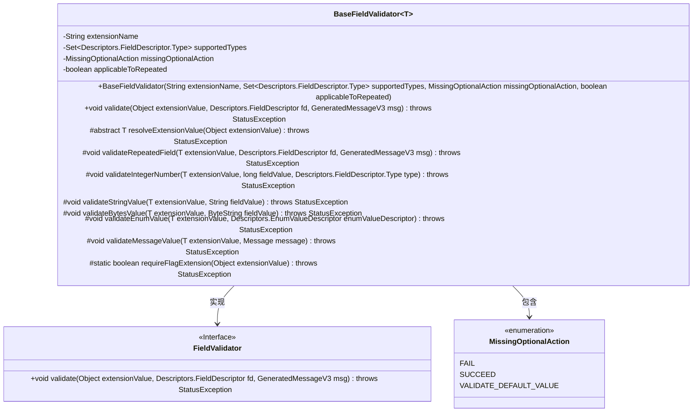
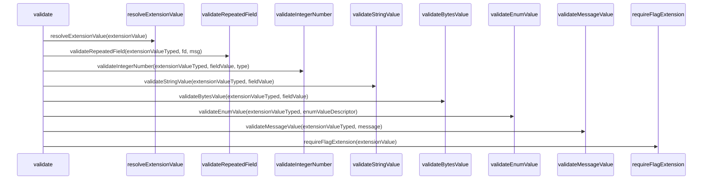

# 基础信息

|      |      |
|------|------|
| 名称 | BaseFieldValidator |
| 编码语言 | .java |
| 代码路径 | Signal-Server/service/src/main/java/org/whispersystems/textsecuregcm/grpc/validators/BaseFieldValidator.java |
| 包名 | org.whispersystems.textsecuregcm.grpc.validators |
| 依赖项 | ['java.util.Objects.requireNonNull', 'org.whispersystems.textsecuregcm.grpc.validators.ValidatorUtils.internalError', 'org.whispersystems.textsecuregcm.grpc.validators.ValidatorUtils.invalidArgument', 'com.google.protobuf.ByteString', 'com.google.protobuf.Descriptors', 'com.google.protobuf.GeneratedMessageV3', 'com.google.protobuf.Message', 'io.grpc.Status', 'io.grpc.StatusException', 'java.util.Set'] |
| 概述说明 | BaseFieldValidator抽象类实现字段验证，支持多类型和可选字段处理。 |

# 说明

抽象类BaseFieldValidator设计用于实现字段验证功能，支持处理多种数据类型和可选字段。该抽象类提供了一种通用的验证框架，能够灵活应对不同场景下的字段验证需求，确保数据的有效性和完整性。通过继承和扩展，开发者可以针对具体业务需求定制验证逻辑，提升代码的可维护性和复用性。

# 类列表 Class Summary

| 名称   | 类型  | 说明 |
|-------|------|-------------|
| BaseFieldValidator | class | 抽象类BaseFieldValidator实现字段验证，支持多种类型和可选字段处理。 |

## 类 BaseFieldValidator

|      |      |
|------|------|
| 访问范围 | public abstract |
| 类型 | class |
| 名称 | BaseFieldValidator |
| 说明 | 抽象类BaseFieldValidator实现字段验证，支持多种类型和可选字段处理。 |

### UML类图

**描述：**  
`BaseFieldValidator` 是一个抽象类，实现了 `FieldValidator` 接口，用于验证字段的值。它包含多个私有成员变量，如 `extensionName`、`supportedTypes` 等，并提供了多个受保护的抽象方法用于具体字段类型的验证。`MissingOptionalAction` 是一个枚举类，用于处理可选字段缺失时的操作。`BaseFieldValidator` 类通过 `validate` 方法进行字段验证，并根据字段类型调用相应的验证方法。

### 内部方法调用关系图

```mermaid
graph TD
    A["类BaseFieldValidator<T>"]
    B["属性: String extensionName"]
    C["属性: Set<Descriptors.FieldDescriptor.Type> supportedTypes"]
    D["属性: MissingOptionalAction missingOptionalAction"]
    E["属性: boolean applicableToRepeated"]
    F["枚举: MissingOptionalAction"]
    G["构造方法: BaseFieldValidator"]
    H["方法: validate"]
    I["方法: resolveExtensionValue"]
    J["方法: validateRepeatedField"]
    K["方法: validateIntegerNumber"]
    L["方法: validateStringValue"]
    M["方法: validateBytesValue"]
    N["方法: validateEnumValue"]
    O["方法: validateMessageValue"]
    P["静态方法: requireFlagExtension"]

    A --> B
    A --> C
    A --> D
    A --> E
    A --> F
    A --> G
    A --> H
    A --> I
    A --> J
    A --> K
    A --> L
    A --> M
    A --> N
    A --> O
    A --> P
```

这段代码定义了一个抽象类 `BaseFieldValidator<T>`，用于验证字段的值。它包含多个属性和方法，用于处理不同类型的字段验证。类中的 `validate` 方法是核心，负责根据字段的类型和属性调用相应的验证方法。代码还定义了一个枚举 `MissingOptionalAction`，用于处理可选字段缺失时的不同操作。流程图展示了类的结构和方法之间的关系，时序图则展示了 `validate` 方法调用其他方法的过程。

### 字段列表 Field List

| 名称  | 类型  | 说明 |
|-------|-------|------|
| supportedTypes | Set<Descriptors.FieldDescriptor.Type> | 私有集合存储支持的字段描述符类型。 |
| missingOptionalAction | MissingOptionalAction | 私有不可变的缺失可选操作变量。 |
| applicableToRepeated | boolean | 私有布尔变量，标识是否适用于重复情况。 |
| extensionName | String | 私有字符串变量extensionName。 |

### 方法列表 Method List

| 名称  | 类型  | 说明 |
|-------|-------|------|
| resolveExtensionValue | T | 抽象方法，解析扩展值，可能抛出状态异常。 |
| validateEnumValue | void | 未实现validateEnumValue方法，需完成。 |
| validateMessageValue | void | `validateMessageValue`方法未实现，抛出内部错误。 |
| requireFlagExtension | boolean | 静态方法检查扩展值是否为true，否则抛出异常。 |
| validateIntegerNumber | void | 未实现的`validateIntegerNumber`方法抛出内部错误。 |
| validateStringValue | void | 未实现的验证字符串值方法抛出内部错误。 |
| validate | void | 验证扩展值，处理可选字段、重复字段和类型检查，抛出异常。 |
| validateRepeatedField | void | 未实现`validateRepeatedField`方法，需补充具体逻辑。 |
| validateBytesValue | void | 未实现`validateBytesValue`方法，需抛出内部错误。 |

