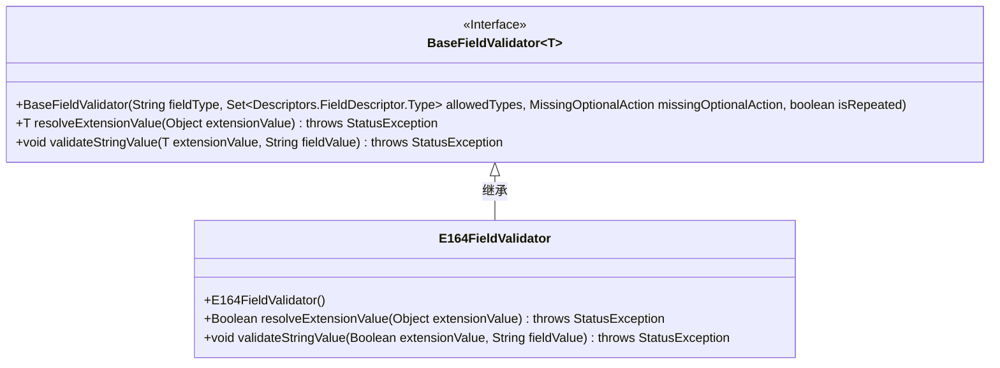
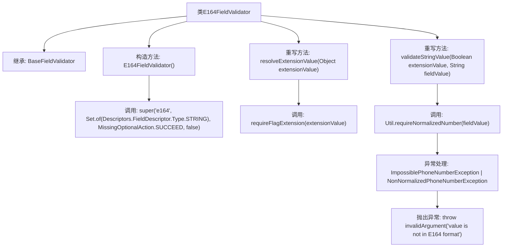

# 基础信息

|      |      |
|------|------|
| 名称 | E164FieldValidator |
| 编码语言 | .java |
| 代码路径 | Signal-Server/service/src/main/java/org/whispersystems/textsecuregcm/grpc/validators/E164FieldValidator.java |
| 包名 | org.whispersystems.textsecuregcm.grpc.validators |
| 依赖项 | ['org.whispersystems.textsecuregcm.grpc.validators.ValidatorUtils.invalidArgument', 'com.google.protobuf.Descriptors', 'io.grpc.StatusException', 'java.util.Set', 'org.whispersystems.textsecuregcm.util.ImpossiblePhoneNumberException', 'org.whispersystems.textsecuregcm.util.NonNormalizedPhoneNumberException', 'org.whispersystems.textsecuregcm.util.Util'] |
| 概述说明 | E164FieldValidator继承BaseFieldValidator，用于验证字符串是否符合E164格式。 |

# 说明

E164FieldValidator是一个用于验证字符串是否符合E164格式的验证器，它继承自BaseFieldValidator。E164格式是一种国际电话号码的标准格式，通常包括国家代码和电话号码，且不包含任何分隔符或特殊字符。该验证器的主要功能是确保输入的字符串严格遵循E164格式，从而提高数据的准确性和一致性。通过继承BaseFieldValidator，E164FieldValidator可以利用基类提供的通用验证逻辑和接口，专注于实现E164格式的特定验证规则。

# 类列表 Class Summary

| 名称   | 类型  | 说明 |
|-------|------|-------------|
| E164FieldValidator | class | E164FieldValidator验证字符串是否为E164格式，继承自BaseFieldValidator。 |

## 类 E164FieldValidator

|      |      |
|------|------|
| 访问范围 | public |
| 类型 | class |
| 名称 | E164FieldValidator |
| 说明 | E164FieldValidator验证字符串是否为E164格式，继承自BaseFieldValidator。 |

### UML类图

### 描述：
`E164FieldValidator` 是一个继承自 `BaseFieldValidator<Boolean>` 的类，用于验证字符串是否符合 E164 格式的电话号码。它通过调用 `Util.requireNormalizedNumber` 方法来验证字符串的格式，如果不符合要求，则抛出 `StatusException`。`E164FieldValidator` 重写了父类的 `resolveExtensionValue` 和 `validateStringValue` 方法，以实现特定的验证逻辑。

### 内部方法调用关系图

该流程图描述了`E164FieldValidator`类的结构及其方法调用关系。`E164FieldValidator`继承自`BaseFieldValidator<Boolean>`，并重写了`resolveExtensionValue`和`validateStringValue`方法。在构造方法中，调用了父类的构造方法。`validateStringValue`方法会调用`Util.requireNormalizedNumber`来验证字段值，如果出现异常，则抛出`invalidArgument`异常，提示值不符合E164格式。

### 字段列表 Field List

| 名称  | 类型  | 说明 |
|-------|-------|------|

### 方法列表 Method List

| 名称  | 类型  | 说明 |
|-------|-------|------|
| resolveExtensionValue | Boolean | 重写方法，解析扩展值并返回布尔结果。 |
| validateStringValue | void | 验证字符串值，确保其为E164格式，否则抛出异常。 |

