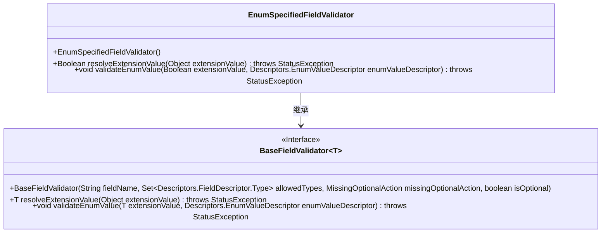
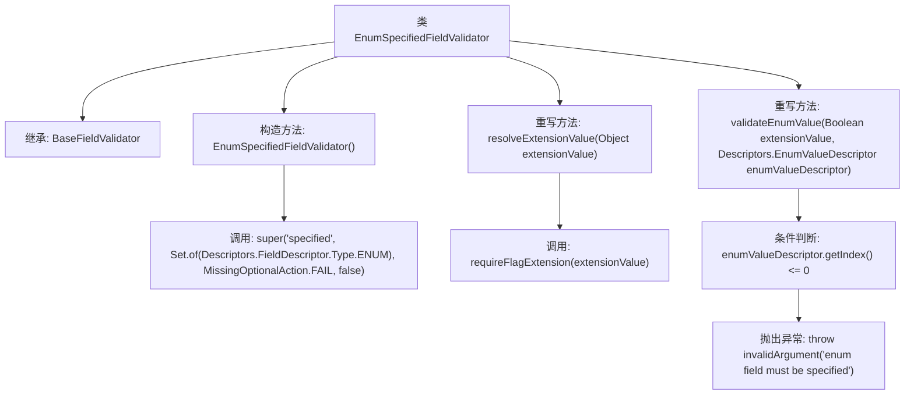

# 基础信息

|      |      |
|------|------|
| 名称 | EnumSpecifiedFieldValidator |
| 编码语言 | .java |
| 代码路径 | Signal-Server/service/src/main/java/org/whispersystems/textsecuregcm/grpc/validators/EnumSpecifiedFieldValidator.java |
| 包名 | org.whispersystems.textsecuregcm.grpc.validators |
| 依赖项 | ['org.whispersystems.textsecuregcm.grpc.validators.ValidatorUtils.invalidArgument', 'com.google.protobuf.Descriptors', 'io.grpc.StatusException', 'java.util.Set'] |
| 概述说明 | 验证枚举字段索引大于0，否则抛出异常。 |

# 说明

EnumSpecifiedFieldValidator用于验证枚举字段，其核心功能是检查枚举字段的索引值是否大于0。如果索引值不大于0，即索引值小于或等于0时，该验证器会抛出异常，以确保枚举字段的合法性。这种验证机制有助于在数据处理过程中提前发现并处理无效的枚举值，保证系统的稳定性和数据的准确性。

# 类列表 Class Summary

| 名称   | 类型  | 说明 |
|-------|------|-------------|
| EnumSpecifiedFieldValidator | class | EnumSpecifiedFieldValidator验证枚举字段，确保其索引大于0，否则抛出异常。 |

## 类 EnumSpecifiedFieldValidator

|      |      |
|------|------|
| 访问范围 | public |
| 类型 | class |
| 名称 | EnumSpecifiedFieldValidator |
| 说明 | EnumSpecifiedFieldValidator验证枚举字段，确保其索引大于0，否则抛出异常。 |

### UML类图

类图描述：
`EnumSpecifiedFieldValidator` 继承自 `BaseFieldValidator<Boolean>`，实现了对枚举类型字段的验证。它通过构造函数初始化验证器，并重写了 `resolveExtensionValue` 和 `validateEnumValue` 方法，分别用于解析扩展值和验证枚举值。`validateEnumValue` 方法会检查枚举值的索引，若索引小于等于0则抛出异常，确保枚举字段被正确指定。

### 内部方法调用关系图

这段代码定义了一个名为 `EnumSpecifiedFieldValidator` 的类，它继承自 `BaseFieldValidator<Boolean>`。该类的主要功能是验证枚举类型的字段是否被正确指定。构造函数中调用了父类的构造函数，并重写了 `resolveExtensionValue` 和 `validateEnumValue` 方法。`resolveExtensionValue` 方法通过调用 `requireFlagExtension` 来解析扩展值，而 `validateEnumValue` 方法则检查枚举值的索引是否大于0，如果不满足条件则抛出异常。

### 字段列表 Field List

| 名称  | 类型  | 说明 |
|-------|-------|------|

### 方法列表 Method List

| 名称  | 类型  | 说明 |
|-------|-------|------|
| resolveExtensionValue | Boolean | 方法覆盖，解析扩展值并返回标志扩展结果。 |
| validateEnumValue | void | 验证枚举值，若索引小于等于0则抛出异常。 |

