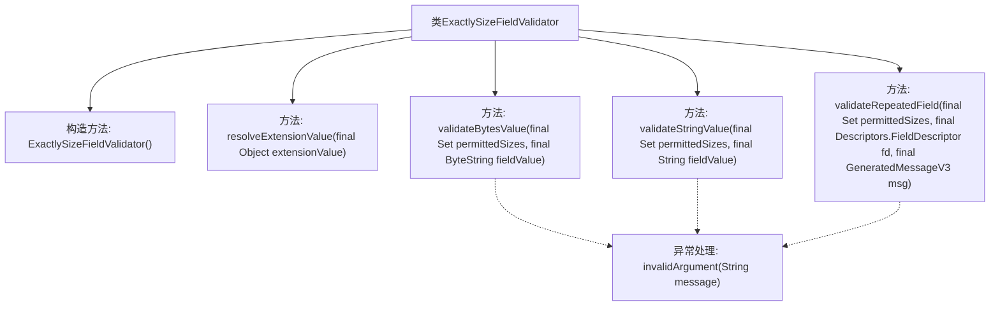

# 基础信息

|      |      |
|------|------|
| 名称 | ExactlySizeFieldValidator |
| 编码语言 | .java |
| 代码路径 | Signal-Server/service/src/main/java/org/whispersystems/textsecuregcm/grpc/validators/ExactlySizeFieldValidator.java |
| 包名 | org.whispersystems.textsecuregcm.grpc.validators |
| 依赖项 | ['org.whispersystems.textsecuregcm.grpc.validators.ValidatorUtils.invalidArgument', 'com.google.protobuf.ByteString', 'com.google.protobuf.Descriptors', 'com.google.protobuf.GeneratedMessageV3', 'io.grpc.StatusException', 'java.util.List', 'java.util.Set'] |
| 概述说明 | ExactlySizeFieldValidator验证字段大小是否符合预设集合，支持字符串、字节和重复字段。 |

# 说明

ExactlySizeFieldValidator用于验证字段大小是否符合预设集合，支持验证字符串、字节和重复字段的大小。该验证器确保字段的大小与预期值一致，适用于多种数据类型，提供灵活且精确的验证功能。

# 类列表 Class Summary

| 名称   | 类型  | 说明 |
|-------|------|-------------|
| ExactlySizeFieldValidator | class | ExactlySizeFieldValidator验证字段大小是否符合预设集合，支持字符串、字节和重复字段。 |


## 类 ExactlySizeFieldValidator

|      |      |
|------|------|
| 访问范围 | public |
| 类型 | class |
| 名称 | ExactlySizeFieldValidator |
| 说明 | ExactlySizeFieldValidator验证字段大小是否符合预设集合，支持字符串、字节和重复字段。 |


### UML类图

```mermaid
classDiagram
    class BaseFieldValidator~T~ {
        <<Interface>>
        +BaseFieldValidator(String validatorName, Set~Descriptors.FieldDescriptor.Type~ acceptedTypes, MissingOptionalAction missingOptionalAction, boolean allowMultiple)
        +T resolveExtensionValue(Object extensionValue) throws StatusException
        +void validateBytesValue(T permittedSizes, ByteString fieldValue) throws StatusException
        +void validateStringValue(T permittedSizes, String fieldValue) throws StatusException
        +void validateRepeatedField(T permittedSizes, Descriptors.FieldDescriptor fd, GeneratedMessageV3 msg) throws StatusException
    }

    class ExactlySizeFieldValidator {
        +ExactlySizeFieldValidator()
        +Set~Integer~ resolveExtensionValue(Object extensionValue) throws StatusException
        +void validateBytesValue(Set~Integer~ permittedSizes, ByteString fieldValue) throws StatusException
        +void validateStringValue(Set~Integer~ permittedSizes, String fieldValue) throws StatusException
        +void validateRepeatedField(Set~Integer~ permittedSizes, Descriptors.FieldDescriptor fd, GeneratedMessageV3 msg) throws StatusException
    }

    ExactlySizeFieldValidator --> BaseFieldValidator~Set~Integer~~ : 继承
```

### 描述
`ExactlySizeFieldValidator` 是一个继承自 `BaseFieldValidator` 的类，用于验证字段的大小是否符合预期。它支持验证字节数组、字符串以及重复字段的大小。通过 `resolveExtensionValue` 方法将扩展值解析为 `Set<Integer>`，并通过 `validateBytesValue`、`validateStringValue` 和 `validateRepeatedField` 方法分别验证字节数组、字符串和重复字段的大小是否在允许的范围内。如果验证失败，将抛出 `StatusException` 异常。


### 内部方法调用关系图



这段代码定义了一个名为`ExactlySizeFieldValidator`的类，继承自`BaseFieldValidator<Set<Integer>>`。该类用于验证字段的大小是否符合预定义的集合中的值。构造方法初始化了验证器的类型和默认行为。类中的四个方法分别用于解析扩展值、验证字节数组、字符串和重复字段的大小。如果验证失败，会抛出带有错误信息的异常。流程图展示了类中各方法的调用关系及异常处理流程。

### 字段列表 Field List

| 名称  | 类型  | 说明 |
|-------|-------|------|

### 方法列表 Method List

| 名称  | 类型  | 说明 |
|-------|-------|------|
| validateBytesValue | void | 验证字节数组长度是否在允许范围内，否则抛出异常。 |
| validateStringValue | void | 验证字符串长度是否符合允许范围，否则抛出异常。 |
| validateRepeatedField | void | 验证重复字段大小是否在允许范围内，否则抛出异常。 |
| resolveExtensionValue | Set<Integer> | 重写方法，将扩展值转换为不可修改的整数集。 |


