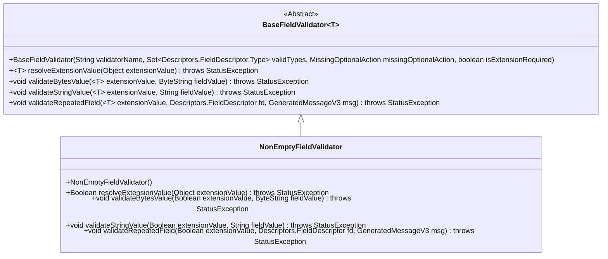
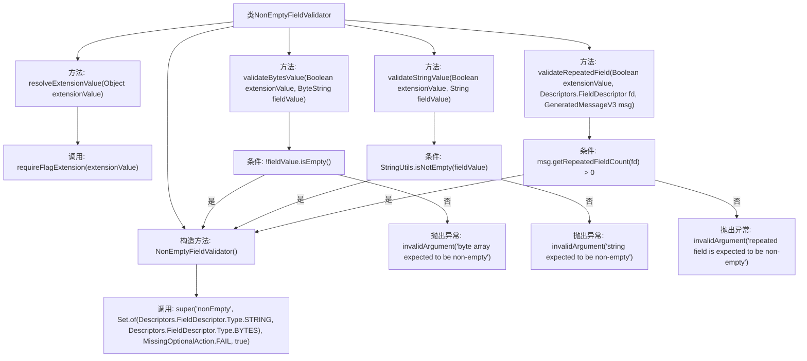

# 基础信息

|      |      |
|------|------|
| 名称 | NonEmptyFieldValidator |
| 编码语言 | .java |
| 代码路径 | Signal-Server/service/src/main/java/org/whispersystems/textsecuregcm/grpc/validators/NonEmptyFieldValidator.java |
| 包名 | org.whispersystems.textsecuregcm.grpc.validators |
| 依赖项 | ['org.whispersystems.textsecuregcm.grpc.validators.ValidatorUtils.invalidArgument', 'com.google.protobuf.ByteString', 'com.google.protobuf.Descriptors', 'com.google.protobuf.GeneratedMessageV3', 'io.grpc.StatusException', 'java.util.Set', 'org.apache.commons.lang3.StringUtils'] |
| 概述说明 | NonEmptyFieldValidator验证字符串、字节数组和重复字段非空。 |

# 说明

NonEmptyFieldValidator用于验证字段是否为空，支持多种数据类型，包括字符串、字节数组以及重复字段。该验证器确保这些字段在提交或处理时不为空，从而保证数据的完整性和有效性。通过这种方式，开发者可以避免因空字段引发的错误或异常，提升系统的稳定性和可靠性。

# 类列表 Class Summary

| 名称   | 类型  | 说明 |
|-------|------|-------------|
| NonEmptyFieldValidator | class | NonEmptyFieldValidator验证字段非空，支持字符串、字节数组和重复字段。 |

## 类 NonEmptyFieldValidator

|      |      |
|------|------|
| 访问范围 | public |
| 类型 | class |
| 名称 | NonEmptyFieldValidator |
| 说明 | NonEmptyFieldValidator验证字段非空，支持字符串、字节数组和重复字段。 |

### UML类图

这段代码定义了一个 `NonEmptyFieldValidator` 类，它继承自泛型类 `BaseFieldValidator<Boolean>`。`NonEmptyFieldValidator` 用于验证字段是否非空，支持字符串、字节数组和重复字段的验证。该类通过重写父类的方法，分别处理不同类型的字段验证逻辑，并在字段为空时抛出异常。

### 内部方法调用关系图

**描述：**  
`NonEmptyFieldValidator` 类继承自 `BaseFieldValidator<Boolean>`，用于验证字段是否非空。构造方法初始化验证器类型和缺失操作策略。`resolveExtensionValue` 方法解析扩展值，`validateBytesValue` 和 `validateStringValue` 方法分别验证字节数组和字符串是否非空，`validateRepeatedField` 方法验证重复字段是否非空。如果字段为空，抛出相应的异常。

### 字段列表 Field List

| 名称  | 类型  | 说明 |
|-------|-------|------|

### 方法列表 Method List

| 名称  | 类型  | 说明 |
|-------|-------|------|
| resolveExtensionValue | Boolean | 重写方法，解析扩展值并返回布尔结果。 |
| validateRepeatedField | void | 验证重复字段非空，若为空则抛出异常。 |
| validateStringValue | void | 验证字符串非空，为空则抛出异常。 |
| validateBytesValue | void | 验证字节数组非空，若为空则抛出异常。 |

