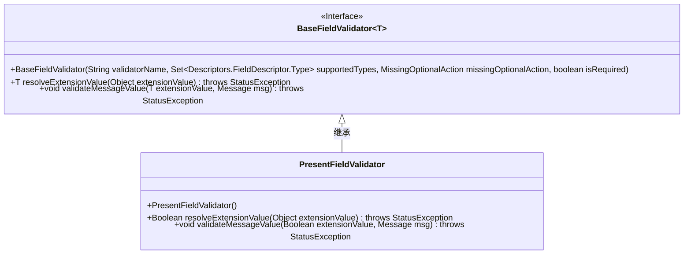
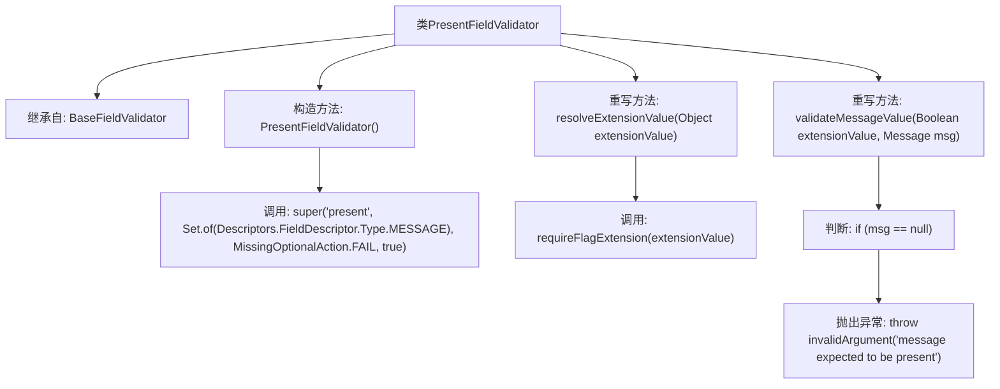

# 基础信息

|      |      |
|------|------|
| 名称 | PresentFieldValidator |
| 编码语言 | .java |
| 代码路径 | Signal-Server/service/src/main/java/org/whispersystems/textsecuregcm/grpc/validators/PresentFieldValidator.java |
| 包名 | org.whispersystems.textsecuregcm.grpc.validators |
| 依赖项 | ['org.whispersystems.textsecuregcm.grpc.validators.ValidatorUtils.invalidArgument', 'com.google.protobuf.Descriptors', 'com.google.protobuf.Message', 'io.grpc.StatusException', 'java.util.Set'] |
| 概述说明 | PresentFieldValidator验证字段存在，缺失时抛出异常。 |

# 说明

PresentFieldValidator用于验证消息字段是否存在，若字段缺失则会抛出异常。该验证器确保在处理消息时，所有必需的字段都已正确提供，从而避免因字段缺失导致的错误或异常情况。通过这种验证机制，可以提高系统的健壮性和可靠性，确保数据处理的完整性和准确性。

# 类列表 Class Summary

| 名称   | 类型  | 说明 |
|-------|------|-------------|
| PresentFieldValidator | class | PresentFieldValidator验证消息字段是否存在，缺失时抛出异常。 |

## 类 PresentFieldValidator

|      |      |
|------|------|
| 访问范围 | public |
| 类型 | class |
| 名称 | PresentFieldValidator |
| 说明 | PresentFieldValidator验证消息字段是否存在，缺失时抛出异常。 |

### UML类图

这段代码定义了一个 `PresentFieldValidator` 类，它继承自 `BaseFieldValidator<Boolean>`。`PresentFieldValidator` 用于验证消息字段是否存在。在构造函数中，它初始化了验证器的名称、支持的类型、缺失时的操作以及是否为必填字段。`resolveExtensionValue` 方法用于解析扩展值，而 `validateMessageValue` 方法则用于验证消息值，如果消息为空，则抛出异常。

### 内部方法调用关系图

**描述**：  
该流程图展示了`PresentFieldValidator`类的结构及其方法调用关系。`PresentFieldValidator`继承自`BaseFieldValidator<Boolean>`，并在构造方法中调用父类的构造方法。类中重写了`resolveExtensionValue`方法，该方法调用`requireFlagExtension`来处理扩展值。此外，还重写了`validateMessageValue`方法，用于验证消息值，若消息为空，则抛出异常。整个流程清晰地展示了类的继承关系及方法间的调用逻辑。

### 字段列表 Field List

| 名称  | 类型  | 说明 |
|-------|-------|------|

### 方法列表 Method List

| 名称  | 类型  | 说明 |
|-------|-------|------|
| validateMessageValue | void | 验证消息值，若为空则抛出异常。 |
| resolveExtensionValue | Boolean | 方法解析扩展值并返回布尔结果，可能抛出状态异常。 |

