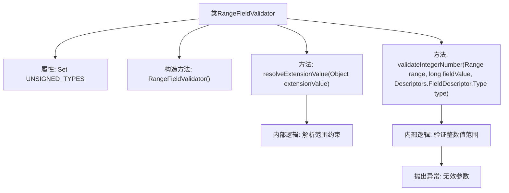

# 基础信息

|      |      |
|------|------|
| 名称 | RangeFieldValidator |
| 编码语言 | .java |
| 代码路径 | Signal-Server/service/src/main/java/org/whispersystems/textsecuregcm/grpc/validators/RangeFieldValidator.java |
| 包名 | org.whispersystems.textsecuregcm.grpc.validators |
| 依赖项 | ['org.whispersystems.textsecuregcm.grpc.validators.ValidatorUtils.invalidArgument', 'com.google.protobuf.Descriptors', 'io.grpc.StatusException', 'java.util.Set', 'org.signal.chat.require.ValueRangeConstraint'] |
| 概述说明 | RangeFieldValidator验证数值范围，支持多种整数类型，确保值在指定范围内。 |

# 说明

RangeFieldValidator是一种用于验证数值范围的工具，支持多种整数类型。其主要功能是确保输入的数值在用户指定的范围内。该验证器能够有效处理不同类型的整数数据，保证数据的有效性和准确性，适用于需要严格控制数值范围的场景。通过使用RangeFieldValidator，开发者可以轻松实现对数值范围的验证，确保数据符合预期要求。

# 类列表 Class Summary

| 名称   | 类型  | 说明 |
|-------|------|-------------|
| RangeFieldValidator | class | RangeFieldValidator验证数值范围，支持多种整数类型，确保值在指定范围内。 |


## 类 RangeFieldValidator

|      |      |
|------|------|
| 访问范围 | public |
| 类型 | class |
| 名称 | RangeFieldValidator |
| 说明 | RangeFieldValidator验证数值范围，支持多种整数类型，确保值在指定范围内。 |


### UML类图

```mermaid
classDiagram
    class RangeFieldValidator {
        -Set~Descriptors.FieldDescriptor.Type~ UNSIGNED_TYPES
        +RangeFieldValidator()
        +Range resolveExtensionValue(Object extensionValue) throws StatusException
        +void validateIntegerNumber(Range range, long fieldValue, Descriptors.FieldDescriptor.Type type) throws StatusException
    }

    class BaseFieldValidator~T~ {
        <<Interface>>
        +BaseFieldValidator(String validatorName, Set~Descriptors.FieldDescriptor.Type~ supportedTypes, MissingOptionalAction missingOptionalAction, boolean isFieldRequired)
        +T resolveExtensionValue(Object extensionValue) throws StatusException
        +void validateIntegerNumber(T range, long fieldValue, Descriptors.FieldDescriptor.Type type) throws StatusException
    }

    class Range {
        +int min
        +int max
        +Range(int min, int max)
    }

    class Descriptors {
        class FieldDescriptor {
            enum Type {
                INT64, UINT64, INT32, FIXED64, FIXED32, UINT32, SFIXED32, SFIXED64, SINT32, SINT64
            }
        }
    }

    class ValueRangeConstraint {
        +boolean hasMin()
        +int getMin()
        +boolean hasMax()
        +int getMax()
    }

    class StatusException {
        +StatusException(String message)
    }

    BaseFieldValidator~Range~ <|-- RangeFieldValidator
    RangeFieldValidator --> Range : 使用
    RangeFieldValidator --> Descriptors.FieldDescriptor : 依赖
    RangeFieldValidator --> ValueRangeConstraint : 依赖
    RangeFieldValidator --> StatusException : 抛出
```

### 描述
`RangeFieldValidator` 是一个继承自 `BaseFieldValidator` 的类，用于验证字段值是否在指定范围内。它通过 `resolveExtensionValue` 方法解析扩展值并生成 `Range` 对象，然后通过 `validateIntegerNumber` 方法验证字段值是否符合范围要求。如果字段值为负数且类型为无符号类型，或字段值超出范围，则抛出 `StatusException`。


### 内部方法调用关系图



这段代码定义了一个`RangeFieldValidator`类，继承自`BaseFieldValidator<Range>`，用于验证字段值的范围。类中包含一个静态属性`UNSIGNED_TYPES`，表示无符号类型集合。构造方法初始化了支持的字段类型集合。`resolveExtensionValue`方法解析扩展值并返回一个`Range`对象，`validateIntegerNumber`方法验证整数值是否在指定范围内，若不在范围内则抛出异常。

### 字段列表 Field List

| 名称  | 类型  | 说明 |
|-------|-------|------|
| UNSIGNED_TYPES = Set.of(      Descriptors.FieldDescriptor.Type.FIXED32,      Descriptors.FieldDescriptor.Type.UINT32,      Descriptors.FieldDescriptor.Type.FIXED64,      Descriptors.FieldDescriptor.Type.UINT64  ) | Set<Descriptors.FieldDescriptor.Type> | 定义包含四种无符号类型的静态常量集合。 |

### 方法列表 Method List

| 名称  | 类型  | 说明 |
|-------|-------|------|
| resolveExtensionValue | Range | 解析扩展值生成范围对象。 |
| validateIntegerNumber | void | 验证整数范围，若为无符号类型或超出范围则抛出异常。 |


