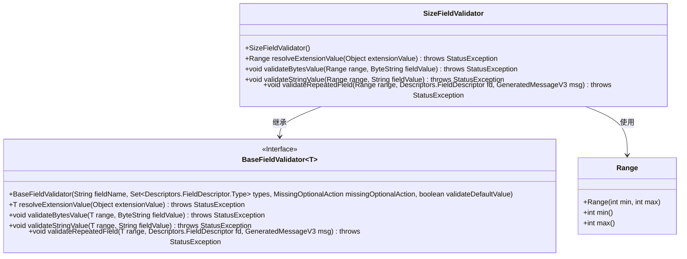
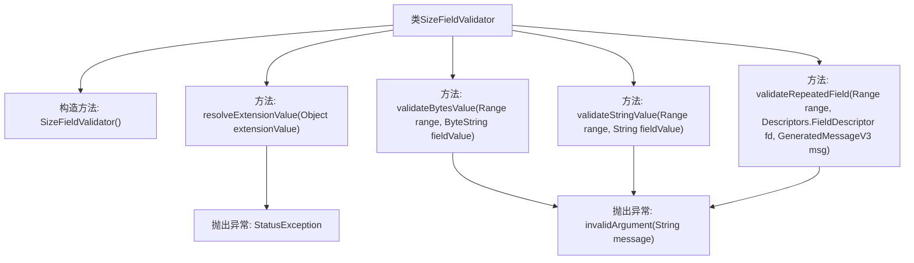

# 基础信息

|      |      |
|------|------|
| 名称 | SizeFieldValidator |
| 编码语言 | .java |
| 代码路径 | Signal-Server/service/src/main/java/org/whispersystems/textsecuregcm/grpc/validators/SizeFieldValidator.java |
| 包名 | org.whispersystems.textsecuregcm.grpc.validators |
| 依赖项 | ['org.whispersystems.textsecuregcm.grpc.validators.ValidatorUtils.invalidArgument', 'com.google.protobuf.ByteString', 'com.google.protobuf.Descriptors', 'com.google.protobuf.GeneratedMessageV3', 'io.grpc.StatusException', 'java.util.Set', 'org.signal.chat.require.SizeConstraint'] |
| 概述说明 | SizeFieldValidator验证字段大小，超范围则抛出异常。 |

# 说明

SizeFieldValidator用于验证字符串、字节和重复字段的大小范围，确保其长度或大小在指定范围内。如果字段的大小超出预设的最小或最大限制，该验证器将抛出异常，提示数据不符合要求。此功能有助于确保数据的一致性和有效性，避免因数据过大或过小导致的问题。

# 类列表 Class Summary

| 名称   | 类型  | 说明 |
|-------|------|-------------|
| SizeFieldValidator | class | SizeFieldValidator验证字符串、字节和重复字段的大小范围，超出范围抛出异常。 |

## 类 SizeFieldValidator

|      |      |
|------|------|
| 访问范围 | public |
| 类型 | class |
| 名称 | SizeFieldValidator |
| 说明 | SizeFieldValidator验证字符串、字节和重复字段的大小范围，超出范围抛出异常。 |

### UML类图

这段代码定义了一个 `SizeFieldValidator` 类，它继承自 `BaseFieldValidator<Range>`，用于验证字段的大小是否在指定范围内。`SizeFieldValidator` 类通过 `resolveExtensionValue` 方法将扩展值解析为 `Range` 对象，并通过 `validateBytesValue`、`validateStringValue` 和 `validateRepeatedField` 方法分别验证字节串、字符串和重复字段的大小是否在 `Range` 指定的范围内。如果验证失败，将抛出 `StatusException` 异常。

### 内部方法调用关系图

这段代码定义了一个名为`SizeFieldValidator`的类，继承自`BaseFieldValidator<Range>`。类的主要功能是验证字段的大小是否在指定范围内。构造方法初始化了验证器的基本属性。`resolveExtensionValue`方法将扩展值解析为`Range`对象。`validateBytesValue`、`validateStringValue`和`validateRepeatedField`方法分别验证字节串、字符串和重复字段的大小是否在`Range`范围内，如果不在范围内则抛出异常。

### 字段列表 Field List

| 名称  | 类型  | 说明 |
|-------|-------|------|

### 方法列表 Method List

| 名称  | 类型  | 说明 |
|-------|-------|------|
| validateBytesValue | void | 验证字节字段值是否在指定范围内，否则抛出异常。 |
| resolveExtensionValue | Range | 解析扩展值生成范围，包含最小值和最大值。 |
| validateStringValue | void | 验证字符串长度是否在指定范围内，超出则抛出异常。 |
| validateRepeatedField | void | 验证重复字段值是否在指定范围内，否则抛出异常。 |

