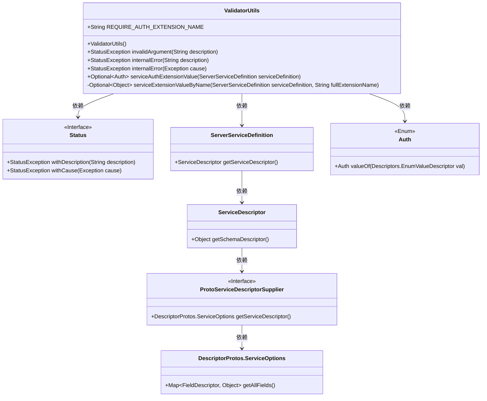
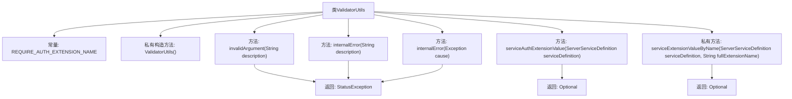

# 基础信息

|      |      |
|------|------|
| 名称 | ValidatorUtils |
| 编码语言 | .java |
| 代码路径 | Signal-Server/service/src/main/java/org/whispersystems/textsecuregcm/grpc/validators/ValidatorUtils.java |
| 包名 | org.whispersystems.textsecuregcm.grpc.validators |
| 依赖项 | ['com.google.protobuf.DescriptorProtos', 'com.google.protobuf.Descriptors', 'io.grpc.ServerServiceDefinition', 'io.grpc.Status', 'io.grpc.StatusException', 'io.grpc.protobuf.ProtoServiceDescriptorSupplier', 'java.util.Map', 'java.util.Optional', 'org.signal.chat.require.Auth'] |
| 概述说明 | ValidatorUtils类提供验证工具，含异常处理与认证扩展值获取。 |

# 说明

ValidatorUtils类是一个提供验证工具的工具类，主要功能包括异常处理和认证扩展值的获取。该类旨在简化验证流程，确保在处理异常时能够有效管理错误，并通过获取认证扩展值来增强系统的安全性和灵活性。通过集中管理验证逻辑，ValidatorUtils类提高了代码的可维护性和可扩展性。

# 类列表 Class Summary

| 名称   | 类型  | 说明 |
|-------|------|-------------|
| ValidatorUtils | class | ValidatorUtils类提供验证工具，包括异常处理和认证扩展值获取。 |

## 类 ValidatorUtils

|      |      |
|------|------|
| 访问范围 | public final |
| 类型 | class |
| 名称 | ValidatorUtils |
| 说明 | ValidatorUtils类提供验证工具，包括异常处理和认证扩展值获取。 |

### UML类图

这段代码定义了一个名为 `ValidatorUtils` 的工具类，主要用于处理与服务和认证相关的验证逻辑。它提供了多个静态方法来生成不同类型的 `StatusException` 异常，并通过 `serviceAuthExtensionValue` 方法从 `ServerServiceDefinition` 中提取认证扩展值。代码还涉及到多个依赖类，如 `Status`、`ServerServiceDefinition`、`ServiceDescriptor`、`ProtoServiceDescriptorSupplier` 和 `DescriptorProtos.ServiceOptions`，这些类共同协作来完成服务的扩展值提取和异常处理。

### 内部方法调用关系图

这段代码定义了一个名为`ValidatorUtils`的工具类，主要用于处理验证相关的逻辑。它包含多个静态方法，用于生成不同类型的异常（如`invalidArgument`和`internalError`），以及一个用于从服务定义中提取认证扩展值的方法`serviceAuthExtensionValue`。私有方法`serviceExtensionValueByName`负责根据扩展名称从服务描述符中提取对应的值。流程图展示了类内部的方法调用关系和返回类型，清晰地反映了代码的结构和逻辑流程。

### 字段列表 Field List

| 名称  | 类型  | 说明 |
|-------|-------|------|
| REQUIRE_AUTH_EXTENSION_NAME = "org.signal.chat.require.auth" | String | REQUIRE_AUTH_EXTENSION_NAME定义为需要认证的扩展名。 |

### 方法列表 Method List

| 名称  | 类型  | 说明 |
|-------|-------|------|
| invalidArgument | StatusException | 静态方法返回描述无效参数的异常对象。 |
| internalError | StatusException | 创建返回内部错误状态异常的静态方法。 |
| internalError | StatusException | 定义静态方法internalError，返回带描述的内部错误状态异常。 |
| serviceAuthExtensionValue | Optional<Auth> | 静态方法serviceAuthExtensionValue从服务定义中提取认证扩展值并转换为Auth枚举。 |
| serviceExtensionValueByName | Optional<Object> | 静态方法通过服务定义和扩展名获取扩展值，返回Optional对象。 |

