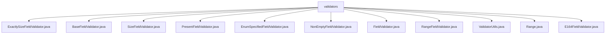

# 基础信息

|      |      |
|------|------|
| 名称 | validators |
| 编码语言 | .java |
| 代码路径 | Signal-Server/service/src/main/java/org/whispersystems/textsecuregcm/grpc/validators |
| 包名 | Signal-Server.service.src.main.java.org.whispersystems.textsecuregcm.grpc.validators |
| 概述说明 | 验证器类用于字段大小、范围、枚举、非空及E164格式验证，确保数据完整性和准确性。 |

# 说明

## 概述
该代码模块主要提供了一系列用于字段验证的工具类，旨在确保数据在处理过程中的有效性和完整性。这些验证器涵盖了多种数据类型和验证场景，包括字段大小、范围、存在性、枚举值、空值以及特定格式（如E164格式）的验证。通过继承和扩展`BaseFieldValidator`抽象类，开发者可以灵活定制验证逻辑，提升代码的可维护性和复用性。此外，`ValidatorUtils`类提供了异常处理和认证扩展值获取的工具，进一步简化了验证流程。

## 主要业务场景
1. **字段大小验证**：
   - `ExactlySizeFieldValidator`：验证字段大小是否符合预设集合，适用于字符串、字节和重复字段。
   - `SizeFieldValidator`：验证字段的大小是否在指定范围内，适用于字符串、字节和重复字段。

2. **字段存在性验证**：
   - `PresentFieldValidator`：验证消息字段是否存在，确保所有必需字段已正确提供。

3. **枚举值验证**：
   - `EnumSpecifiedFieldValidator`：验证枚举字段的索引值是否大于0，确保枚举字段的合法性。

4. **空值验证**：
   - `NonEmptyFieldValidator`：验证字段是否为空，适用于字符串、字节数组和重复字段。

5. **数值范围验证**：
   - `RangeFieldValidator`：验证数值是否在指定范围内，支持多种整数类型。

6. **特定格式验证**：
   - `E164FieldValidator`：验证字符串是否符合E164格式，确保国际电话号码的准确性。

7. **验证工具类**：
   - `ValidatorUtils`：提供异常处理和认证扩展值获取的工具，简化验证流程。

这些验证器广泛应用于数据处理、消息传递和系统交互中，确保数据的准确性、一致性和完整性，从而提升系统的稳定性和可靠性。

### 包内部结构视图

该流程图展示了`validators`文件夹下的多个验证器类文件之间的层级关系。`validators`作为根节点，包含了多个具体的验证器类文件，如`ExactlySizeFieldValidator.java`、`BaseFieldValidator.java`等。每个验证器类文件都是`validators`文件夹的直接子节点，清晰地展示了这些文件在项目中的组织结构和依赖关系。

# 文件列表 File List

| 名称   | 类型  | 说明 |
|-------|------|-------------|
| [Range.java](Range.md) | file | 信息为空，无法生成概要描述。 |
| [ValidatorUtils.java](ValidatorUtils.md) | file | ValidatorUtils类提供验证工具，含异常处理与认证扩展值获取。 |
| [FieldValidator.java](FieldValidator.md) | file | 信息为空，无法生成概要描述。 |
| [PresentFieldValidator.java](PresentFieldValidator.md) | file | PresentFieldValidator验证字段存在，缺失时抛出异常。 |
| [ExactlySizeFieldValidator.java](ExactlySizeFieldValidator.md) | file | ExactlySizeFieldValidator验证字段大小是否符合预设集合，支持字符串、字节和重复字段。 |
| [E164FieldValidator.java](E164FieldValidator.md) | file | E164FieldValidator继承BaseFieldValidator，用于验证字符串是否符合E164格式。 |
| [RangeFieldValidator.java](RangeFieldValidator.md) | file | RangeFieldValidator验证数值范围，支持多种整数类型，确保值在指定范围内。 |
| [NonEmptyFieldValidator.java](NonEmptyFieldValidator.md) | file | NonEmptyFieldValidator验证字符串、字节数组和重复字段非空。 |
| [EnumSpecifiedFieldValidator.java](EnumSpecifiedFieldValidator.md) | file | 验证枚举字段索引大于0，否则抛出异常。 |
| [SizeFieldValidator.java](SizeFieldValidator.md) | file | SizeFieldValidator验证字段大小，超范围则抛出异常。 |
| [BaseFieldValidator.java](BaseFieldValidator.md) | file | BaseFieldValidator抽象类实现字段验证，支持多类型和可选字段处理。 |

