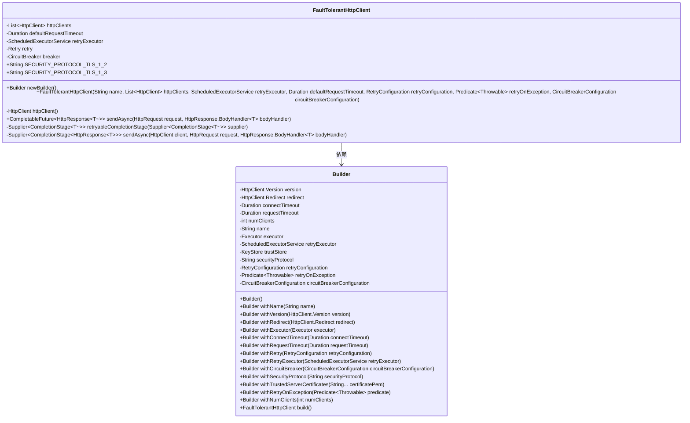

# 基础信息

|      |      |
|------|------|
| 名称 | FaultTolerantHttpClient |
| 编码语言 | .java |
| 代码路径 | Signal-Server/service/src/main/java/org/whispersystems/textsecuregcm/http/FaultTolerantHttpClient.java |
| 包名 | org.whispersystems.textsecuregcm.http |
| 依赖项 | ['com.google.common.annotations.VisibleForTesting', 'io.github.resilience4j.circuitbreaker.CircuitBreaker', 'io.github.resilience4j.retry.Retry', 'io.github.resilience4j.retry.RetryConfig', 'java.net.http.HttpClient', 'java.net.http.HttpRequest', 'java.net.http.HttpResponse', 'java.security.KeyStore', 'java.security.cert.CertificateException', 'java.time.Duration', 'java.util.List', 'java.util.concurrent.CompletableFuture', 'java.util.concurrent.CompletionStage', 'java.util.concurrent.Executor', 'java.util.concurrent.ScheduledExecutorService', 'java.util.concurrent.ThreadLocalRandom', 'java.util.function.Predicate', 'java.util.function.Supplier', 'java.util.stream.IntStream', 'io.micrometer.core.instrument.Tags', 'org.glassfish.jersey.SslConfigurator', 'org.whispersystems.textsecuregcm.configuration.CircuitBreakerConfiguration', 'org.whispersystems.textsecuregcm.configuration.RetryConfiguration', 'org.whispersystems.textsecuregcm.util.CertificateUtil', 'org.whispersystems.textsecuregcm.util.CircuitBreakerUtil', 'org.whispersystems.textsecuregcm.util.ExceptionUtils'] |
| 概述说明 | FaultTolerantHttpClient类实现容错HTTP客户端，支持重试、断路器和负载均衡。 |

# 说明

FaultTolerantHttpClient类设计用于实现容错HTTP客户端，具备重试机制、断路器功能以及多客户端负载均衡支持。重试机制确保在请求失败时自动进行多次尝试，提高请求成功率。断路器功能在检测到连续失败时自动中断请求，防止系统过载。多客户端负载均衡则通过分发请求到多个客户端实例，优化资源利用并提升系统整体性能。该类综合了多种容错策略，确保HTTP请求在复杂网络环境中的稳定性和可靠性。

# 类列表 Class Summary

| 名称   | 类型  | 说明 |
|-------|------|-------------|
| FaultTolerantHttpClient | class | FaultTolerantHttpClient类实现容错HTTP客户端，支持重试、断路器及多客户端负载均衡。 |

## 类 FaultTolerantHttpClient

|      |      |
|------|------|
| 访问范围 | public |
| 类型 | class |
| 名称 | FaultTolerantHttpClient |
| 说明 | FaultTolerantHttpClient类实现容错HTTP客户端，支持重试、断路器及多客户端负载均衡。 |

### UML类图

这段代码定义了一个`FaultTolerantHttpClient`类，它是一个具有容错机制的HTTP客户端，支持重试和断路器功能。`FaultTolerantHttpClient`类通过`Builder`模式进行配置，允许设置多个HTTP客户端实例、重试策略、断路器配置等。`Builder`类提供了丰富的配置选项，使得客户端可以根据需求进行灵活配置。`FaultTolerantHttpClient`类通过`sendAsync`方法发送异步HTTP请求，并支持在请求失败时自动重试或触发断路器机制。

### 内部方法调用关系图

```mermaid
graph TD
    A["类FaultTolerantHttpClient"]
    B["属性: List<HttpClient> httpClients"]
    C["属性: Duration defaultRequestTimeout"]
    D["属性: ScheduledExecutorService retryExecutor"]
    E["属性: Retry retry"]
    F["属性: CircuitBreaker breaker"]
    G["常量: SECURITY_PROTOCOL_TLS_1_2 = 'TLSv1.2'"]
    H["常量: SECURITY_PROTOCOL_TLS_1_3 = 'TLSv1.3'"]
    I["静态方法: newBuilder()"]
    J["构造方法: FaultTolerantHttpClient(...)"]
    K["方法: httpClient()"]
    L["方法: sendAsync(HttpRequest request, HttpResponse.BodyHandler<T> bodyHandler)"]
    M["方法: retryableCompletionStage(Supplier<CompletionStage<T>> supplier)"]
    N["方法: sendAsync(HttpClient client, HttpRequest request, HttpResponse.BodyHandler<T> bodyHandler)"]
    O["内部类Builder"]
    P["属性: HttpClient.Version version"]
    Q["属性: HttpClient.Redirect redirect"]
    R["属性: Duration connectTimeout"]
    S["属性: Duration requestTimeout"]
    T["属性: int numClients"]
    U["属性: String name"]
    V["属性: Executor executor"]
    W["属性: ScheduledExecutorService retryExecutor"]
    X["属性: KeyStore trustStore"]
    Y["属性: String securityProtocol"]
    Z["属性: RetryConfiguration retryConfiguration"]
    AA["属性: Predicate<Throwable> retryOnException"]
    AB["属性: CircuitBreakerConfiguration circuitBreakerConfiguration"]
    AC["方法: withName(String name)"]
    AD["方法: withVersion(HttpClient.Version version)"]
    AE["方法: withRedirect(HttpClient.Redirect redirect)"]
    AF["方法: withExecutor(Executor executor)"]
    AG["方法: withConnectTimeout(Duration connectTimeout)"]
    AH["方法: withRequestTimeout(Duration requestTimeout)"]
    AI["方法: withRetry(RetryConfiguration retryConfiguration)"]
    AJ["方法: withRetryExecutor(ScheduledExecutorService retryExecutor)"]
    AK["方法: withCircuitBreaker(CircuitBreakerConfiguration circuitBreakerConfiguration)"]
    AL["方法: withSecurityProtocol(String securityProtocol)"]
    AM["方法: withTrustedServerCertificates(String... certificatePem)"]
    AN["方法: withRetryOnException(Predicate<Throwable> predicate)"]
    AO["方法: withNumClients(int numClients)"]
    AP["方法: build()"]

    A --> B
    A --> C
    A --> D
    A --> E
    A --> F
    A --> G
    A --> H
    A --> I
    A --> J
    A --> K
    A --> L
    A --> M
    A --> N
    A -.-> O
    O --> P
    O --> Q
    O --> R
    O --> S
    O --> T
    O --> U
    O --> V
    O --> W
    O --> X
    O --> Y
    O --> Z
    O --> AA
    O --> AB
    O --> AC
    O --> AD
    O --> AE
    O --> AF
    O --> AG
    O --> AH
    O --> AI
    O --> AJ
    O --> AK
    O --> AL
    O --> AM
    O --> AN
    O --> AO
    O --> AP
```

这段代码定义了一个具有容错能力的HTTP客户端类 `FaultTolerantHttpClient`，它支持重试机制、断路器模式以及多客户端负载均衡。通过内部类 `Builder` 提供了灵活的配置选项，包括超时设置、重试策略、断路器配置等。构造方法初始化了这些配置，并提供了异步发送HTTP请求的功能，支持在请求失败时自动重试或触发断路器机制。

### 字段列表 Field List

| 名称  | 类型  | 说明 |
|-------|-------|------|
| httpClients | List<HttpClient> | 私有不可变HttpClient列表。 |
| breaker | CircuitBreaker | 私有最终断路器实例。 |
| defaultRequestTimeout | Duration | 私有常量默认请求超时时间。 |
| retry | Retry | 私有不可变重试对象。 |
| retryExecutor | ScheduledExecutorService | 私有且不可变的定时重试执行器。 |
| SECURITY_PROTOCOL_TLS_1_3 = "TLSv1.3" | String | 定义常量SECURITY_PROTOCOL_TLS_1_3，值为TLSv1.3。 |
| SECURITY_PROTOCOL_TLS_1_2 = "TLSv1.2" | String | 定义常量SECURITY_PROTOCOL_TLS_1_2，值为"TLSv1.2"。 |

### 方法列表 Method List

| 名称  | 类型  | 说明 |
|-------|-------|------|
| sendAsync | Supplier<CompletionStage<HttpResponse<T>>> | 定义异步发送HTTP请求的方法，返回CompletionStage的Supplier。 |
| retryableCompletionStage | Supplier<CompletionStage<T>> | 定义支持重试的异步任务执行方法。 |
| newBuilder | Builder | 静态方法newBuilder返回Builder类的新实例。 |
| httpClient | HttpClient | 该方法从httpClients集合中随机获取一个HttpClient实例。 |
| sendAsync | CompletableFuture<HttpResponse<T>> | 发送异步HTTP请求，处理超时和重试机制，返回CompletableFuture。 |

