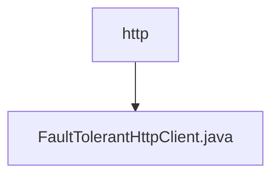

# 基础信息

|      |      |
|------|------|
| 名称 | http |
| 编码语言 | .java |
| 代码路径 | Signal-Server/service/src/main/java/org/whispersystems/textsecuregcm/http |
| 包名 | Signal-Server.service.src.main.java.org.whispersystems.textsecuregcm.http |
| 概述说明 | FaultTolerantHttpClient类实现容错HTTP客户端，支持重试、断路器和负载均衡。 |

# 说明

FaultTolerantHttpClient类设计用于实现容错HTTP客户端，具备重试机制、断路器功能以及多客户端负载均衡支持。重试机制确保在请求失败时自动进行多次尝试，提高请求成功率。断路器功能在检测到连续失败时自动中断请求，防止系统过载。多客户端负载均衡则通过分发请求到多个客户端实例，优化资源利用并提升系统整体性能。该类综合了多种容错策略，确保HTTP请求在复杂网络环境中的稳定性和可靠性。

### 包内部结构视图

该流程图展示了路径层级关系，`http`文件夹包含一个文件`FaultTolerantHttpClient.java`。路径结构简单明了，仅包含一个文件夹和一个文件，清晰地反映了文件在项目中的位置和层级关系。

# 文件列表 File List

| 名称   | 类型  | 说明 |
|-------|------|-------------|
| [FaultTolerantHttpClient.java](FaultTolerantHttpClient.md) | file | FaultTolerantHttpClient类实现容错HTTP客户端，支持重试、断路器和负载均衡。 |

